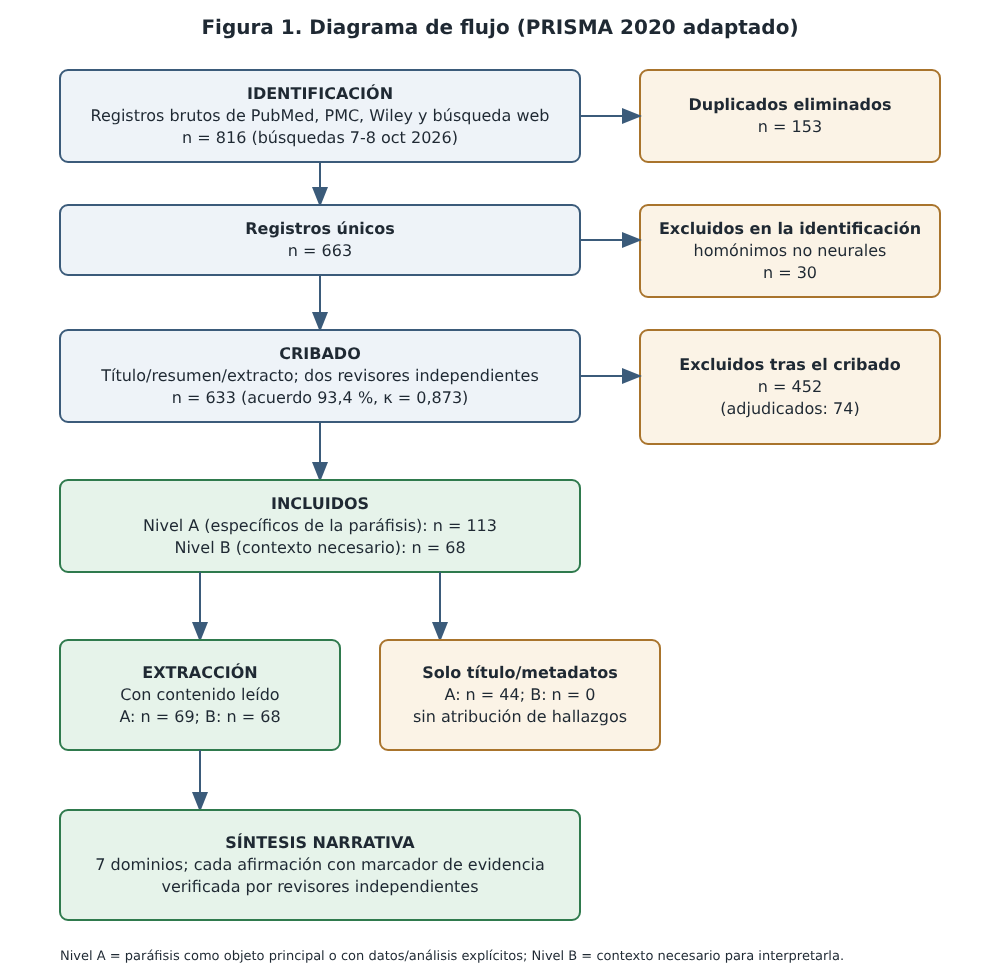

# Paráfisis cerebral (*paraphysis cerebri*): revisión sistemática narrativa sobre su filogenia, ontogenia, anatomía, histología y fisiología

> **BORRADOR NO LISTO PARA ENVÍO.** Documento generado con asistencia de inteligencia artificial a partir de fuentes consultadas el 7–8 de octubre de 2026. Cada afirmación empírica remite a un registro de evidencia y fue contrastada por verificadores independientes (también agentes de IA), pero **ninguna referencia ha sido verificada por una persona frente a la fuente primaria**. Los autores humanos deben completar autoría, afiliaciones, declaraciones y revisión de las fuentes antes de cualquier uso académico.

**Autoría y afiliaciones:** *[pendiente: a completar por los autores humanos responsables]*

**Fecha de la búsqueda:** 7–8 de octubre de 2026 · **Idioma:** español · **Tipo de documento:** revisión sistemática narrativa (PRISMA 2020 adaptado)

## Resumen

**Introducción.** La paráfisis (*paraphysis cerebri*) es una estructura del techo del prosencéfalo cuya identidad anatómica es discutida [1]. **Objetivo.** Sintetizar con evidencia verificable su filogenia, ontogenia, anatomía, histología y fisiología. **Métodos.** Revisión sistemática narrativa (PRISMA 2020 adaptado) con búsqueda en PubMed, Wiley Scholar Gateway y la web el 7 y 8 de octubre de 2026; cribado por dos revisores independientes (agentes de IA); extracción estructurada con citas literales; y verificación independiente de cada afirmación. **Resultados.** De 663 registros únicos, 113 estudios específicos y 68 contextuales cumplieron los criterios; solo siete de los específicos se leyeron a texto completo y 44 se conocen únicamente por su título. Las fuentes asignan la paráfisis al techo telencefálico o al diencefálico y usan el término también para un saco dorsal o un divertículo epitalámico [2-5]. Se informa su presencia en peces, anfibios y reptiles [4,6,7] y, en humanos, como rudimentaria e inconstante [8]. Su epitelio comparte rasgos con el plexo coroideo en *Hyla versicolor* [9]; las funciones propuestas son interpretaciones o hipótesis [6,10]; en los experimentos de paraphysectomía en la rana toro [11-13] se retiró, en uno de ellos, el complejo paráfisis-plexo coroideo [13], sin que los demás resúmenes precisen si se conservó el plexo. El origen parafisario de los quistes coloides sigue sin resolverse [14]. **Conclusiones.** El conocimiento verificable sobre la paráfisis es escaso, antiguo y de definición inestable; interpretación de esta revisión: el avance más urgente es acordar su definición y recuperar a texto completo la literatura clásica.

**Palabras clave:** paráfisis cerebral; *paraphysis cerebri*; telencéfalo; plexo coroideo; saco dorsal; quiste coloide; revisión sistemática narrativa.

## Abstract

**Background.** The paraphysis (*paraphysis cerebri*) is a structure of the forebrain roof whose anatomical identity is disputed [1]. **Objective.** To synthesise verifiable evidence on its phylogeny, ontogeny, anatomy, histology and physiology. **Methods.** Systematic narrative review (adapted PRISMA 2020) searching PubMed, Wiley Scholar Gateway and the web on 7–8 October 2026; title/abstract screening by two independent reviewers (AI agents); structured extraction with verbatim quotes; and independent verification of every claim. **Results.** Of 663 unique records, 113 paraphysis-specific and 68 contextual studies were included; only seven specific studies were read in full text and 44 are known only by title. Sources assign the paraphysis to the telencephalic or the diencephalic roof and also use the term for a dorsal sac or an epithalamic diverticulum [2-5]. It is reported in fishes, amphibians and reptiles [4,6,7] and, in humans, as rudimentary and inconstant [8]. Its epithelium shares features with the choroid plexus in *Hyla versicolor* [9]; proposed functions are authors' interpretations or hypotheses [6,10]; in the bullfrog paraphysectomy experiments [11-13] one study removed the paraphyseal–choroid plexus complex as a unit [13], and the other abstracts do not state whether the plexus was spared. A paraphyseal origin of colloid cysts remains unresolved [14]. **Conclusions.** Verifiable knowledge of the paraphysis is scarce, old and of unstable definition; in this review's interpretation, the most urgent advances are agreeing on its definition and recovering the classical literature in full text.

**Keywords:** paraphysis cerebri; telencephalon; choroid plexus; dorsal sac; colloid cyst; narrative systematic review.

## 1. Introducción

La paráfisis (*paraphysis cerebri*) fue descrita en un caso clínico-patológico de 1954 como una evaginación del frente del tercer ventrículo vinculada a un derivado del epéndimo [15]; su asignación al techo telencefálico o diencefálico es discutida [1]. Se enuncia que está bien desarrollada en anfibios y reptiles [16,17] y Niknejad (2015) la caracteriza, en el ser humano, como una estructura embrionaria vestigial y evanescente [14]. Su identidad anatómica, sin embargo, es objeto de controversia: para algunos autores es un derivado telencefálico y para otros pertenece al techo del prosómero 3 [1]; además, el término se ha aplicado a lo que otros autores llaman saco dorsal [4] y a un divertículo epitalámico [5].

La paráfisis ha interesado por razones funcionales y clínicas. Se ha propuesto que interviene en la regulación del calcio [11], que el complejo paráfisis-plexo coroideo participa en la función paratiroidea [13] y que contribuye a la producción del líquido cefalorraquídeo [6,18] o al intercambio de sustancias entre sangre y líquido cefalorraquídeo [6,19]; la hipótesis atribuida a Sjövall la vincula con el origen de los quistes coloides del tercer ventrículo [14], cuyo verdadero origen sigue en debate [14].

En esta revisión se busca ordenar lo que puede afirmarse, con evidencia verificable, sobre la filogenia, la ontogenia, la anatomía, la histología y la fisiología de la paráfisis; mostrar para cada afirmación en qué fuente se apoya y con qué profundidad se leyó esa fuente; y delimitar con claridad lo que no pudo establecerse con los canales bibliográficos disponibles.

## 2. Métodos

### Diseño y marco de referencia

Se realizó una revisión sistemática narrativa: la búsqueda, el cribado, la extracción y la apreciación de los estudios fueron explícitos y reproducibles, pero la síntesis es cualitativa y se organiza por dominios morfológicos y funcionales, no por estudio. Se adaptó la declaración PRISMA 2020 [20] para el diagrama de flujo y el registro de decisiones, y se usó la escala SANRA [21] como lista de comprobación interna de calidad de una revisión narrativa. No se registró un protocolo previo (por ejemplo, en PROSPERO); los criterios de elegibilidad se fijaron antes del cribado y están reproducidos más abajo. La estrategia de búsqueda se amplió de forma iterativa mediante rondas de crítica de cobertura hasta que una segunda ronda de crítica concluyó que no cabía esperar registros nuevos con los canales disponibles.

### Pregunta de revisión

¿Qué se sabe, con base en la literatura recuperable, sobre la paráfisis (*paraphysis cerebri*) en cuanto a su filogenia (distribución comparada, homología, terminología), ontogenia, anatomía macroscópica y topográfica, histología y ultraestructura (incluidos marcadores histoquímicos y moleculares) y fisiología o función, y qué correlatos clínicos se han propuesto (en particular su relación con el quiste coloide del tercer ventrículo)?

### Fuentes de información y fechas

Las búsquedas se ejecutaron el 7 y el 8 de octubre de 2026 en tres canales: (i) PubMed, incluidos los textos completos de acceso abierto de PubMed Central (PMC), consultados mediante un servidor MCP; (ii) Wiley Scholar Gateway (pasajes de texto completo de revistas de Wiley); y (iii) un buscador web (WebSearch) usado solo como canal de descubrimiento de literatura clásica, libros, literatura no inglesa y trabajos recientes. Los resultados del buscador web son resúmenes redactados por un modelo de lenguaje, de modo que ninguna referencia hallada únicamente por esa vía se consideró verificada hasta confirmarla en PubMed.

No estuvieron disponibles: Scite (cuota mensual agotada), Elicit (el plan no incluye acceso por API) y, tras 30 consultas, la cuota gratuita de Wiley Scholar Gateway (se restablece el 1 de noviembre de 2026). La política de red de la organización bloqueó, además, el acceso directo a Europe PMC, OpenAlex, Crossref, Semantic Scholar, doi.org, Biodiversity Heritage Library, Internet Archive y a los servidores de varias editoriales; no se intentó eludir esta restricción. No se consultaron Embase, Scopus ni Web of Science.

### Estrategia de búsqueda

Se registraron 789 consultas (PubMed 475; PMC 27; Wiley 44, de las cuales 30 se ejecutaron y el resto devolvió el aviso de cuota agotada; buscador web 243). La cadena nuclear fue *paraphysis*, con las variantes ortográficas *paraphyseal*, *paraphysial*, *paraphysus*, *paraphyse*, *paraphisial*, *paraphysectomy* y la frase "paraphysis cerebri", combinadas con grupos taxonómicos (peces, teleósteos, tiburones, dipnoos, anfibios, reptiles, tuátara, aves, mamíferos, humanos) y con las estructuras vecinas (saco dorsal, velum transversum, telencéfalo medio o impar, plexo coroideo, complejo pineal, órgano subcomisural, órganos circunventriculares). Se añadieron consultas sobre quiste coloide, desarrollo molecular del techo telencefálico, fisiología (paraphysectomía, trazadores, transporte de fluido), literatura clásica y no inglesa, y trabajos recientes; se expandieron los vecinos por artículos relacionados de PubMed y se rastrearon las listas de referencias de los textos completos disponibles. Los términos latinos *lamina supraneuroporica* y *coronarium* no son recuperables en PubMed. El registro completo de consultas está en el material suplementario (`busqueda/search_log.json`).

### Criterios de elegibilidad

Se incluyeron registros de cualquier año, idioma y taxón en dos niveles. *Nivel A (específico de la paráfisis)*: la paráfisis es objeto principal o el registro aporta datos originales, análisis explícito o relato historiográfico explícito sobre ella (incluidos trabajos sobre quiste coloide que documentan o discuten un origen parafisario, obras clásicas identificadas como descripciones de la paráfisis, estudios experimentales y trabajos que informan marcaje génico o proteico en la paráfisis). *Nivel B (contextual, necesario)*: registros no centrados en la paráfisis pero necesarios para interpretarla (definición u ontogenia de estructuras adyacentes, estadificación embrionaria humana, patrón molecular de la línea media dorsal telencefálica, órganos ependimarios secretores comparables y trabajos de histogénesis del quiste coloide necesarios para sopesar la hipótesis parafisaria). Se excluyeron los homónimos no neurales (paráfisis o parafisis de hongos, algas e insectos; "parafisario" ortopédico), las series clínicas o quirúrgicas sin datos de histogénesis y los trabajos genéricos sobre plexo coroideo, hem cortical, placa del techo, pineal u órganos circunventriculares sin relación con la región parafisaria.

### Cribado

De 816 registros brutos se obtuvieron 663 registros únicos tras eliminar duplicados por PMID, DOI y título normalizado. Treinta homónimos evidentes se excluyeron en la fase de identificación, con registro individual de la causa. Los 633 restantes fueron cribados por título y resumen (o por el extracto disponible) por dos revisores independientes, sin acceso a las decisiones del otro: un perfil de biología del desarrollo y neuroanatomía comparada y un perfil de anatomía humana, histología y neuropatología. Un tercer revisor adjudicó las discrepancias y los casos inciertos. Los revisores fueron agentes de inteligencia artificial (modelos de lenguaje) con instrucciones y criterios idénticos; no hubo cribado por revisores humanos independientes. El acuerdo inicial fue de 93,4 % (κ de Cohen = 0,873 para cuatro categorías y 0,88 para incluir frente a excluir); 74 registros requirieron adjudicación.

### Extracción de datos y apreciación crítica

Para cada registro incluido se extrajeron taxón, estadio, método, hallazgos sobre la paráfisis (con su dimensión: filogenia, ontogenia, anatomía, histología, fisiología, clínica o terminología), la terminología empleada por los autores, las menciones a otras obras y las salvedades. Cada hallazgo debía ir acompañado de una cita literal del texto realmente leído; las 340 citas literales se contrastaron automáticamente con el texto fuente guardado y 340 coincidieron. Se registró la profundidad real de lectura: texto completo, resumen completo, extracto parcial, instantánea de resumen web no verificada o solo metadatos. Una auditoría independiente contrastó con PubMed los textos fuente guardados de 74 registros con resumen o texto completo (72 coincidieron literalmente con el resumen de PubMed; en uno PubMed no tiene resumen y el texto guardado es la transcripción del texto completo, y en otro el resumen guardado está truncado y fue rotulado como parcial; no se hallaron alteraciones del contenido).

La apreciación crítica se adaptó de la lista AQUA para estudios anatómicos originales [22] a tres dominios (descripción de especímenes, descripción de métodos y sustento de las afirmaciones: observación directa frente a inferencia). Como la mayoría de los registros se leyó solo a nivel de resumen o de extracto, el resultado habitual fue "no evaluable", y esa categoría se informa tal cual en lugar de imputarse. No se calculó puntuación global de calidad ni se excluyó ningún estudio por su calidad.

### Síntesis narrativa y verificación de afirmaciones

La síntesis se redactó por dominios exclusivamente a partir de la base de extracción. Cada oración empírica lleva un marcador que remite a un hallazgo extraído, a una mención secundaria o, para obras conocidas solo por su título, a la identificación bibliográfica. Un analizador automático separó el texto en 577 afirmaciones verificables y verificadores independientes (agentes distintos de los redactores) contrastaron cada una con la evidencia citada, con la posibilidad de releer el resumen en PubMed. Las afirmaciones señaladas (excesivas, no respaldadas, mal atribuidas o sin matiz) fueron reescritas o eliminadas y las secciones revisadas se verificaron de nuevo. Las oraciones sin marcador se limitaron a texto conectivo o a interpretaciones de esta revisión, rotuladas como tales.

### Declaración de uso de inteligencia artificial

La búsqueda, el cribado, la extracción, la redacción y la verificación fueron realizados por modelos de lenguaje orquestados mediante Claude Code, con las habilidades `scientific-writing`, `literature-review`, `scholar-megasearch` y `citation-management` [23]. La inteligencia artificial no es autora de este trabajo. Los autores responsables deben revisar las fuentes primarias antes de cualquier uso académico, ya que ninguna verificación humana de las referencias forma parte del proceso descrito aquí.

## 3. Resultados

### 3.1 Selección de estudios

La búsqueda produjo 816 registros brutos que, tras eliminar duplicados, se redujeron a 663 registros únicos (Tabla 1, Tabla 2 y Figura 1). Treinta registros eran homónimos no neurales (principalmente ortopedia, micología, algología, entomología y holoprosencefalia) y se excluyeron en la identificación. De los 633 registros cribados, 113 cumplieron los criterios del Nivel A y 68 los del Nivel B; 452 se excluyeron.

**Tabla 1.** Canales y consultas registradas.

| Canal | Consultas registradas | Registros brutos aportados |
|---|---|---|
| PubMed (incl. expansión por artículos relacionados) | 475 | 644 |
| PubMed Central (texto completo) | 27 | 9 |
| Wiley Scholar Gateway (30 consultas efectivas; cuota gratuita agotada) | 44 | 47 |
| Búsqueda web (descubrimiento; resultados no verificados) | 243 | 116 |
| **Total** | 789 | 816 |

**Tabla 2.** Flujo de selección de registros.

| Etapa | n |
|---|---|
| Registros identificados (brutos, todos los canales) | 816 |
| Duplicados eliminados (PMID, DOI, título normalizado) | 153 |
| Registros únicos | 663 |
| Excluidos en la identificación (homónimos no neurales) | 30 |
| Registros cribados (título/resumen/extracto; dos revisores independientes) | 633 |
| Excluidos tras el cribado | 452 |
| Incluidos: Nivel A (específicos de la paráfisis) | 113 |
| Incluidos: Nivel B (contexto necesario) | 68 |
| Registros con contenido extraíble (resumen, texto o extracto) | 137 |
| Obras identificadas solo por título o metadatos (sin contenido verificable) | 44 |

### 3.2 Características de la base de evidencia

Lo más importante para interpretar esta revisión es la **profundidad real de lectura** de cada registro (Tabla 3). Solo siete de los 113 estudios específicos (Nivel A) pudieron leerse a texto completo; la mayoría se leyó a nivel de resumen o de extracto, 30 se conocen únicamente por instantáneas de resúmenes web redactados por un modelo de lenguaje (no verificadas) y 44 solo por su título y metadatos. Esta limitación condiciona toda la síntesis: los trabajos morfológicos clásicos (finales del siglo XIX a mediados del XX), que son el núcleo histórico del tema, son en gran parte inaccesibles en esta revisión más allá de su identificación bibliográfica (Anexo A).

**Tabla 3.** Profundidad de lectura de los registros incluidos.

| Profundidad de lectura | Nivel A (específicos) | Nivel B (contexto) | Total |
|---|---|---|---|
| Texto completo | 7 | 0 | 7 |
| Resumen completo | 23 | 44 | 67 |
| Extracto parcial | 9 | 18 | 27 |
| Instantánea web (no verificada) | 30 | 6 | 36 |
| Solo título/metadatos | 44 | 0 | 44 |
| **Total** | 113 | 68 | 181 |

Tras la lectura, la paráfisis resultó ser el tema principal (25 registros) o sustancial (17) en 42 registros del Nivel A y sustancial en uno del Nivel B. Se mencionaba solo de pasada en 24 registros del Nivel A y 15 del Nivel B, y 55 registros no la mencionaban en el texto leído (3 del Nivel A y 52 del Nivel B, estos últimos sobre todo trabajos de contexto como la histogénesis del quiste coloide) (Tabla 4). Los 44 registros restantes del Nivel A solo se conocen por su título.

**Tabla 4.** Peso de la paráfisis en los textos efectivamente leídos.

| Tratamiento de la paráfisis tras la lectura | Nivel A | Nivel B | Total |
|---|---|---|---|
| Principal | 25 | 0 | 25 |
| Sustancial | 17 | 1 | 18 |
| Mención circunstancial | 24 | 15 | 39 |
| Ninguna | 3 | 52 | 55 |
| No evaluable (solo título) | 44 | 0 | 44 |

La distribución cronológica de los registros incluidos es muy desigual (Tabla 5): predomina la literatura de mediados del siglo XX y de las décadas de 1970 a 1990, y la producción posterior al año 2000 es escasa y, en buena parte, trata la paráfisis de forma tangencial (por ejemplo, como dominio de expresión génica o como estructura rotulada en atlas).

**Tabla 5.** Registros incluidos por período de publicación.

| Período | Registros incluidos |
|---|---|
| Siglo XIX | 7 |
| 1900s | 9 |
| 1910s | 8 |
| 1920s | 3 |
| 1930s | 1 |
| 1940s | 8 |
| 1950s | 17 |
| 1960s | 16 |
| 1970s | 24 |
| 1980s | 18 |
| 1990s | 23 |
| 2000s | 11 |
| 2010s | 15 |
| 2020s | 7 |
| s. f. | 14 |

Los grupos taxonómicos mencionados en los registros con contenido leído se resumen en la Tabla 6. La cifra de humanos refleja sobre todo la literatura clínica sobre quiste coloide, no observaciones de la paráfisis normal. La tabla describe el corpus recuperado y **no es una distribución filogenética de la paráfisis**; esta se trata en la sección 3.4.

**Tabla 6.** Grupos taxonómicos mencionados en los registros con contenido leído.

| Grupo taxonómico | Registros con lectura de contenido que lo mencionan |
|---|---|
| Humanos | 52 |
| Quelonios | 14 |
| Anuros | 14 |
| Varios grupos | 11 |
| Urodelos | 9 |
| Euterios | 9 |
| Actinopterigios | 7 |
| Aves | 6 |
| Dipnoos | 6 |
| Escamosos | 6 |
| Condrictios | 4 |
| Ciclóstomos | 3 |
| Cocodrilianos | 1 |
| Tuátara | 1 |

Las secciones siguientes (3.3 a 3.9) presentan la síntesis narrativa por dominios. Cada oración con contenido empírico lleva un número de referencia; las oraciones que combinan o interpretan la evidencia se rotulan como "Interpretación de esta revisión". Los resultados de la verificación independiente de afirmaciones se resumen en la sección 2 y en el Anexo C.

### 3.3 Terminología, definición e historia

Esta sección considera 67 registros: 23 con hallazgos de terminología sobre la paráfisis (2 a texto completo, 8 a nivel de resumen, 6 como extractos parciales y 7 como fragmentos secundarios de resúmenes web, no verificados; 15 de ellos de contexto) y 44 conocidos solo por título y metadatos; 59 de los 67 se citan en el texto. Se citan además 19 registros de otras dimensiones (10 fragmentos secundarios no verificados, 5 resúmenes, 2 extractos y 2 textos completos). La historia clásica se reconstruye, por tanto, sobre todo desde títulos y atribuciones de segunda mano.

#### Nombres y variantes

Según una fuente secundaria no verificada, Burckhardt (1890, 1892) llamó «coronarium» a una estructura conspicua situada en el interior del órgano pineal, en la región dorsal del encéfalo de *Protopterus annectens* (especie tomada del título); el fragmento no la llama paráfisis [24,25]. Según otra fuente secundaria no verificada, Studnicka (1905) sostuvo que «la estructura» debía llamarse paraphysis en lugar de un nombre anterior que el fragmento no muestra [26].

Según una fuente secundaria no verificada, en Alay (1971), sobre *Liolaemus gravenhorsti*, la abreviatura PAR acompaña a «paraepífisis» en un fragmento y a «paráfisis» en otro, sin que el texto leído establezca que designen lo mismo [27]. Dos registros que las notas de búsqueda describen como el mismo capítulo de 1965 difieren en el título registrado: uno, en una redacción de catálogo no literal, nombra «paraphysis» [28] y otro, en el título de PubMed, «para-epiphysis» [29]. Khonsari (2009) define el epitálamo por el núcleo habenular y dos divertículos, uno izquierdo «paraphysis (or parietal)» y uno derecho «epiphysis (or pineal)» [5]. Interpretación de esta revisión: ese uso designa un divertículo epitalámico izquierdo y no coincide con el de los trabajos que ubican la paráfisis en el techo telencefálico o diencefálico rostral, por lo que no deben fusionarse.

#### Definición y ubicación: ¿techo telencefálico o diencefálico?

Un caso clínico-patológico de 1954 describe la paráfisis, en observaciones no referenciadas del patólogo, como una evaginación del frente del tercer ventrículo vinculada a «un derivado del epéndimo» (la palabra que los une es ilegible en el OCR; el registro la restituye como «formada por») [15]. Joven (2012) declara, según el extracto, que la naturaleza de la paráfisis es controvertida: derivado telencefálico para unos autores, parte del techo de p3 para otros [1]. Interpretación de esta revisión: según la Tabla 7, las fuentes se reparten entre una sede telencefálica (posición rostral al velum transversum o relación con el plexo coroideo) y una diencefálica (plexo coroideo extraventricular o modelo prosomérico, p3). Interpretación de esta revisión: la discrepancia aparece incluso dentro de los anfibios (Kappers, según Joven 2012, frente a *Pleurodeles waltl* y *Ambystoma mexicanum*), por lo que no parece deberse al taxón; el corpus no permite resolverla. Joven (2013) añade que el modelo prosomérico modificado omitió la paráfisis [30]. El extracto de la *Terminologia Neuroanatomica* adopta el modelo prosomérico y define «Telencephalon medium» como la parte rostral a D1 [31]; en ese extracto no aparece la paráfisis [31].

#### Tabla 7. Sede del techo asignada a la paráfisis

|Fuente|Taxón|Sede|Base|
|---|---|---|---|
| Ung (2004) | tuatara neonato | evaginación de la *lamina supraneuroporica* del telencéfalo (con cita); su abertura pasa al saco dorsal según Dendy | resumen y extracto [7] |
| Bandín (2013), que cita a Warren | no especificado | descrita dentro del telencéfalo por ser rostral al velum transversum | texto completo; secundaria [2] |
| Bandín (2013), que cita a Kappers | no especificado | órgano telencefálico posterior adyacente al plexo coroideo del tercer ventrículo | texto completo; secundaria [2] |
| Joven (2012), que cita a Kappers | anfibios | órgano telencefálico posterior adyacente al plexo coroideo del tercer ventrículo | extracto; secundaria [1] |
| Registro R644, sin autoría | *Salmo gairdneri* adulto | parte diferenciada de la *pars impar telencephali* del techo telencefálico | fragmento secundario no verificado [32] |
| Shuangshoti (1966) | vertebrados inferiores | plexo coroideo extraventricular del diencéfalo; velum transversum como límite arbitrario | extracto [3] |
| Pombero (2008) | quimeras codorniz-pollo | prosómero 3 (p3) | extracto [33] |
| Joven (2013) | *Pleurodeles waltl* | derivado de la placa del techo en el límite p3 y telencéfalo evaginado, más probablemente de p3 | extracto [30] |
| Rivas-Manzano (2022) | *Ambystoma mexicanum* | estructura circunventricular del techo del diencéfalo | resumen [34] |
| Vingert (2025) | *Correlophus ciliatus* | primordios en los bordes anterior y posterior del techo diencefálico; no se precisa cuál es la paráfisis | fragmento secundario no verificado [35] |
| Gupta; Shrivastava (s.f.) | *Xenentodon cancila* | «alguna indicación» de la paráfisis en el techo del diencéfalo; el parapineal se da por ausente, es decir, se nombra como estructura distinta | fragmento secundario no verificado [36] |
| Armao (2000) | humano | evaginación del techo diencefálico dorsal al foramen interventricular | fragmento secundario no verificado [37] |
| Gaillard (2017) | no indicado | hebra delgada entre el telencéfalo y las porciones anteriores del diencéfalo | fragmento web no verificado [38] |

#### Paráfisis, saco dorsal y complejos con plexo coroideo

Tsuneki (1986) señala, según el resumen, paráfisis en dogfish (*Mustelus*) y en los teleósteos osteoglosomorfos *Osteoglossum* y *Gnathonemus* [4], y juzga que la llamada paráfisis del pez pulmonado «no es una paráfisis, sino un saco dorsal» [4]. Interpretación de esta revisión: para los peces pulmonados la literatura recuperada emplea tres rótulos: «coronarium» (fragmento secundario no verificado que no menciona la paráfisis; la especie, *Protopterus annectens*, se toma del título) [24], «paraphysis» (solo título, sobre *Protopterus annectens*) [39] y «dorsal sac» (según el resumen de Tsuneki, sin género especificado) [4]; el corpus recuperado no muestra que «coronarium» equivalga a «paraphysis» o «dorsal sac», y la equivalencia entre estos dos rótulos se apoya aquí en el juicio de Tsuneki (según el resumen). En otros taxones se tratan como estructuras distintas: McNulty (1976) halló saco dorsal y paráfisis en *Bathylagus wesethi* y ambos ausentes en *Nezumia liolepis* [40]. Según el extracto, Wilder (s.f.) define el «dorsal sack» como una evaginación en bolsa de la diatela entre epífisis y paráfisis en muchos vertebrados inferiores [41].

En Rivas-Manzano (2022), los autores concluyen, según el resumen, que en *Ambystoma mexicanum* la paraphysis cerebri consta de dos órganos adyacentes (AEP y PEP), pero sugieren que AEP y PEP son homólogos de la paraphysis cerebri y del saco dorsal, respectivamente [34]. Interpretación de esta revisión: el resumen usa así «paraphysis cerebri» con dos alcances (AEP más PEP, y solo AEP), por lo que el alcance del término no queda unívoco. Según Niknejad (2015), Shuangshoti clasificó la paráfisis como plexo coroideo extraventricular [14]. Sarras (1986) llama «paraphyseal-choroid plexus complex» a la estructura retirada quirúrgicamente en *Rana catesbeiana*, y «paraphysectomy» a la operación [13]. Interpretación de esta revisión: como se retira el complejo como unidad, el rótulo no permite atribuir los efectos a la paráfisis sola. Owens (1978) usa «pineal-paraphyseal complex» en tortugas marinas, con la paráfisis extensamente fusionada a la porción distal del cuerpo pineal [42]. Según el extracto, Shiraishi (2013) no pudo determinar, en embriones humanos, si estructuras alrededor de la paráfisis eran plexo coroideo del DV o parte de ella [43].

#### El «quiste paraphysial» y el quiste coloide

Witzig (1982), en un registro de contexto, indica en el resumen que el quiste coloide del tercer ventrículo es también llamado «paraphysis cyst» y que su etiología sigue siendo imprecisa [44]. Según una fuente secundaria no verificada, el origen paraphysial de estos quistes fue sugerido por primera vez por Sjövall en 1909 [45]; el título de Sjövall (1909) en el registro del corpus (no verificado frente al original) plantea la identidad como pregunta («Paraphyse?») [45]. Según Niknejad (2015), Fulton y Bailey (1929) introdujeron «neuroepithelial cyst» y adujeron argumentos patológicos y anatómicos contra un origen paraphysial [14], y Kappers (1955) restauró parcialmente la teoría de Sjövall, explicando la localización ectópica por inclusión de anlagen paraphysiales periféricas de origen ependimario [14]. Mansour (2023, registro de contexto) señala que se creía que los quistes coloides derivaban de elementos neuroectodérmicos de la paráfisis y que estudios inmunohistoquímicos recientes cuestionan el origen neuroepitelial [46]; Cevik (2025) infiere, según el resumen y desde la tinción PAX-7, que el quiste coloide es un remanente de la paráfisis [47], y Niknejad (2015) concluye que el origen sigue en debate [14]. Interpretación de esta revisión: en los títulos de la Tabla 8, «paraphysial cyst» denota una hipótesis de origen y no una identidad demostrada, como sugieren el signo de interrogación de Sjövall y el debate señalado por Niknejad.

#### Tabla 8. Títulos clínicos con la etiqueta paraphysial (solo título)

|Año|Obra|Nivel|
|---|---|---|
| 1909 | Sjövall, «Über eine Ependymcyste embryonalen Charakters (Paraphyse?) im dritten Hirnventrikel mit tödlichem Ausgang» | solo título [45] |
| 1946 | Wilson, «Colloid (paraphisial) cysts of the third ventricle…», West Virginia Med J | solo título [48] |
| 1948 | Dublin, «Paraphysial cyst of third ventricle», Northwest Med | solo título [49] |
| 1949 | Greenwood, «Paraphysial cysts of the third ventricle; with report of eight cases», J Neurosurg | solo título [50] |
| 1951 | Schwartz, «Paraphysial cyst of the third ventricle; report of a case with autopsy observations», AMA Arch Pathol | solo título [51] |
| 1953 | Ariens Kappers, «The so-called paraphyseal cystose tumors of the third cerebral ventricle», Geneeskd Gids | solo título [52] |
| 1953 | Burrows, «Paraphysial cyst of the third ventricle of the brain», Illinois Med J | solo título [53] |
| 1956 | Glazer, «Paraphyseal or colloid cysts of the third ventricle», Radiology | solo título [54] |
| 1956 | Slade, «Paraphysial cyst of the third ventricle», Am J Surg | solo título [55] |
| 1959 | Heaven, «Paraphysial (colloid) cysts of the third ventricle…», Bull Los Angeles Neurol Soc | solo título [56] |
| 1960 | Gemperlein, «Paraphyseal cysts of the third ventricle. Report of two cases in infants», J Neuropathol Exp Neurol | solo título [57] |
| 1961 | Hullay, «On cysts of the foramen of Monro (para-physeal cysts of the 3d ventricle)», Acta Chir Acad Sci Hung | solo título [58] |
| 1962 | Kenefick, «Paraphysial cyst», J Iowa State Med Soc | solo título [59] |
| 1964 | Krohn, «Paraphysial cyst of third ventricle», Tex State J Med | solo título [60] |
| 1970 | Agrawal, «Paraphyseal cyst (an autopsy report)», J Assoc Physicians India | solo título [61] |
| 1974 | Danziger, «Paraphysial cysts of the third ventricle», S Afr Med J | solo título [62] |
| s.f. | «Ependymal and Paraphyseal Cysts», capítulo de libro (Springer) | solo título [63] |

#### Registro histórico

Interpretación de esta revisión: según la Tabla 9, desde 1949 aparecen, junto a los títulos de desarrollo, otros sobre función experimental, ablación, ultraestructura y regulación de la secreción.

#### Tabla 9. Atribuciones de segunda mano y obras conocidas solo por título

|Año|Obra|Nivel|
|---|---|---|
| s.f. | Francotte, «Récherches sur le dévéloppement de L'épiphyse», Arch Biol | solo título [64] |
| s.f. | Minot, «On the morphology of the pineal region, based upon its development in Acanthias», Am J Anat | solo título [65] |
| 1891 | Selenka, «Das Stirnorgan der Wirbeltiere» (identidad con la ref. (12) de Dexter inferida, no confirmada): Dexter atribuye a «Selenka (12)» la primera identificación de la paráfisis en pollos | fragmento secundario no verificado [66] |
| 1894 (año del registro) | Un texto posterior (identificado en las notas de búsqueda como el de Dexter) cita a «Burckhardt (3)», quien muestra la paráfisis de un embrión de cuervo como un pequeño divertículo, «not unlike» la de *Petromyzon*; no está confirmado que la ref. (3) corresponda a este trabajo de 1894 (existe otro registro Burckhardt 1894, R006) | fragmento secundario no verificado [67] |
| 1894 | Sorensen, «Comparative study of the epiphysis and roof of the diencephalon», J Comp Neurol | solo título [68] |
| 1895 | Studnicka, «Zur Anatomie der sog. Paraphyse des Wirbelthiergehirns» | solo título [69] |
| 1899 | Melchers, «Über rudimentäre Hirnanhangsgebilde beim Gecko (Epi-, Para- und Hypophyse)», Z Wiss Zool | solo título [70] |
| 1900 | Stemmler, título según listas de referencias posteriores (redacción exacta no verificada): «Die Entwicklung der Anhänge am Zwischenhirndach beim Gecko», disertación de Leipzig | solo título [71] |
| 1902 | Dexter refiere que D'Erchia identificó la paráfisis en peces y en embriones de mamíferos y la consideraba constante en todos los vertebrados, sin observaciones en aves | fragmento secundario no verificado [72] |
| 1905 | Studnicka, «Die Parietalorgane», en Oppel, Lehrbuch | solo título; véase el texto [26] |
| 1906 | Chiarugi, sobre la región parafisaria del telencéfalo en embriones de *Torpedo ocellata* (título con OCR deficiente) | solo título [73] |
| 1910 | Reese, «Development of the brain of the American alligator: the paraphysis and hypophysis» | solo título [74] |
| 1911 | Warren, «Paraphysis and Pineal Region in Reptilia», Am J Anat | solo título [75] |
| 1912 | Un texto atribuido a Streeter afirma que la «anterior choroidal pouch» ha sido homologada con la paráfisis de los vertebrados inferiores | fragmento secundario no verificado [76] |
| 1949 | Ariëns Kappers, «Preliminary data on the function of the paraphysis cerebri in Urodela», Experientia | solo título [77] |
| 1949 | Van de Kamer, desarrollo normal de epífisis y paráfisis en *Amblystoma* (título en neerlandés) | solo título [78] |
| 1950 | Ariëns-Kappers, «The development and structure of the paraphysis cerebri in urodeles with experiments on its function in Amblystoma mexicanum», J Comp Neurol | solo título [79] |
| 1953 | Trost, embriología e histología de epífisis, paráfisis, velum transversum, saco dorsal y órgano subcomisural en *Anguis fragilis*, *Chalcides ocellatus* y *Natrix natrix* | solo título [80] |
| 1955 | Kappers, «The development of the paraphysis cerebri in man…», J Comp Neurol | solo título [81] |
| 1956 | Ariens Kappers, «On the development, structure and function of the paraphysis cerebri», Prog Neurobiol | solo título [82] |
| 1956 | Kappers, desarrollo de la paraphysis cerebri en *Scylliorhinus caniculus* (título en neerlandés) | solo título [83] |
| 1957 | Dorn, estructura fina de la paraphysis de *Protopterus annectens* (título en alemán) | solo título [39] |
| 1957 | Legait, cambios cerebrales secundarios a ablación o cauterización de la paráfisis en *Rana esculenta* | solo título [84] |
| 1957 | Watermann, el problema de la homología del órgano subfornical y la paráfisis | solo título [85] |
| 1964 | Kelly, «An ultrastructural analysis of the paraphysis cerebri in newts» | solo título [86] |
| 1965 | Stockem, ontogénesis y función de la paráfisis de los anfibios | solo título [87] |
| 1966 | Stockem, embriología comparada de la paráfisis en aves | solo título [88] |
| 1967 | Srebro, órgano subfornical de las ranas y regulación de la actividad secretora de la paráfisis | solo título [89] |
| 1968 | Paul, estudios histoquímicos de plexos coroideos, paraphysis cerebri y epéndimo de *Rana temporaria* | solo título [90] |
| s.f. | «Epiphyse und Paraphyse im Lebenscyclus der Anuren» | solo título [91] |

#### Vacíos de evidencia

- En el corpus recuperado no se encontraron datos sobre quién describió o nombró primero la paráfisis; según un fragmento secundario no verificado, Dexter atribuye a D'Erchia la identificación en peces y embriones de mamíferos [72] y a Selenka la primera identificación en pollos [72], y de la obra de Francotte solo se conoce el título [64].
- No se pudo establecer si el «coronarium» de Burckhardt y la «paraphysis» de Studnicka designan la misma estructura; Holmgren (1959) solo se conoce por un fragmento sobre Burckhardt [25].
- De Studnicka, Ariëns Kappers, Warren, Reese, Sorensen, Melchers, Stemmler y Chiarugi solo constan títulos o un fragmento secundario de sus propias obras; las posiciones de Warren y Kappers solo se conocen de segunda mano (Bandín 2013; Joven 2012) y no se recuperaron sus definiciones originales [1,2,26,68-71,73-75,79,81].
- En el corpus recuperado no se encontró una fuente de texto completo que dirima la adscripción telencefálica o diencefálica [1].
- En el corpus recuperado no se encontraron datos sobre la entrada formal de la paráfisis en la *Terminologia Neuroanatomica* [31] ni sobre la etimología del término.
- No se resolvió si la «para-epífisis» de 1965 es paráfisis o parapineal, y el título «paraphysis» de ese capítulo procede de una redacción de catálogo no literal [28,29]; tampoco se resolvió qué designa PAR en Alay (1971) [27].
- En el material recuperado no constan el criterio de Tsuneki (1986) para separar paráfisis y saco dorsal (solo se leyó el resumen), el contenido de Dorn (1957) (solo título) ni los límites del «complejo paraphyseal-plexo coroideo» (el resumen de Sarras no los precisa) [4,13,39].
- No se leyeron Sjövall ni Fulton y Bailey; el año de Sjövall (1909 o 1910), el título de 1929 y la fecha de Dexter (1902 o 1903) son inciertos [45,72,92].

### 3.4 Filogenia

En esta revisión, la sección se apoya en 82 registros con datos de filogenia o terminología sobre la paráfisis (paraphysis cerebri) o conocidos solo por su título: 44 de título, 13 de fragmento secundario no verificado (resúmenes web), 13 de resumen, 8 de extracto y 4 de texto completo. En esta revisión, solo 19 registros contienen hallazgos filogenéticos explícitos (3 de texto completo, 6 de resumen, 4 de extracto y 6 de fragmento secundario), y 7 de ellos son de contexto, no evidencia central. Esta revisión es un mapa de lo que afirman las fuentes recuperadas, no un inventario de la distribución de la estructura.

#### Identidad de la estructura y nomenclatura comparada

Según Bandín (2013), que cita a Warren, la paráfisis se describió dentro del telencéfalo por situarse rostral al velum transversum, límite dorsal clásico con el diencéfalo [2]. Joven (2012) señala, en un extracto, que su naturaleza es controvertida: derivado telencefálico para unos autores y parte del techo del prosómero 3 (p3) para otros [1]. Joven (2013) interpreta, en un extracto, que es un derivado de la placa del techo originado en el límite entre p3 y el telencéfalo evaginado, con mayor probabilidad de p3 [30], y Shuangshoti (1966, J Morphol), en extracto, la asigna al diencéfalo [3]. En cambio, Ung (2004) recoge su definición como evaginación de la *lamina supraneuroporica* del telencéfalo [7].

Khonsari (2009) emplea, según el extracto, "paraphysis (or parietal)" para el divertículo epitalámico izquierdo [5], y Tsuneki (1986) juzga, en su resumen, que la llamada paráfisis del pez pulmonado es un saco dorsal [4]. Según una fuente secundaria no verificada, Burckhardt (1890, 1892) llamó "coronarium" a una estructura interior al órgano pineal; el fragmento no la designa como paráfisis [24], y otra fuente secundaria igualmente no verificada atribuye a Studnicka (1905) el argumento de que "la estructura" debía llamarse paráfisis, sin precisar cuál [26].

Interpretación de esta revisión: como el término designa en las fuentes una evaginación telencefálica, un derivado del techo diencefálico, una estructura que algunos llaman saco dorsal y un divertículo epitalámico, los datos taxonómicos solo son comparables entre fuentes que comparten convención; esta sección conserva la denominación de cada fuente.

#### Distribución taxonómica notificada

En esta revisión, la Tabla 10 ordena los datos por taxón o grupo, dato informado, marcador de fuente y profundidad de la evidencia; cada fila vale solo para lo que nombra y no sustenta generalizaciones a clases.

#### Tabla 10. Distribución taxonómica notificada, con el nivel de la fuente

|Taxón|Dato|Ref.|Nivel|
|---|---|---|---|
| Diez taxones comparados (anfioxo, lamprea, dogfish, pez dorado, pez pulmonado, rana, salamandra, tortuga, paloma, ratón) | Un resumen lista la paráfisis entre los derivados ependimarios comparados en esos taxones; no comunica resultado específico sobre la paráfisis | [93] | Resumen (registro de contexto) |
| *Petromyzon* (ciclóstomo) | Según una fuente secundaria no verificada, la paráfisis de un embrión de cuervo se describe "no distinta" de la de *Petromyzon*, que aparece solo como término de comparación | [67] | Fragmento secundario no verificado (contexto) |
| Lampreas, condrictios, actinopterigios y sarcopterigios (uso epitalámico del término) | Según Khonsari (2009), las lampreas muestran ambos divertículos neurales, los condrictios solo el derecho (pineal) y actinopterigios y sarcopterigios ambos órganos; allí "paraphysis" designa el divertículo epitalámico izquierdo | [5] | Extracto |
| Condrictios: dogfish (*Mustelus*) | Paráfisis hallada (Tsuneki 1986) | [4] | Resumen |
| Condrictios: embriones de *Torpedo ocellata*; *Scylliorhinus caniculus* (grafía del título) | Existen trabajos cuyos títulos aluden a la región parafisaria del telencéfalo en embriones de *Torpedo ocellata* (Chiarugi 1906; título con OCR defectuoso) y al desarrollo de la paráfisis cerebral en *Scylliorhinus caniculus* (Kappers 1956); sin contenido verificado | [73,83] | Solo título |
| Osteoglosomorfos (*Osteoglossum*, *Gnathonemus*) | Paráfisis hallada (Tsuneki 1986) | [4] | Resumen |
| *Bathylagus wesethi*; *Nezumia liolepis* | Paráfisis y saco dorsal presentes en *B. wesethi*; ambas estructuras ausentes en *N. liolepis* (McNulty 1976) | [40] | Resumen |
| *Salmo gairdneri* (adulto) | Según una fuente secundaria no verificada, la paráfisis cerebral está representada por una parte diferenciada de la *pars impar telencephali* del techo telencefálico | [32] | Fragmento secundario no verificado; referencia sin identificar |
| *Xenentodon cancila* | Según una fuente secundaria no verificada, en el techo del diencéfalo hay "alguna indicación" de paráfisis y el parapineal está ausente | [36] | Fragmento secundario no verificado |
| Esturión; "algunos peces"; ranas | Una conferencia clinicopatológica (1954) describe, sin cita, la paráfisis como propia de ciertos vertebrados inferiores: ranas, algunos peces y, según el hablante, de modo prominente el esturión (texto parcialmente ilegible) | [15] | Texto completo (comentario de fondo, sin referencia) |
| Pez pulmonado (*Protopterus annectens*, según el título de la monografía de 1892; el fragmento no nombra el taxón) | Según una fuente secundaria no verificada, Burckhardt (1890, 1892) nombró "coronarium" una estructura conspicua interior al órgano pineal; el fragmento no la llama paráfisis | [24] | Fragmento secundario no verificado (contexto) |
| Peces pulmonados | Tsuneki (1986) juzga que la llamada paráfisis del pez pulmonado es un saco dorsal; existe un trabajo de 1957 cuyo título trata de la estructura fina de la "paráfisis" de *Protopterus annectens* | [4,39] | Resumen; solo título |
| Urodelos (Urodela) | Según una fuente secundaria no verificada (Gladstone 1940), la paráfisis suele estar bien desarrollada y puede ser un divertículo tubular simple o ramificada y glandular | [94] | Fragmento secundario no verificado |
| *Ambystoma mexicanum* (larvas); *Amblystoma* (adulto) | Larvas: los autores concluyen que la paráfisis cerebral está formada por dos órganos adyacentes (AEP y PEP); adulto: túbulos parafisarios de epitelio ependimario columnar bajo que terminan ciegos (Roofe, s. f.) | [34,95] | Resumen; extracto |
| *Pleurodeles waltl* | Células Pax7-inmunorreactivas en la paráfisis (Joven 2013) | [30] | Resumen |
| Anfibios (Osborn, citado en un trabajo sobre *Necturus maculatus*); *Cynops pyrrhogaster* | Según una fuente secundaria no verificada (Warren 1905), Osborn muestra la paráfisis en un cerebro adulto en comparación con los de otros anfibios; en el tritón *Cynops* solo se detectó señal del receptor V2 de AVT en la paráfisis | [18,96] | Fragmento secundario no verificado (contexto); resumen |
| *Xenopus laevis* | Embriones tempranos: inmunorreactividad débil para Pax7 en estructuras membranosas entre los hemisferios que contienen la paráfisis, distintas del plexo coroideo (Bandín 2013); en los moldes cerebrales, la arteria coroidea irriga la paráfisis y el plexo coroideo (Lametschwandtner 2018) | [2,97] | Texto completo; extracto |
| *Bufo bufo* (larvas) | Glándula tubular-ramificada de numerosos túbulos con epitelio monoestratificado, rodeada de tejido conectivo y sinusoides | [6] | Resumen |
| *Rana pipiens*, *Rana catesbeiana*; *Hyla versicolor* | Lecho capilar parafisario sinusoidal que recibe sangre aferente del plexo coroideo asociado en *Rana*; túbulos de los sacos endolinfáticos en estrecha relación con la porción dorsal de la paráfisis en *Hyla versicolor* | [9,16] | Resumen |
| *Hypsiboas pulchellus*, *P. sauvagii*, *P. boliviana*, *R. fernandezae* | Tamaño variable entre especies: mayor en *P. sauvagii* y *P. boliviana* que en *H. pulchellus*; menos desarrollada y cordoniforme en *R. fernandezae* (Manzano 2017) | [98] | Extracto |
| *Natrix maura* | Células epiteliales parafisarias polarizadas, con polo apical hacia el tercer ventrículo y polo basal sobre una capa de tejido conectivo que rodea el órgano | [19] | Resumen |
| *Calotes versicolor* (embriones) | La paráfisis (escrita "papaphysis" en el resumen) es una estructura simple | [99] | Resumen |
| *Correlophus ciliatus* (embriones); *Liolaemus gravenhorsti* | Según fuentes secundarias no verificadas, los primordios de paráfisis y epífisis del gecko son evaginaciones del techo del diencéfalo; en *Liolaemus*, la sigla PAR acompaña a "paraepífisis" y a "paráfisis" en fragmentos distintos | [27,35] | Fragmentos secundarios no verificados (R132: contexto) |
| Gecko; *Anguis fragilis*, *Chalcides ocellatus*, *Natrix natrix* | Existen trabajos cuyos títulos nombran epífisis, paráfisis (Para-) e hipófisis en el gecko (Melchers 1899) y epífisis, paráfisis, velum transversum, saco dorsal y órgano subcomisural en tres reptiles (Trost 1953); sin contenido verificado | [70,80] | Solo título |
| Tuatara (neonato) | La paráfisis adyacente al ojo pineal es un órgano grande y multisacular; los autores la definen (con cita) como evaginación de la *lamina supraneuroporica* del telencéfalo | [7] | Resumen; extracto |
| Tortugas marinas (*Chelonia mydas*, *Caretta caretta*); *Trachemys* | En tortugas marinas la paráfisis está extensamente fusionada con la porción distal del cuerpo pineal; según una fuente secundaria no verificada, en *Trachemys (scripta) dorbigni* es una estructura neuroepitelial muy vascularizada con epitelio cúbico simple | [42,100] | Resumen; fragmento secundario no verificado |
| Aligátor | Según una fuente secundaria no verificada (Gladstone 1940), el saco dorsal y la paráfisis están presentes en el aligátor; existe un trabajo de 1910 cuyo título trata de la paráfisis e hipófisis del aligátor americano | [74,94] | Fragmento secundario no verificado; solo título |
| Polluelos ("chicks" en el fragmento); cuervo (embriones) | Según fuentes secundarias no verificadas, Selenka es acreditado como el primero en identificar la paráfisis en polluelos y la paráfisis de un embrión de cuervo se muestra como un pequeño divertículo | [66,67] | Fragmentos secundarios no verificados (contexto) |
| Aves (quimeras codorniz-pollo; pollo) | Un extracto de un trabajo con quimeras codorniz-pollo afirma que la paráfisis yace en p3 (Pombero 2008); se describió expresión de Pax7 en la paráfisis del pollo (trabajo citado: Nomura et al.); existe un trabajo de 1966 cuyo título trata de la embriología comparada de la paráfisis en aves | [2,33,88] | Extracto; cita en texto completo; solo título |
| Mamífero placentario (sin especie nombrada) | Según Herring (s. f.), la paráfisis no está representada en el cerebro del mamífero placentario | [101] | Extracto |
| Mammalia (taxón tomado del título; especies no nombradas en el fragmento) | Según una fuente secundaria no verificada (Warren 1917), con referentes de los pronombres no visibles: mucha duda sobre su existencia en "esta clase de vertebrados"; embriones de 21 a 48 mm con paráfisis distinta en prácticamente todos los casos estudiados; en pocos ejemplares, una estructura muy inconstante y relativamente rudimentaria respecto de la de los vertebrados inferiores a los mamíferos | [102] | Fragmento secundario no verificado (contexto) |
| Embriones humanos | La paráfisis "está apareciendo" en el estadio 18 (O'Rahilly 1990); detectada "at least after CS19" (formulación literal del extracto, es decir, tras CS19) en el techo del DV, abreviatura tal como se imprime (Shiraishi 2013) | [43,103] | Resumen; extracto |
| Humano (descripciones generales) | Transitoria en embriones de 19 a 32 mm (conferencia de 1954, sin referencia); según fuentes secundarias no verificadas, se desarrolla en la séptima semana y sus rudimentos normalmente desaparecen hacia los 3,5 meses, aunque otra fuente secundaria indica que solo a veces surge en humanos; rudimentaria e inconstante en el hombre según un extracto (Shuangshoti 1966, Am J Anat) | [8,15,37,104] | Texto completo; fragmentos secundarios no verificados (contexto); extracto |

En los resúmenes recuperados, las observaciones de presencia o ausencia de paráfisis en peces con especie nombrada proceden de dos trabajos: paráfisis en *Mustelus* y en los osteoglosomorfos *Osteoglossum* y *Gnathonemus* [4], y paráfisis presente en *Bathylagus wesethi* y ausente, junto con el saco dorsal, en *Nezumia liolepis* [40]. Interpretación de esta revisión: no autorizan a extender la presencia o la ausencia a los peces óseos, y un informe de ausencia en una especie no es prueba de ausencia en esa especie ni en su grupo.

Una generalización que se repite en tres de las fuentes leídas es que la paráfisis está bien desarrollada en anfibios y reptiles: la enuncian Hinton (1990) como afirmación introductoria [16] y Ringler (2019) [17]; Manzano (2017), que cita a Hinton et al., 1990, la describe como desarrollada en anfibios y reptiles no avianos [98]. Interpretación de esta revisión: son afirmaciones de fondo que, en el texto leído, no se acompañan de una lista de especies examinadas y no establecen la distribución dentro de anfibios ni de reptiles.

Por estadio, la presencia se describe en embriones (*Xenopus laevis* [2]; *Calotes versicolor* [99]), larvas (*Bufo bufo* [6]) y adultos (*Amblystoma* [95]). Interpretación de esta revisión: son en su mayoría especies distintas en estadios distintos, sin comparación embrionaria-adulta dentro de un taxón.

Herring (s. f.) afirma, en un extracto, que la paráfisis no está representada en el cerebro del mamífero placentario [101], mientras que un fragmento secundario no verificado atribuido a Warren (1917), sin especie ni antecedentes de los pronombres visibles, recoge dudas sobre su existencia en "esta clase" [102], embriones de 21 a 48 mm con paráfisis distinta en prácticamente todos los casos estudiados [102] y, en pocos ejemplares, una estructura inconstante y relativamente rudimentaria [102]. En humanos, la paráfisis se describe como "apareciendo" en el estadio 18 según un resumen [103], como detectada "at least after CS19" (formulación literal, es decir, tras CS19) según un extracto [43] y como desarrollada en la séptima semana según un fragmento secundario no verificado [37].

#### Homologías propuestas

**Plexo coroideo.** Shuangshoti (1966, J Morphol) concluye, en el extracto disponible, que la paráfisis es un plexo coroideo modificado, por su origen neuroepitelial común y propiedades histoquímicas similares [3]. Rivas-Manzano (2022) describen en el epitálamo larvario de *Ambystoma mexicanum* dos primordios que originan plexos coroideos extraventriculares anterior (AEP) y posterior (PEP) [34] y sugieren que AEP y PEP son homólogos de la paráfisis cerebral y del saco dorsal, respectivamente [34], aunque el mismo resumen concluye que la paráfisis consta de ambos órganos [34]. Por otra parte, Bandín (2013) describen en embriones tempranos de *Xenopus laevis* inmunorreactividad débil para Pax7 en estructuras membranosas, distintas del plexo coroideo, que contienen la paráfisis [2]; la frase original ("distinct from the choroid plexus") no precisa si lo distinto es la estructura membranosa o la paráfisis, y en la Discusión los mismos autores hablan de "formaciones membranosas del plexo coroideo y la paráfisis adherida" [2]. Shiraishi (2013) no pudo determinar, en embriones humanos, si las estructuras alrededor de la paráfisis eran plexo coroideo del DV o parte de ella [43]. Interpretación de esta revisión: las fuentes relacionan la paráfisis con el plexo coroideo, pero no coinciden en si es un plexo modificado, una estructura distinta (lectura posible, no inequívoca, de la frase de Bandín 2013) o un órgano de límites no resueltos.

**Saco dorsal.** McNulty (1976) trata paráfisis y saco dorsal como estructuras separadas, ambas presentes en *B. wesethi* [40]. En el tuatara, Ung (2004) recoge que la apertura de la paráfisis, originalmente al tercer ventrículo, se desplaza según Dendy hasta abrirse al saco dorsal [7], y que este contiene plexo coroideo idéntico en estructura al de los ventrículos laterales [7]. Interpretación de esta revisión: las fuentes presentan la relación como estructuras separadas, reasignación, apertura secundaria o unidades homólogas a dos órganos, sin criterio común.

**Órgano subfornical.** En el corpus recuperado solo se identificó, a nivel de título, un trabajo sobre el problema de la homología entre el órgano subfornical y la paráfisis (Watermann 1957) [85] y otro que relaciona el órgano subfornical de las ranas con la regulación de la actividad secretora de la paráfisis (Srebro 1967) [89]; no se encontraron datos sobre su contenido.

**Bolsa coroidea anterior.** Según una fuente secundaria no verificada atribuida a Streeter (1912), la bolsa coroidea anterior ha sido homologada con la paráfisis de los vertebrados inferiores; el fragmento no indica localización, estadio ni taxón [76].

#### Interpretaciones evolutivas

Según Dexter (1902), en un fragmento secundario no verificado, D'Erchia identificó la paráfisis en peces y en embriones de mamíferos y la consideró constante en todos los vertebrados, sin observaciones en aves [72]. Interpretación de esta revisión: la constancia universal y los informes de ausencia en una especie de pez [40] y en el mamífero placentario [101] no son conciliables sin precisar taxones, estadios y criterios, que las fuentes leídas no aportan.

En el extremo opuesto, Niknejad (2015) caracteriza la paráfisis cerebral como estructura embrionaria vestigial evanescente [14] y Shuangshoti (1966, Am J Anat) la describe en un extracto como rudimentaria e inconstante en el hombre [8]. Interpretación de esta revisión: los enunciados dibujan un gradiente descriptivo, de "bien desarrollada" en anfibios y reptiles a "vestigial", "rudimentaria" o "inconstante" en el hombre, pero se apoyan en afirmaciones de fondo, extractos y fragmentos secundarios, sin reconstrucción de estados ancestrales que permita inferir una secuencia de reducción.

Se documenta variación dentro de grupos: forma tubular simple o ramificada y glandular en Urodela, según una fuente secundaria no verificada [94], y tamaño variable entre cuatro especies de anuros, según un extracto [98]. Interpretación de esta revisión: esa variación desaconseja atribuir a una clase la morfología descrita en una especie.

Moreno (2014) informan un marcaje parafisario conspicuo de Pax7 "principalmente en anamniotas" entre las especies estudiadas, sin detallar en cuáles [105], y Bandín (2013) concluyen que la única estructura telencefálica que podría expresar Pax7, al menos en algunos vertebrados, sería la paráfisis [2]. Interpretación de esta revisión: estas observaciones señalan un marcador compartido por algunos anamniotas, pero por sí solas no establecen homología entre las estructuras así denominadas.

Según el extracto, Khonsari (2009) indica que los condrictios conservan solo el divertículo derecho (pineal) [5], mientras que Tsuneki (1986) informa una paráfisis en *Mustelus* [4]. Interpretación de esta revisión: ambas afirmaciones solo son compatibles si "paráfisis" designa estructuras distintas en cada fuente.

#### Vacíos de evidencia

En esta revisión no se encontraron datos de contenido directos sobre varios trabajos clásicos conocidos solo por su título, como Ariëns-Kappers (1950) sobre urodelos [79] y Trost (1953) sobre tres reptiles [80]; de Ariens Kappers (1956, Progress in Neurobiology) consta el título [82]; aparte, Joven (2012) atribuye a «ArinsKappers, 1956» (tal como se imprime; el extracto no identifica la obra) la descripción del órgano telencefálico posterior adyacente al plexo coroideo [1].

En esta revisión no se encontraron datos sobre la paráfisis en mixinos ni en lampreas distintos del uso epitalámico del término [5]; para ciclóstomos solo hay una comparación incidental con *Petromyzon* en un fragmento secundario no verificado [67], y para condrictios, la paráfisis de *Mustelus* [4] y títulos sobre *Torpedo ocellata* y *Scylliorhinus caniculus* [73,83]. Esta revisión tampoco pudo establecer qué taxones de los diez comparados por Brocklehurst (1979) presentan paráfisis [93].

En esta revisión no se encontraron datos sobre aves adultas ni sobre mamíferos no humanos con especie nombrada: para aves hay fragmentos secundarios no verificados [66,67] y el título de Stockem (1966) [88]; para mamíferos, un fragmento secundario no verificado [102] y un extracto [101], ambos sin especie nombrada. Tampoco sobre cocodrilianos más allá de una frase secundaria no verificada [94] y el título de Reese (1910) [74], ni sobre peces pulmonados más allá de la reasignación a saco dorsal [4] y el título de Dorn (1957) [39].

Esta revisión no pudo establecer el contenido de la homología entre órgano subfornical y paráfisis, de la que solo se identificó el título de Watermann (1957) [85], ni el taxón, el estadio o la evidencia de la homologación de la bolsa coroidea anterior [76].

Interpretación de esta revisión: no pudo establecerse una distribución filogenética por clases de la paráfisis telencefálica, porque las observaciones con especie nombrada son escasas, usan nomenclaturas distintas y, si informan ausencia, no la prueban; el único análisis filogenético recuperado, Khonsari (2009), emplea "paraphysis" para el divertículo epitalámico izquierdo [5], y en el corpus recuperado no se encontraron análisis filogenéticos formales de la paráfisis telencefálica.

### 3.5 Ontogenia

En esta revisión, la sección de ontogenia se apoya en 85 registros: 41 con hallazgos de ontogenia (4 leídos a texto completo, 24 a nivel de resumen, 1 de extracto y 12 conocidos solo por fragmentos de búsqueda web de resumen automático, no verificados) y los 44 registros identificados únicamente por título en toda la revisión, 14 de los cuales figuran en el Tabla 12 (que incluye además dos obras conocidas por un fragmento no verificado que solo reproduce el título). Esta revisión clasificó solo 10 de los 41 registros con hallazgos como evidencia central sobre la paráfisis (paraphysis cerebri) y los otros 31 como contexto (clásicos conocidos por fragmentos, quistes del tercer ventrículo y territorios vecinos). Esta revisión usa además, señalándolo, hallazgos de otras dimensiones, y advierte que buena parte de la bibliografía clásica sobre el desarrollo de la paráfisis recuperada se conoce solo por el título (Tabla 12) o por fragmentos de búsqueda no verificados, de modo que lo que sigue describe lo que el corpus recuperado permite afirmar y no el estado completo del conocimiento.

#### Terminología y ubicación del origen

Según Joven (2012), la naturaleza de la paráfisis es controvertida: para algunos autores es un derivado telencefálico y para otros pertenece al techo del prosómero 3 (p3) [1]; el Tabla 11 reúne las ubicaciones que atribuye cada fuente.

#### Tabla 11. Ubicación de origen atribuida a la paráfisis por cada fuente

| Caso | Sitio | Ref |
|---|---|---|
| Tuatara (definición citada por Ung 2004) | evaginación de la *lamina supraneuroporica* del telencéfalo | [7] |
| Paráfisis en general (Warren, según Bandín 2013) | dentro del telencéfalo, rostral al velum transversum | [2] |
| Anfibios (Kappers, según Joven 2012 y Bandín 2013) | órgano telencefálico posterior adyacente al plexo coroideo del tercer ventrículo | [1,2] |
| *Pleurodeles waltl* (Joven 2013) | derivado de la placa del techo en el límite entre p3 y el telencéfalo evaginado, más probablemente de p3 | [30] |
| *Ambystoma mexicanum* (Rivas-Manzano 2022) | estructura circunventricular del techo del diencéfalo | [34] |
| *Correlophus ciliatus* (fragmento no verificado) | evaginación del techo del diencéfalo | [35] |
| Humano (Armao 2000, fragmento no verificado) | evaginación en bolsa del techo diencefálico, dorsal al foramen interventricular | [37] |
| Enciclopedia en línea de radiología (taxón no indicado en el fragmento; fragmento no verificado) | hebra delgada entre el telencéfalo y las porciones anteriores del diencéfalo | [38] |
| Humano (Shiraishi 2013) | detectada en el techo de la "DV" (abreviatura no desarrollada en el extracto) | [43] |

Interpretación de esta revisión: la discrepancia entre origen telencefálico y diencefálico (o en p3) aparece en anfibios y, entre taxones distintos, en reptiles (tuatara frente a un fragmento no verificado sobre un gecko) según el Tabla 11; en las filas sobre humanos (Armao, Shiraishi) no se asigna un origen telencefálico; la fila de la enciclopedia, sin taxón indicado, sitúa la estructura entre el telencéfalo y el diencéfalo anterior; y el corpus recuperado no contiene un estudio que resuelva la discrepancia en un mismo taxón. Según Joven (2013), el modelo prosomérico modificado ignoró la paráfisis y dejó al plexo coroideo como único derivado de la placa del techo de p3 y del telencéfalo [30]. Además, el término designa estructuras distintas según la fuente: Khonsari (2009) lo aplica al divertículo epitalámico izquierdo, pareado con la epífisis derecha [5], y Tsuneki (1986) juzga que la llamada paráfisis del pez pulmonado es un saco dorsal [4]. Interpretación de esta revisión: los datos ontogénicos de esas estructuras no deben fusionarse con los de la paráfisis telencefálica sin una homologación explícita.

#### Obras clásicas identificadas solo por título

Dos de las obras del Tabla 12 (Warren 1911 y la monografía de Van de Kamer de 1949) se conocen por un fragmento de búsqueda web no verificado que solo reproduce el título [106,107].

#### Tabla 12. Obras clásicas sobre la paráfisis conocidas únicamente por su título o por un fragmento que solo lo reproduce (solo algunos títulos mencionan el desarrollo; sus resultados no están en el corpus)

| Obra | Título | Ref |
|---|---|---|
| Studnicka (1895) | Sobre la anatomía de la llamada paráfisis del encéfalo de los vertebrados | [69] |
| Melchers (1899) | Sobre apéndices cerebrales rudimentarios del gecko (epi-, para- e hipófisis) | [70] |
| Stemmler (1900) | El desarrollo de los apéndices del techo del diencéfalo en el gecko (disertación, Leipzig) | [71] |
| Chiarugi (1906) | Sobre la región parafisaria del telencéfalo y algunos engrosamientos del ectodermo tegumentario correspondiente en embriones de *Torpedo ocellata* | [73] |
| Reese (1910) | Desarrollo del encéfalo del caimán americano: la paráfisis y la hipófisis | [74] |
| Warren (1911) | El desarrollo de la paráfisis y la región pineal en Reptilia | [106] |
| Van de Kamer (1949) | Desarrollo normal de la epífisis y la paráfisis en *Amblystoma*; y Sobre el desarrollo, la determinación y el significado de la epífisis y la paráfisis de los anfibios | [78,107] |
| Kappers (1950) | Desarrollo y estructura de la paráfisis cerebral en urodelos, con experimentos sobre su función en *Amblystoma mexicanum* | [79] |
| Trost (1953) | Embriología, histogénesis e histología de epífisis, paráfisis, velum transversum, saco dorsal y órgano subcomisural en *Anguis fragilis*, *Chalcides ocellatus* y *Natrix natrix* | [80] |
| Kappers (1955) | Desarrollo de la paráfisis cerebral en el hombre y su relación con el tubérculo intercolumnar | [81] |
| Kappers (1956) | Desarrollo de la paráfisis cerebral en *Scylliorhinus caniculus* | [83] |
| Kappers (1956, otra obra) | Sobre el desarrollo, la estructura y la función de la paráfisis cerebral | [82] |
| Stockem (1965) | Sobre la ontogénesis y la función de la paráfisis de los anfibios | [87] |
| Stockem (1966) | Sobre la embriología comparada de la paráfisis en aves | [88] |
| Sin autor ni fecha | Epífisis y paráfisis en el ciclo vital de los anuros | [91] |

Interpretación de esta revisión: los títulos de varias de estas obras anuncian estudios del desarrollo de la paráfisis en diversos taxones (los de Studnicka y Melchers no mencionan el desarrollo), pero cualquier cronología que se les atribuya sería una inferencia sin sustento en el corpus.

#### Anfibios

En *Ambystoma mexicanum*, Rivas-Manzano (2022) describe, según el resumen, en cortes del epitálamo de larvas de distintas etapas (sin especificarlas en el resumen), además de la epífisis, dos primordios dorsales que parecen ser evaginaciones saculares extraventriculares de origen distinto y que originan los plexos coroideos extraventriculares anterior (AEP) y posterior (PEP) [34]. Los primordios surgen perpendiculares entre sí, crecen y muestran pliegues e invaginaciones luminales [34]; luego se interrelacionan, el PEP cubre dorsalmente al AEP y sus límites son difíciles de definir [34]. Los autores sugieren que AEP y PEP son homólogos de la paráfisis cerebral y del saco dorsal, respectivamente [34]. Interpretación de esta revisión: por esa homología, los dos primordios no pueden equipararse sin más con la paráfisis.

En *Xenopus laevis*, Bandín (2013) observó en embriones tempranos procesados in toto (estadios 34-40) una inmunorreactividad débil de Pax7 en las estructuras membranosas entre los hemisferios telencefálicos que contienen la paráfisis, "distinta del plexo coroideo" [2]. La continuidad de esa expresión en estadios posteriores no pudo evaluarse en su material [2]. En la Discusión, los autores indican que no obtuvieron de forma consistente resultados similares a la expresión intensa de Pax7 descrita en la paráfisis de un urodelo, lo que atribuyen muy probablemente a que las formaciones membranosas del plexo coroideo y la paráfisis adherida se perdieron al disecar los encéfalos; el texto recuperado no imprime la especie en que no se obtuvieron esos resultados [2].

En larvas de *Bufo bufo*, Farnesi (1994) describe, según el resumen, la paráfisis como una glándula tubular ramificada de numerosos túbulos con paredes epiteliales monoestratificadas, rodeada de tejido conectivo y sinusoides [6]. En el corpus recuperado no se encontraron datos sobre cambios metamórficos; solo hay títulos sobre la ontogénesis y función de la paráfisis de anfibios [87] y su estudio en el ciclo vital de los anuros [91].

#### Reptiles y aves

En el tuatara neonatal, Ung (2004) describe la paráfisis como un órgano grande, multisacular, adyacente al ojo pineal [7]. Ung (2004) indica, citando a Dendy, que la paráfisis, con numerosas luces, originalmente se abría al tercer ventrículo y que durante el desarrollo embrionario la abertura se desplaza sobre la *commissura aberrans*, de modo que desemboca en el saco dorsal [7]. Según una fuente secundaria no verificada, en el gecko *Correlophus ciliatus* los primordios de paráfisis y epífisis son evaginaciones del techo del diencéfalo [35], lo que difiere de la definición telencefálica citada para el tuatara [7]. En embriones de *Calotes versicolor*, Haldar (1977) describe, según el resumen, la paráfisis (escrita "papaphysis" en el resumen) como una estructura simple [99].

En el corpus recuperado, los datos ontogénicos directos sobre la morfología de la paráfisis de aves que se citan aquí provienen de fragmentos no verificados: según uno, Dexter (1902) informa en embriones del pollo que "la cavidad" se comunica con la del prosencéfalo y que su pared se engrosa en embriones mayores, sin que el fragmento muestre a qué estructura se refiere [72], y el mismo fragmento atribuye a Selenka la primera identificación de la paráfisis en pollos [72]. Otro, que cita a Burckhardt, muestra la paráfisis de un embrión de cuervo como un pequeño divertículo, sin que se confirme su correspondencia con el trabajo de 1894 del corpus [67]. Según Bandín (2013), se ha descrito expresión de Pax7 en la paráfisis del pollo durante el desarrollo [2].

#### Mamíferos y ser humano

Según una fuente secundaria no verificada, Warren (1917) observó una paráfisis distinta en prácticamente todos los embriones de 21 a 48 mm estudiados, sin que el fragmento nombre las especies [102]. Otro fragmento del mismo trabajo, cuyo referente no se muestra, describe en unos pocos ejemplares una estructura muy inconstante y relativamente rudimentaria respecto de la de los vertebrados inferiores a los mamíferos [102]. Herring (sin fecha en el registro) afirma, en un extracto que no indica estadio ni la base de su afirmación, que la paráfisis no está representada en el cerebro del mamífero placentario [101]. Interpretación de esta revisión: ese enunciado y lo referido para Warren (embriones de 21 a 48 mm, especies sin nombrar) no son directamente comparables, porque el extracto de Herring no precisa el estadio al que se refiere.

#### Tabla 13. Aparición y regresión en el ser humano según cada fuente

| Fuente | Dato | Ref |
|---|---|---|
| O'Rahilly (1990), resumen | "está apareciendo" en el estadio 18; el resumen no precisa su posición | [103] |
| Shiraishi (2013), extracto | detectada "al menos después de CS19" (el extracto no aclara si incluye CS19) en el techo de la "DV", con epitelio circundante delgado e irregular y estroma indiferenciado | [43] |
| Armao (2000), fragmento no verificado | se desarrolla en la séptima semana | [37] |
| Armao (2000), fragmento no verificado | los rudimentos desaparecen normalmente por degeneración total hacia los 3,5 meses | [37] |
| Conferencia clinicopatológica 1954, texto completo | estructura transitoria presente con embriones de 19-32 mm (comentario sin referencia) | [15] |
| Tesis sobre *Trachemys scripta dorbigni*, fragmento no verificado | en humanos está presente durante un corto período embrionario (antecedente general) | [108] |
| Niknejad (2015), texto completo | "estructura embrionaria vestigial evanescente" (caracterización de los autores) | [14] |
| Shuangshoti (1966), extracto | rudimentaria e inconstante en el hombre | [8] |
| Nagaraju (2010), resumen | remanente embriológico "consistente con" paráfisis en un humano adulto (título) | [109] |

Interpretación de esta revisión: estadios, semanas y longitudes del Tabla 13 no pueden homogeneizarse, y la persistencia en el adulto descansa en la interpretación de los autores de un informe de caso.

#### Relación con estructuras vecinas durante el desarrollo

Respecto del plexo coroideo, Shiraishi (2013) señala que su estudio no determinó si las estructuras alrededor de la paráfisis eran plexo coroideo de la "DV" (abreviatura no desarrollada en el extracto) o parte de la paráfisis [43], y sugiere que el plexo coroideo de la "DV" y la paráfisis pueden originarse alrededor de la "JB" (abreviatura no desarrollada en el extracto) [43]. Según Niknejad (2015), Shuangshoti clasificó la paráfisis como plexo coroideo extraventricular [14]; Shuangshoti (1966) la reenfatiza así por un origen neuroepitelial común [8]. Respecto del saco dorsal, según Ung (2004) en el tuatara este, en el que según Dendy (citado por Ung) se abre la paráfisis, es una evaginación del tercer ventrículo que contiene plexo coroideo [7], y Wilder (sin fecha en el registro) lo define, en muchos vertebrados inferiores, como evaginación de la diatela entre la epífisis y la paráfisis [41].

Como contexto, sin mención de la paráfisis en lo leído de los resúmenes de Müller (el del estadio 14 está truncado por PubMed), estos describen en el embrión humano el cierre del neuroporo rostral hacia el final del estadio 11, que produce la lámina terminal [110], un cambio de grosor del techo que indica el sitio del velum transversum, aún no distinguible, en el estadio 14 [111] y el inicio del futuro plexo coroideo en el techo del telencephalon medium en el estadio 17 [112]. Interpretación de esta revisión: los estadios 17 y 18 son contiguos, pero los resúmenes leídos no establecen que plexo coroideo y paráfisis compartan territorio.

#### Evidencia molecular del desarrollo

En el corpus recuperado, los datos de expresión génica del desarrollo en la paráfisis que se encontraron conciernen a Pax7 [2,30,105]; aparte, un resumen localiza señal de ARNm e inmunorreactividad del receptor V2 de vasotocina en la paráfisis del tritón *Cynops pyrrhogaster*, sin estadio indicado [18]. En un estudio de *Pleurodeles waltl* (embriones, larvas y juveniles recién metamorfoseados), Joven (2013) halló células Pax7-positivas en la paráfisis, el lóbulo intermedio de la hipófisis y la placa basal de p3 [30]. Según Bandín (2013), se informó expresión intensa de Pax7 en la paráfisis de un urodelo, como pequeña invaginación de la placa del techo telencefálica y mantenida durante el desarrollo [2]. Interpretación de esta revisión: esa ubicación parece diferir de la de Joven (2013), que la considera más probablemente parte de p3 [30]; el texto recuperado no permite identificar con certeza la obra citada. Moreno (2014) informa marcaje conspicuo de Pax7 en la paráfisis, principalmente en anamniotas entre las especies estudiadas, sin detallar cuáles [105]. Bandín (2013) concluye que la única estructura telencefálica que podría expresar Pax7, al menos en algunos vertebrados, sería la paráfisis [2].

#### Tabla 14. Contexto: patrones de la línea media dorsal en ratón (especie según términos MeSH; no examinan la paráfisis)

| Estudio | Dato | Ref |
|---|---|---|
| Hébert (2002) | en mutantes de Bmpr1a solo el plexo coroideo, derivado más dorsomedial, no se especificó ni diferenció pese a la señal BMP comprometida en todo el telencéfalo dorsal | [113] |
| Cheng (2006) | la ablación de células de la placa del techo causó falla de inducción de la línea media y holoprosencefalia en el telencéfalo dorsal | [114] |
| Currle (2005) | la ablación de células que expresan Gdf7 impidió formar el dominio posterior del plexo coroideo telencefálico, que carece de linajes Gdf7 | [115] |
| Gaston-Massuet (2005) | hacia E10.5 ("by E10.5") Zic4 está aumentado en la línea media dorsal del prosencéfalo, con dominio ampliado en el límite diencéfalo-telencéfalo, el septo y la lámina terminal | [116] |

Interpretación de esta revisión: esas vías señalan la línea media dorsal, pero el corpus no contiene datos que las vinculen con la formación de la paráfisis.

#### Derivados patológicos postulados (contexto)

Estos pasajes tratan de quistes, no de la paráfisis normal: según Niknejad (2015), Sjövall supuso un origen parafisario de los quistes coloides [14] y Kappers (1955) restauró parcialmente la teoría mediante la inclusión de "anlagen" parafisarias periféricas [14]. Según Kurwale (2013), Cheng (1999) planteó que el cierre defectuoso del situs neuroporicus formaría una paráfisis vacuolada que crece como quiste [117]. Otros autores interpretan origen en neuroepitelio del techo diencefálico [118], neuroectodermo primitivo [119] o endodermo [120]. Un autor señala que las investigaciones embriológicas no aclaran el origen [44], y Niknejad (2015) lo describe aún en debate [14].

#### Vacíos de evidencia

- Chiarugi (1906), Warren (1911), Kappers (1955, 1956) y Stockem (1965, 1966) se conocen por título (en el caso de Warren 1911, por un fragmento no verificado que solo lo reproduce; de Kappers 1955 hay además una referencia de segunda mano a su explicación de los quistes ectópicos [14]), de modo que su cronología, estadios y datos de regresión de la paráfisis no están en el corpus recuperado [73,81,83,87,88,106].
- No se encontraron datos sobre cambios metamórficos de la paráfisis; para anuros solo se identificó un título sobre su estudio en el ciclo vital [91].
- Reptiles y aves: los datos ontogénicos directos sobre la morfología de la paráfisis citados en esta sección provienen de resúmenes (tuatara neonatal [7]; *Calotes versicolor*, sin estadios precisados en el resumen [99]) y de fragmentos no verificados en los que tampoco se precisan los estadios (gecko [35]; cuervo [67]; en el fragmento de Dexter sobre el pollo no se muestra a qué estructura se refiere «la cavidad» [72]); la embriología de la abertura de la paráfisis del tuatara se conoce, con contenido recuperado, solo por una referencia de segunda mano a Dendy [7].
- La cronología humana proviene de un resumen, un extracto, un fragmento no verificado y un comentario sin referencia de una conferencia clinicopatológica [15,37,43,103]. Interpretación de esta revisión: por estar expresada en estadios, semanas y longitudes, no puede homogeneizarse (Tabla 13).
- Según Joven (2012), la naturaleza de la paráfisis (derivado telencefálico o parte del techo de p3) es controvertida [1]; Joven (2013) interpreta, en *Pleurodeles waltl*, que se origina en el límite entre p3 y el telencéfalo evaginado, más probablemente en p3 [30]. Interpretación de esta revisión: el corpus recuperado no contiene un estudio que resuelva la controversia en un mismo taxón (Tabla 11).
- El resumen de Rivas-Manzano (2022) describe la paráfisis de *Ambystoma mexicanum* como formada por dos órganos adyacentes (AEP y PEP) [34] y, a la vez, sugiere que AEP y PEP son homólogos de la paráfisis y del saco dorsal, respectivamente [34]. Interpretación de esta revisión: el resumen no permite precisar qué primordio corresponde a la paráfisis frente al saco dorsal.
- Los datos de expresión génica del desarrollo en la paráfisis que se encontraron conciernen a Pax7 [2,30,105]; además, un resumen informa señal de ARNm e inmunorreactividad del receptor V2 de vasotocina en la paráfisis de un tritón, sin estadio indicado [18]. No se encontraron análisis funcionales de vías del desarrollo de la paráfisis; los estudios de ablación o pérdida de función del Tabla 14 conciernen a la línea media dorsal del ratón [113-115].
- No se encontraron datos que confirmen el origen parafisario de los quistes coloides [14].
- En el ser humano, la persistencia de la paráfisis en adultos se apoya, entre las fuentes citadas en esta sección, en un informe de caso cuyos autores creen que el remanente corresponde a la paráfisis [109]; otro resumen del corpus solo infiere, por la tinción PAX-7, que el quiste coloide es un remanente de la paráfisis [47].

### 3.6 Anatomía macroscópica y topográfica

Esta revisión reunió para esta sección 81 registros sobre la paráfisis (paraphysis cerebri) con contenido anatómico o identificados por título: 44 conocidos solo por título y metadatos, 3 a texto completo, 14 a nivel de resumen, 8 como extractos parciales y 12 como fragmentos secundarios de resúmenes web, no verificados; 13 de los 37 registros con contenido son de contexto y no constituyen evidencia central. Esta revisión cita además 11 registros de otras dimensiones (4 a nivel de resumen, 4 como extractos y 3 como fragmentos secundarios no verificados). En esta revisión, la topografía y la forma proceden sobre todo de resúmenes, extractos, rótulos de figuras o menciones de pasada; los trabajos clásicos se conocen en su mayoría solo por su título. Esta revisión no encontró, en el corpus recuperado, medidas absolutas de la paráfisis, y el único atlas mencionado se cita sin que su referencia pueda identificarse.

#### Posición y relaciones topográficas

Un caso clínico-patológico de 1954 describe la paráfisis, en observaciones no referenciadas del patólogo, como una evaginación del frente del tercer ventrículo vinculada a «un derivado del epéndimo» (la palabra que los une es ilegible en el OCR; el registro la restituye como «formada por») [15]. Manzano (2017), que cita a Hinton y colaboradores (1990), la describe como un órgano glandular de anfibios y reptiles no aviares a nivel del tercer ventrículo [98]. En embriones tempranos de *Xenopus laevis*, Bandín (2013) observó inmunorreactividad débil a Pax7 en estructuras membranosas entre los hemisferios telencefálicos que contienen la paráfisis, distintas del plexo coroideo [2].

Sobre la sede en el techo prosencefálico, Joven (2012) afirma, según el extracto, que para unos autores es un derivado telencefálico y para otros parte del techo del prosómero 3 (p3) [1]. Bandín (2013) recoge que la paráfisis fue descrita dentro del telencéfalo porque, según Warren, queda rostral al velum transversum [2]. En sentido contrario, Shuangshoti (1966), en su trabajo sobre vertebrados inferiores, interpreta las evaginaciones del extremo rostral del techo diencefálico como plexos coroideos extraventriculares del diencéfalo (la paráfisis) y el velum transversum como un límite arbitrario [3]; Pombero (2008) afirma, según el extracto, que yace en p3 [33]; Joven (2013) interpreta que se origina en el límite entre p3 y el telencéfalo evaginado, más probablemente en p3 [30]; y Rivas-Manzano (2022) describe, en *Ambystoma mexicanum*, la paraphysis cerebri como la estructura circunventricular del techo del diencéfalo [34]. Interpretación de esta revisión: el desacuerdo aparece dentro de los anfibios (Kappers, según Joven (2012), que recoge la descripción de la paráfisis de anfibios como órgano telencefálico posterior [1], frente a Joven (2013) en *Pleurodeles waltl* [30] y Rivas-Manzano (2022) en *Ambystoma mexicanum* [34]), por lo que no parece depender del taxón; la discusión terminológica de fondo se trata en otra sección.

Se rotula aparte el saco dorsal, que Wilder (s.f.) define, según el extracto, como evaginación en bolsa de la diatela situada entre la epífisis y la paráfisis en muchos vertebrados inferiores [41].

#### Tabla 15. Relaciones topográficas descritas por taxón

|Taxón|Relación|Base|
|---|---|---|
|Tuatara neonato|Paráfisis adyacente al ojo pineal; los autores la definen, con cita, como evaginación de la *lamina supraneuroporica* del telencéfalo y recogen que, según Dendy, su abertura, originalmente al tercer ventrículo, pasa a dar al saco dorsal, que según el extracto es una evaginación del tercer ventrículo con plexo coroideo idéntico al de los ventrículos laterales|Resumen y extracto, en parte secundaria [7]|
|Tortugas marinas (*Chelonia mydas*, *Caretta caretta*)|Complejo pineal-parafisario grande, proyectado dorsal y anteriormente sobre el prosencéfalo; paráfisis extensamente fusionada a la porción distal del cuerpo pineal; no se observó conducto entre la luz pineal y el tercer ventrículo|Resumen [42]|
|*Hyla versicolor*|Túbulos de los sacos endolinfáticos en estrecha relación con la porción dorsal de la paráfisis|Resumen [9]|
|*Ambystoma mexicanum* (larvas)|El plexo extraventricular posterior (PEP) yace dorsal al anterior (AEP), siempre entre este y las meninges; los autores concluyen que la paráfisis consta de ambos órganos y, en otro punto del mismo resumen, sugieren que AEP y PEP son homólogos de la paráfisis y del saco dorsal, respectivamente|Resumen [34]|
|*Amblystoma* (adulto)|Túbulos parafisarios que se comunican entre sí por una boca común con el tercer ventrículo|Extracto [95]|
|*Salmo gairdneri* (adulto)|Paráfisis representada por una parte diferenciada de la *pars impar telencephali* del techo telencefálico|Fragmento secundario no verificado, sin autoría [32]|
|*Xenentodon cancila*|«Alguna indicación» de la paráfisis en el techo del diencéfalo; parapineal ausente|Fragmento secundario no verificado [36]|
|*Trachemys scripta dorbigni*|Según una frase general de una tesis, estructura neuroepitelial y órgano circunventricular situado entre los hemisferios cerebrales|Fragmento secundario no verificado; contexto [108]|
|Sin taxón indicado (embrión)|Según una entrada enciclopédica en línea (Gaillard 2017), los «paraphysis elements» aparecen como una hebra delgada entre el telencéfalo y las porciones anteriores del diencéfalo|Fragmento web no verificado; contexto [38]|
|Humano (embrión)|Evaginación en bolsa del techo diencefálico dorsal al foramen interventricular, en la séptima semana|Fragmento secundario no verificado [37]|
|Humano|Los rudimentos parafisarios normalmente desaparecen por degeneración total hacia los 3,5 meses de edad|Fragmento secundario no verificado [37]|
|Humano (embrión)|Paráfisis detectada «at least after CS19» en el techo del «DV» (según el extracto, como mínimo tras CS19; no aclara si incluye CS19; abreviatura «DV» no expandida en el extracto); no se pudo determinar si las estructuras circundantes eran plexo coroideo del DV o parte de la paráfisis|Extracto [43]|

#### Forma, tamaño y variación entre taxones

La presencia varía entre taxones: McNulty (1976) halló paráfisis y saco dorsal en *Bathylagus wesethi* y ambos ausentes en *Nezumia liolepis* [40]. Tsuneki (1986) refiere, según el resumen, paráfisis en el dogfish *Mustelus* y en los teleósteos osteoglosomorfos *Osteoglossum* y *Gnathonemus* [4], y juzga que la llamada paráfisis del pez pulmonado no lo es, sino un saco dorsal [4]. Herring (s.f.) afirma, según el extracto, que la paráfisis, probablemente glandular en algunos vertebrados inferiores, no está representada en el encéfalo del mamífero placentario [101], y Shuangshoti (1966), en su trabajo sobre el plexo coroideo humano, la describe como rudimentaria e inconstante en el hombre [8].

En el corpus recuperado, las diferencias de tamaño entre especies nombradas solo se documentan de forma explícita en ranas: según el extracto de Manzano (2017), la paráfisis es mayor en *P. sauvagii* y *P. boliviana* que en *Hypsiboas pulchellus*, y menos desarrollada y en forma de cordón en *R. fernandezae* (abreviaturas de género tal como se imprimen) [98].

Khonsari (2009), según el extracto, llama «paraphysis (or parietal)» al divertículo epitalámico izquierdo y «epiphysis (or pineal)» al derecho [5], y los autores interpretan que los condrictios conservan solo el derecho, pineal [5]. Interpretación de esta revisión: Khonsari parece usar «paraphysis» para un referente distinto del de las demás fuentes de esta sección, pero el extracto no aborda la estructura telencefálica, por lo que la diferencia es una inferencia de esta revisión y no una afirmación de la fuente. Interpretación de esta revisión: la afirmación de Khonsari sobre los condrictios no puede conciliarse con la de Tsuneki sobre *Mustelus* sin conocer la definición que cada autor da, porque el resumen de Tsuneki no define la estructura y Khonsari usa «paraphysis» para un divertículo epitalámico izquierdo; ambas lecturas se mantienen separadas.

#### Tabla 16. Forma y presencia por grupo, con el nivel de la fuente

|Grupo|Observación|Base|
|---|---|---|
|Urodelos|Según Gladstone (1940), la estructura puede aparecer como divertículo tubular simple o ser ramificada y de aspecto glandular|Fragmento secundario no verificado [94]|
|*Amblystoma* (adulto)|Epitelio ependimario bajo-columnar que forma túbulos parafisarios de fondo ciego|Extracto [95]|
|*Bufo bufo* (larvas)|Glándula tubular-ramificada de numerosos túbulos de pared monoestratificada|Resumen [6]|
|Tuatara neonato|Órgano grande y multisacular (observación de los autores); el texto añade, citando literatura, que tiene numerosas luces|Resumen y extracto, en parte secundaria [7]|
|*Calotes versicolor* (embriones)|Estructura simple (el resumen escribe «papaphysis»)|Resumen [99]|
|Reptiles (aligátor)|Según Gladstone (1940), el saco dorsal y la paráfisis «también están presentes» en el aligátor («alligator»); el fragmento no muestra la lista previa|Fragmento secundario no verificado [94]|
|Dipnoos (según el título del registro)|Un fragmento secundario atribuye a Burckhardt (1890, 1892) una breve descripción de la región dorsal del encéfalo con un órgano pineal y, en su interior, una estructura conspicua que llamó «coronarium»; el fragmento no nombra la especie (la monografía de 1892 trata de *Protopterus annectens* según el título del registro) ni la llama paráfisis|Fragmento secundario no verificado [24]|
|Dipnoos|El título de Dorn (1957) trata de la estructura fina de la «paraphysis» de *Protopterus annectens*|Solo título [39]|
|Condrictios|El título de Chiarugi (1906) habla de la región parafisaria del telencéfalo en embriones de *Torpedo ocellata*; el de Kappers (1956), del desarrollo de la paráfisis en *Scyliorhinus canicula*|Solo título [73,83]|
|Reptiles (gecos)|El título de Melchers (1899) nombra «Epi-, Para- und Hypophyse» del gecko, y el de Stemmler (1900) trata del desarrollo de los apéndices del techo del diencéfalo del gecko|Solo título [70,71]|
|Aves|Un texto posterior (de Dexter, según las notas del registro) acredita a «Selenka (12)» como el primero en identificar la paráfisis en «chicks» (polluelos); no está confirmado que la referencia citada corresponda al trabajo de Selenka de 1891|Fragmento secundario no verificado; contexto [66]|
|Aves|El título de Stockem (1966) trata de la embriología comparada de la paráfisis en aves|Solo título [88]|

#### Paráfisis humana y puntos de referencia adyacentes

El caso clínico-patológico de 1954 describe la paráfisis humana, en observaciones no referenciadas, como una estructura transitoria presente cuando el embrión mide 19 a 32 mm [15]. Según el resumen de O'Rahilly (1990), la paráfisis «está apareciendo» en el estadio 18, pero el resumen no indica dónde yace [103]. Ciric (1975) describe dos quistes neuroepiteliales (coloides) sobre el techo diencefálico, entre los dos fórnices y las dos hojas del septo pelúcido, pero su resumen no menciona la paráfisis [118].

Otros registros, en la parte leída, fijan términos vecinos (el resumen de Müller 1988 está truncado en origen): en embriones humanos del estadio 14 (Müller 1988) el límite ventral entre el *telencephalon medium* y el diencéfalo es el receso preóptico, y el sitio del velum transversum se indica por un cambio de grosor del techo del prosencéfalo [111]; y en la rata, a E13, el área central entre las vesículas telencefálicas pareadas se denomina *telencephalon impar* (Alicelebić 2004) [121]. Interpretación de esta revisión: estos registros no mencionan la paráfisis en lo leído, por lo que no permiten ubicarla respecto de esos límites.

#### Irrigación y microvascularización

Hinton (1990) describe, según el resumen, en *Rana pipiens* y *Rana catesbeiana* un lecho capilar parafisario que es un sistema porta sinusoidal que recibe sangre aferente del plexo coroideo asociado [16]; las arteriolas de la arteria telencefálica posterior que irrigan el plexo coroideo del tercer ventrículo recorren la periferia de la paráfisis antes de ramificarse [16], y las vénulas sinusoidales parecen vaciarse en una estructura venosa de la línea media que atraviesa tangencialmente la paráfisis [16]. En *Xenopus laevis*, el extracto de Lametschwandtner (2018) indica que la arteria diencefálica emite solo la arteria coroidea, que irriga la paráfisis y el plexo coroideo del tercer ventrículo [97]. Interpretación de esta revisión: Hinton atribuye el origen de las arteriolas a una arteria telencefálica posterior y Lametschwandtner a una diencefálica, pero las especies difieren (*Rana*; *Xenopus*) y ambas fuentes se leyeron solo como resumen o extracto, por lo que no es posible decidir si se trata de nomenclatura o de una diferencia anatómica.

Según una fuente secundaria no verificada, Winkelmann y colaboradores (2004) describen la paráfisis de la tortuga *Trachemys (scripta) dorbigni* como muy vascularizada [100], y la administración intraarterial de azul de Evans mostró ausencia de barrera hematoencefálica [100], probablemente relacionada con un endotelio fenestrado [100]. Dos registros de 1965, que las notas de búsqueda identifican como el mismo capítulo, constan con títulos distintos: uno, en una redacción de catálogo no literal, habla de irrigación de epífisis y «paraphysis» en reptiles, y el otro (título verificado en PubMed) de «para-epiphysis» [28,29].

#### Tabla 17. Datos vasculares por taxón

|Taxón|Observación|Base|
|---|---|---|
|*Rana pipiens*, *Rana catesbeiana*|Vénulas del plexo coroideo drenan en sinusoides parafisarios con endotelio fenestrado, que los autores toman como indicio de vasos de transporte; hay fibras nerviosas, pero no inervación simpática monoaminérgica de la vasculatura|Resumen [16]|
|*Xenopus laevis* (adulto)|La arteria diencefálica derecha o izquierda emite solo la arteria coroidea; el extracto no aclara si «del tercer ventrículo» califica también a la paráfisis|Extracto [97]|
|*Amblystoma* (adulto)|Aporte sanguíneo enteramente venoso; sinusoides venosos entre los túbulos que se anastomosan en un rete complejo formado solo por endotelio|Extracto [95]|
|*Natrix maura*|La capa de tejido conectivo contiene sinusoides fenestrados, fibrocitos y escasas fibras nerviosas amielínicas envueltas por células de Schwann|Resumen [19]|
|*Bufo bufo* (larvas)|Túbulos rodeados de tejido conectivo y sinusoides|Resumen [6]|
|*Pseudemys scripta elegans*|Relaciones vasculares de la pineal con saco dorsal, paráfisis y plexo coroideo del tercer ventrículo estudiadas por corrosión y microscopía electrónica de barrido en 10 ejemplares; el resumen no da resultado específico de la paráfisis; las vénulas de la superficie ventral de la pineal se unen a las del plexo coroideo del tercer ventrículo y drenan al seno sagital|Resumen [122]|

#### Imagen, atlas y rotulado en figuras

Ringler (2019) segmentó manualmente la paráfisis como región de interés en imágenes de resonancia magnética con ITK-Snap, siguiendo un atlas publicado de encéfalo cuya especie y cita no se conservaron en el texto leído [17]. Según el resumen, la paráfisis fue una de las tres regiones con mayor cambio de intensidad de señal MEMRI en ranas leopardo del norte expuestas a cantos de conespecíficos [17]; los autores consideran que diferencias de permeabilidad de la barrera hematoencefálica cerca de la paráfisis podrían explicar la acumulación de manganeso, aunque excluyen una explicación solo metodológica o anatómica [17]. Kier (2022) rotula «pa» (paráfisis) y «DS» (saco dorsal) como etiquetas separadas, junto con velum transversum y diencéfalo, en una leyenda de figura de un trabajo sobre morfología arterial y ventricular de dogfish, rana toro e iguana; el extracto no indica la especie de la figura [123]. Los títulos de Glazer (1956) y Danziger (1974) hablan de quistes parafisarios del tercer ventrículo; su contenido no se leyó [54,62].

#### Vacíos de evidencia

- Dimensiones: en el corpus recuperado no se encontraron medidas absolutas de la paráfisis en ningún taxón; la única comparación de tamaño entre especies con datos explícitos es cualitativa y entre ranas [98]; otras fuentes solo ofrecen valoraciones cualitativas del grado de desarrollo, sin medidas (p. ej., «rudimentaria e inconstante» en el hombre según Shuangshoti, 1966) [8].
- Descripciones clásicas: las monografías cuyo título anuncia la estructura o el desarrollo de la paráfisis en urodelos, en el hombre y en vertebrados en general se conocen solo por título, y su contenido topográfico no pudo establecerse [69,79,81].
- Posición: la sede (telencefálica o diencefálica) es objeto de controversia entre autores [1] y en el corpus recuperado no se pudo resolver; en el hombre, un fragmento secundario no verificado la sitúa en el techo diencefálico [37], un extracto en el techo del «DV» (abreviatura no expandida) [43] y un resumen no precisa dónde yace [103].
- Irrigación: en el corpus recuperado no se encontraron datos sobre la irrigación de la paráfisis en aves, peces ni humanos; la de reptiles se conoce solo por datos fragmentarios: un resumen sobre *Natrix maura* con sinusoides fenestrados en la capa de tejido conectivo [19], fragmentos secundarios no verificados sobre *Trachemys* [100], un resumen sin resultado específico de la paráfisis [122] y un capítulo conocido solo por título [28].
- Imagen: en el corpus recuperado no se encontraron descripciones por imagen de la paráfisis normal en humanos; la única segmentación hallada es la de Ringler (2019), hecha manualmente en imágenes de resonancia magnética de ranas siguiendo un atlas publicado de encéfalo cuya cita y especie no se conservaron en el texto leído, y en el texto leído no se informa confirmación histológica de la identidad [17].
- Terminología: «paraphysis» parece designar estructuras distintas: Tsuneki juzga que la llamada paráfisis del pez pulmonado es un saco dorsal [4], y Khonsari llama «paraphysis (or parietal)» al divertículo epitalámico izquierdo [5], aunque el extracto no aborda la estructura telencefálica (la diferencia es inferencia de esta revisión). Interpretación de esta revisión: esto puede dificultar la comparación entre taxones de los registros que usan el término sin definirlo.

### 3.7 Histología, ultraestructura y marcadores

En esta revisión, la base de extracción reúne 45 registros con hallazgos histológicos (de la paráfisis o de estructuras de contexto, como los quistes) (2 de texto completo, 37 de resumen, 4 de extracto y 2 de fragmento secundario no verificado, que corresponden a una misma obra); a ellos se suman los 44 registros conocidos solo por su título en toda la revisión, de los cuales solo una parte alude a histología o ultraestructura en el título. En esta revisión, 25 de esos 45 son registros de contexto, en su mayoría resúmenes sobre quistes coloideos del tercer ventrículo, y 20 son evidencia central. En esta revisión, ninguno de los dos registros de texto completo con hallazgos histológicos es un estudio histológico de la paráfisis: uno es una conferencia clinicopatológica sobre un quiste y el otro, un estudio de Pax6 y Pax7 en el encéfalo, dedica una sola frase a la paráfisis. Esta revisión descansa, por tanto, casi por completo en resúmenes y extractos.

#### Organización tisular y vascularización

En larvas de *Bufo bufo*, la paráfisis es, según el resumen, una glándula tubular-ramificada de túbulos con paredes epiteliales monoestratificadas, rodeados de tejido conectivo y sinusoides [6]. Según un extracto de Roofe (s. f.), en *Amblystoma* adulto (grafía de la fuente) hay túbulos parafisarios de fondo ciego, de epitelio ependimario columnar bajo, que se comunican por una boca común con el tercer ventrículo [95]; los sinusoides venosos intertubulares forman un rete complejo constituido solo por endotelio [95]. En larvas de *Ambystoma mexicanum*, Rivas-Manzano (2022) describen, en el resumen, agregados epiteliales alveolo-acinares con contenido de aspecto secretor en el plexo coroideo extraventricular anterior (AEP) [34] y una estructura de plexo coroideo, pero extraventricular, en el posterior (PEP) [34]; concluyen que la paráfisis consta de ambos órganos [34], aunque también sugieren que AEP y PEP son homólogos de la paráfisis y del saco dorsal, respectivamente [34]. Interpretación de esta revisión: el resumen es ambiguo sobre si la paráfisis es el AEP o el conjunto AEP-PEP, y la histología atribuida a «la paráfisis» de esta especie depende de esa elección.

En *Natrix maura*, el resumen describe células epiteliales polarizadas, con el polo apical hacia el tercer ventrículo y el basal sobre una capa de tejido conectivo que rodea todo el órgano [19]; esa capa contiene sinusoides fenestrados, fibrocitos y escasas fibras nerviosas amielínicas [19]. En *Rana pipiens* y *Rana catesbeiana*, Hinton (1990) informan, según el resumen, sinusoides parafisarios de endotelio fenestrado [16]; hay fibras nerviosas en la paráfisis, pero la histofluorescencia no mostró inervación simpática monoaminérgica de su vasculatura [16]. En embriones humanos, Shiraishi (2013) detectan, según un extracto, la paráfisis al menos después de CS19 en el techo del DV (abreviatura como se imprime), con epitelio circundante delgado e irregular y estroma sin diferenciar [43].

#### Tipos celulares y ultraestructura

Fernández-Llebrez (1982) describen, en el resumen, que las células de *Natrix maura* tienen una superficie apical unida por complejos de unión, con abundantes microvellosidades, escasos cilios y algunas vesículas pinocíticas con cubierta [19], y un citoplasma apical con muchas mitocondrias, Golgi y retículo endoplásmico bien desarrollados y cuerpos laminares abundantes, sin partículas de glucógeno [19]. Discuten un posible papel activo de estas células en el intercambio de sustancias entre el líquido cefalorraquídeo (LCR) y la sangre [19]. En *Hyla versicolor*, Kemnitz (1990) describen, según el resumen, en las células ependimarias de la paráfisis y del plexo coroideo, un borde microvellositario extenso, amplios espacios intercelulares con material amorfo y mitocondrias apicales [9], que interpretan como indicio de intercambio activo entre sangre y LCR [9]. En larvas de *Bufo bufo*, los autores sostienen que las células epiteliales secretan glucoproteína que contribuye a producir LCR [6]. Interpretación de esta revisión: los resúmenes de *Natrix maura* y *Hyla versicolor* coinciden en microvellosidades y mitocondrias apicales y los tres trabajos vinculan el epitelio con intercambio o secreción de LCR, pero son especies distintas, con técnicas no detalladas.

El título de Dorn (1957) alude a la estructura fina de la «paráfisis» de *Protopterus annectens* [39], pero Tsuneki (1986) juzga, en el resumen, que la llamada paráfisis del pez pulmonado es un saco dorsal [4]. Interpretación de esta revisión: no puede establecerse si designan la misma estructura, por lo que los datos del pez pulmonado no son comparables con los de otros taxones.

#### Histoquímica y citoquímica

Según el resumen, Ueno (1984) estudió por ultracitoquímica la actividad de Ca²⁺-ATPasa en la paráfisis cerebral de la rana *Rana esculenta*, con una referencia comparativa (cf.) a Ando et al. 1981 [10]. La reacción fue intensa en el plasmalema de las microvellosidades apicales de las células parafisarias y solo leve en el basolateral [10], con actividad también en mitocondrias, uniones comunicantes, cilios y microfilamentos [10]. Sustituir Ca por Mg redujo de modo conspicuo la actividad, sobre todo en el plasmalema apical [10]. Los autores consideran que, frente al epitelio del plexo coroideo adyacente, la célula parafisaria sería un regulador principal del ion Ca del LCR en ranas [10].

#### Inmunohistoquímica, receptores y factores de transcripción

En *Cynops pyrrhogaster*, Hasunuma (2010) detectaron, según el resumen, en la paráfisis solo señal de ARNm e inmunorreactividad del receptor de arginina vasotocina (AVT) tipo V2 [18], y la califican como posible sitio principal de producción de LCR [18]; Joven (2012), en un extracto, recoge que en urodelos se observó un tipo de receptor de AVT en la paráfisis, relacionado con la regulación osmótica o iónica del LCR [1]. Interpretación de esta revisión: las dos fuentes formulan de modo distinto la función asociada al mismo receptor.

Joven (2013) hallaron, según el resumen, células Pax7 inmunorreactivas en la paráfisis de *Pleurodeles waltl* [30]; en un extracto de la Discusión, sugieren que es un derivado de la placa del techo originado en el límite entre p3 y el telencéfalo evaginado, más probablemente de p3 [30]. En *Xenopus laevis*, Bandín (2013) vieron, en embriones tempranos enteros, inmunorreactividad débil para Pax7 en estructuras membranosas entre los hemisferios telencefálicos que contienen la paráfisis, distinta del plexo coroideo [2]; no pudieron evaluar su continuidad en estadios posteriores [2]. Moreno (2014), en texto completo, informan que en el prosencéfalo rostral el único marcaje conspicuo de Pax7 estuvo en la paráfisis, sobre todo en anamniotas, sin itemizar las especies [105]. Bandín concluyen que la única estructura telencefálica que podría expresar Pax7, al menos en algunos vertebrados, sería la paráfisis [2]. Interpretación de esta revisión: Bandín leen Pax7 como rasgo de una estructura telencefálica [2] y Joven (2013) la sitúan más probablemente en p3 [30], de modo que el marcador, por sí solo, no resuelve la posición. En humanos, Cevik (2025) comparan por inmunotinción de citoqueratina, S100 y PAX-7 ependimo, plexo coroideo y quiste coloide, sin listar tejido de paráfisis en el resumen [47].

#### Relación con el plexo coroideo

Shuangshoti (1966, J Morphol) concluyen, en un extracto, que la paráfisis es un plexo coroideo modificado, por su origen neuroepitelial común y propiedades histoquímicas similares [3]. Kemnitz (1990) describen rasgos ultraestructurales compartidos entre las células ependimarias de la paráfisis y del plexo coroideo [9]. En cambio, Bandín describen inmunorreactividad débil para Pax7 en estructuras membranosas con la paráfisis, distintas del plexo coroideo [2], y Joven (2012), en un extracto, recoge que la paráfisis anfibia carece, a diferencia del plexo, de mecanismos de captación de LCR, con cita de Jansen y Diederen (1987) [1]. Interpretación de esta revisión: las fuentes coinciden en rasgos epiteliales compartidos [3,9]; Shuangshoti concluye que la paráfisis es un plexo coroideo modificado [3], mientras que Bandín describe Pax7 en estructuras membranosas con la paráfisis distintas del plexo [2] y Joven (2013) señala que el modelo prosomérico modificado solo consideró el plexo como derivado de la placa del techo de p3 y del telencéfalo [30]; en los fragmentos leídos, ninguno de los dos aborda esa tesis; sus terminologías también difieren [3,30].

#### Quistes coloideos como comparadores de contexto

Entre los registros de contexto sobre quistes coloideos, Kondziolka (1989) menciona, en el resumen, la paráfisis entre las teorías propuestas [119]. Ho (1992) describen, en el resumen, seis tipos celulares epiteliales cuyos tipos y distribución topográfica son muy similares a los del epitelio respiratorio normal, y señalan que sus observaciones son compatibles con un origen endodérmico, más probablemente respiratorio [124]. En cambio, Kondziolka (1989) concluyen que son una anomalía del desarrollo del neuroectodermo primitivo [119], y Niknejad (2015) que el origen verdadero sigue en debate [14]. Interpretación de esta revisión: las conclusiones divergen y, como ninguno de estos estudios informa tejido de paráfisis, no permiten aceptar ni descartar un origen parafisario.

#### Síntesis comparada

En esta revisión, la Tabla 18 resume por taxón la técnica, la observación, el marcador y la profundidad de la evidencia; cada fila vale solo para lo que nombra.

#### Tabla 18. Observaciones histológicas y de marcadores por taxón

| Taxón | Técnica | Observación principal | Marcador de fuente | Profundidad de la evidencia |
|---|---|---|---|---|
| *Protopterus annectens*; pez pulmonado (género no especificado) | Estructura fina (título) | Existe un trabajo de 1957 sobre la estructura fina de su «paráfisis»; según Tsuneki (1986), la llamada paráfisis del pez pulmonado es un saco dorsal | [4,39] | Solo título; resumen |
| Tritones | Ultraestructura (título) | Existe un trabajo de 1964 sobre el análisis ultraestructural de la paráfisis cerebral | [86] | Solo título |
| *Rana temporaria* | Histoquímica (1968); histoquímica enzimática y de microscopía de fluorescencia (1972) (títulos) | Existen un trabajo de 1968 sobre estudios histoquímicos del plexo coroideo, la paráfisis y el epéndimo, y otro de 1972 sobre estudios histoquímicos enzimáticos y de microscopía de fluorescencia del plexo coroideo y la paráfisis; sin contenido verificado | [90,125] | Solo título |
| Urodelos; *Anguis fragilis*, *Chalcides ocellatus*, *Natrix natrix* | Histología (títulos) | Existen trabajos de Ariëns-Kappers (1950) sobre desarrollo y estructura de la paráfisis en urodelos y de Trost (1953) sobre embriología, histogénesis e histología en tres reptiles | [79,80] | Solo título |
| *Bufo bufo* (larvas) | Ultraestructura (título) | Glándula tubular-ramificada de túbulos con epitelio monoestratificado, tejido conectivo y sinusoides; los autores sostienen que las células secretan glucoproteína | [6] | Resumen |
| *Rana esculenta* | Ultracitoquímica de Ca²⁺-ATPasa | Reacción intensa en microvellosidades apicales y leve en el plasmalema basolateral; actividad también en mitocondrias, uniones comunicantes, cilios y microfilamentos | [10] | Resumen |
| *Rana pipiens*; *Rana catesbeiana* | Histofluorescencia y microscopía del lecho vascular | Sinusoides de endotelio fenestrado; fibras nerviosas sin inervación simpática monoaminérgica de la vasculatura | [16] | Resumen |
| *Hyla versicolor* | Ultraestructura (título) | Células ependimarias de la paráfisis con borde microvellositario extenso, amplios espacios intercelulares y mitocondrias apicales | [9] | Resumen |
| *Ambystoma mexicanum* (larvas) | Histología de series larvarias | AEP de agregados alveolo-acinares con contenido de aspecto secretor; PEP con estructura de plexo coroideo, extraventricular; el resumen es ambiguo sobre cuál es la paráfisis | [34] | Resumen |
| *Amblystoma* (adulto) | Histología | Túbulos de epitelio ependimario columnar bajo, de fondo ciego, con boca común; sinusoides venosos en rete; mitocondrias abundantes en una hembra previa a la puesta y muy pocas en otros ejemplares | [95] | Extracto |
| *Pleurodeles waltl* | Inmunohistoquímica de Pax7 | Células Pax7 inmunorreactivas en la paráfisis, además del lóbulo intermedio y la placa basal de p3 | [30] | Resumen |
| *Cynops pyrrhogaster* | Señal de ARNm e inmunorreactividad de receptores de AVT | En la paráfisis solo se detectó el tipo V2 | [18] | Resumen |
| *Xenopus laevis* (embriones) | Inmunohistoquímica de Pax7 en embriones enteros | Inmunorreactividad débil en estructuras membranosas con la paráfisis, distinta del plexo coroideo; continuidad no evaluable | [2] | Texto completo |
| Ratón, pollo, tortuga, rana, tritón y pez pulmonado (nombres comunes) | Inmunohistoquímica de Pax7 (el título habla de «transcritos») | Único marcaje conspicuo de Pax7 en el prosencéfalo rostral en la paráfisis, sobre todo en anamniotas; especies no itemizadas | [105] | Texto completo (mención breve) |
| Pollo | Pax7 (citado por Bandín) | Según Bandín, se describió expresión de Pax7 en la paráfisis durante el desarrollo | [2] | Texto completo (cita) |
| *Natrix maura* | Microscopía óptica y electrónica | Epitelio polarizado con microvellosidades abundantes, cilios escasos, uniones, cuerpos laminares y sin glucógeno; sinusoides fenestrados en el tejido conectivo | [19] | Resumen |
| *Lacerta vivipara* (embriones y recién eclosionados) | Marcaje con 3H-5-HTP | Reacción débil inespecífica y constante en la paráfisis, usada como tejido de comparación | [126] | Resumen |
| *Calotes versicolor* (embriones) | Histología | Las estructuras del complejo se parecen a la pared cerebral de origen; la frase no nombra la paráfisis | [99] | Resumen |
| Tortugas marinas (*Chelonia mydas*, *Caretta caretta*) | Microscopía óptica (título) | Paráfisis extensamente fusionada a la porción distal del cuerpo pineal | [42] | Resumen |
| *Trachemys (scripta) dorbigni* | Microscopía; azul de Evans intraarterial | Estructura neuroepitelial muy vascularizada con epitelio cúbico simple; ausencia de barrera hematoencefálica | [100] | Fragmento secundario no verificado |
| Tuatara (neonato) | Histología con microscopía óptica | Paráfisis grande y multisacular; función secretora aparente, aún indeterminada | [7] | Resumen |
| Vertebrados inferiores (sin especies en el extracto) | Origen neuroepitelial y propiedades histoquímicas (observaciones no visibles) | Los autores concluyen que la paráfisis es un plexo coroideo modificado | [3] | Extracto |
| Embriones humanos (estadios Carnegie; el extracto no delimita la serie) | No detallada en el extracto | Paráfisis detectada al menos después de CS19 en el techo del DV; epitelio circundante delgado e irregular; estroma sin diferenciar | [43] | Extracto |
| Humano (quistes coloideos; el resumen no informa tejido de paráfisis) | Microscopía electrónica | Ultraestructura de la mayoría indistinguible de la de quistes de Rathke, foliculares de la hipófisis y enterógenos, y de la mucosa bronquial; epéndimo y plexo coroideo de un tipo celular velloso | [127] | Resumen (contexto) |
| Humano (quistes coloideos; el resumen no informa tejido de paráfisis) | Inmunohistoquímica de PAX8 | Los 15 quistes fueron PAX8 positivos; ningún quiste de Rathke, neurentérico ni craneofaringioma | [128] | Resumen (contexto) |
| Humano (quiste coloide, plexo coroideo y epéndimo) | Inmunotinción de citoqueratina, S100 y PAX-7 | Muestras comparadas; el resumen no lista tejido de paráfisis | [47] | Resumen |

#### Vacíos de evidencia

En esta revisión no se encontraron datos de contenido de los trabajos ultraestructurales, histoquímicos e histológicos conocidos solo por título: Kelly (1964) en tritones [86], Dorn (1957) en *Protopterus annectens* [39], Paul (1968, 1972) en *Rana temporaria* [90,125], Ariëns-Kappers (1950) en urodelos [79] y Trost (1953) en tres reptiles [80].

En esta revisión no se encontraron descripciones histológicas de la paráfisis a texto completo, salvo la observación de Pax7 en embriones enteros de *Xenopus laevis* [2] y la mención de un único marcaje conspicuo de Pax7 en la paráfisis en Moreno (2014) [105]; en los resúmenes y extractos leídos, el número de ejemplares, la fijación y las tinciones no constan de forma sistemática, con excepciones aisladas como el estadio neonatal del tuatara [7] o una hembra previa a la puesta en *Amblystoma* [95].

En esta revisión no se encontraron datos sobre PAS, mucicarmín u otras histoquímicas de mucinas y glucoproteínas en la paráfisis: solo consta la afirmación de los autores de secreción glucoproteica en larvas de *Bufo bufo* [6] y, según el resumen de un estudio ultraestructural, la ausencia de partículas de glucógeno en el citoplasma apical de *Natrix maura* [19]. Tampoco se encontraron gránulos de secreción de núcleo denso en la paráfisis; los gránulos de núcleo denso del resumen de Sarras (1986) son de las paratiroides, tras la resección del complejo paráfisis-plexo coroideo [13].

En esta revisión no se encontraron datos de Pax3, Pax6 ni otros factores de transcripción en la paráfisis; los hallazgos se limitan a Pax7 [2,30,105], y el único receptor informado es el tipo V2 de AVT en *Cynops pyrrhogaster* [18].

En esta revisión no se encontraron descripciones histológicas ni ultraestructurales de la paráfisis en peces, cocodrilianos ni mamíferos no humanos con especie nombrada; solo constan títulos de ese tipo, como los de Chiarugi (1906) sobre embriones de *Torpedo ocellata* [73] y Reese (1910) sobre el aligátor americano [74], además de registros de presencia sin descripción (p. ej., [40]; [4]). Para aves, entre los registros leídos, solo hay fragmentos secundarios no verificados (p. ej., uno cuyo referente no es visible [72]), además del título de Stockem (1966) [88] y de una mención de Bandín a la expresión de Pax7 en la paráfisis del pollo, sin descripción histológica propia [2]. En humanos, la única descripción histológica recuperada es la de embriones (el extracto no delimita la serie de estadios Carnegie; paráfisis detectada al menos después de CS19, según un extracto) [43]; además, un título habla de un remanente «consistente con paraphysis cerebri» en un adulto [109].

Los datos de *Trachemys (scripta) dorbigni* proceden de fragmentos secundarios no verificados [100], y de Shuangshoti (1966, J Morphol) solo se leyó un extracto con la conclusión [3]. Interpretación de esta revisión: la terminología dispar, con «paráfisis» aplicada a lo que Tsuneki (1986) considera un saco dorsal en el pez pulmonado [4] y a uno o dos órganos en *Ambystoma mexicanum* [34], dificulta comparar la histología de estos dos taxones con la de los demás.

### 3.8 Fisiología y función

En esta revisión, la sección se apoya en 23 registros con 46 hallazgos de fisiología sobre la paráfisis (paraphysis cerebri): 1 registro a texto completo, 20 a nivel de resumen, 1 como extracto parcial y 1 como fragmento secundario de resumen web, no verificado. En esta revisión, 8 de esos 23 registros son de contexto, no evidencia central: seis estudios de aminas en el complejo pineal-parafisario de tortugas *Lissemys* [129-134], un marcaje con 5-HTP en lagarto [126] y una hipótesis general sobre el líquido cefalorraquídeo (LCR) [93]. Esta revisión suma 44 obras conocidas solo por título, 8 de las cuales anuncian función, ablación o histoquímica de la paráfisis, sin resultados citables.

#### Ablación experimental y eje calcio-paratiroides

Los resultados experimentales recuperados de una intervención quirúrgica sobre la estructura proceden de la paraphysectomía en la rana toro (*Rana catesbeiana*), que en Sarras (1986) retiró el complejo paráfisis-plexo coroideo [13]; los tres estudios se leyeron solo en resumen [11-13]. Según Nelson (1983), la operación produjo hipocalcemia y tetania en 35 ranas, cerca del 40 % de las operadas [11]; los autores concluyen que la paráfisis parece intervenir en la regulación del calcio [11]. A los 22 meses, Nelson (1985) halló paratiroides agrandadas, con peso húmedo diez veces mayor [12] y fracturas espontáneas con fémures de menor contenido de calcio [12]; que la paráfisis produzca un factor necesario para la acción del calcio es una hipótesis de los autores [12]. Sarras (1986) halló que los volúmenes paratiroideos total, celular y vascular se duplicaron a los 7-28 días [13], y los autores sugieren un papel de la estructura extirpada en la función paratiroidea [13].

Sarras (1986) denomina «complejo paráfisis-plexo coroideo» a la estructura retirada [13]. Los resúmenes de Nelson (1983, 1985) no indican si se retiró también el plexo coroideo ni informan del número total de ranas operadas, de si hubo controles simulados (el de 1985 menciona ranas control sin describirlas [12]) ni de la extensión extirpada [11,12]. En *Rana*, las vénulas del plexo coroideo drenan en los sinusoides parafisarios, según Hinton (1990) [16]. Interpretación de esta revisión: con el texto leído, los efectos sobre calcio y paratiroides no pueden atribuirse a la paráfisis aislada, porque Sarras retira el complejo, Nelson no precisa qué se extirpó y, en *Rana*, el plexo drena en los sinusoides parafisarios; en el corpus recuperado no se encontró un experimento que los separe.

Fuentes posteriores describen la función como no establecida: Hinton (1990) la califica de no sustanciada, aunque quizá relacionada con el calcio [16], Ung (2004), en el tuátara, de función aparentemente secretora aún no determinada [7] y Ringler (2019) de mal comprendida pero posiblemente importante para el calcio [17]. Ueno (1984) halló en *Rana esculenta* actividad Ca++-ATPasa intensa en las microvellosidades apicales de las células parafisarias [10]; los autores infieren que serían un regulador principal del calcio del LCR frente al plexo coroideo adyacente, aunque el resumen no ofrece datos comparativos con el plexo [10]. Los títulos de Ariens Kappers (1949) y Ariëns-Kappers (1950) anuncian datos o experimentos sobre la función [77,79] y el de Legait (1957), cambios cerebrales tras ablación o cauterización de la paráfisis [84]; los de Ariens Kappers (1956) y Stockem (1965) tratan la función entre sus temas [82,87]; otros títulos anuncian estudios histoquímicos (Paul 1968 y 1972) [90,125], sin resultados recuperables de ninguno de ellos.

#### Líquido cefalorraquídeo: secreción, transporte e intercambio

Fernández-Llebrez (1982) describe en la culebra de agua *Natrix maura* células con microvellosidades apicales y vesículas pinocíticas [19] y una capa conjuntiva con sinusoides fenestrados [19]; los autores discuten un posible papel activo en el intercambio de sustancias entre LCR y sangre [19]. En *Hyla versicolor*, Kemnitz (1990) describe en el epéndimo de la paráfisis, como en el del plexo coroideo, un borde microvellositario extenso y mitocondrias apicales [9], rasgos que interpreta como indicio de intercambio activo entre sangre y LCR [9]. Como hipótesis, plantea que la paráfisis, el plexo coroideo anterior y los túbulos endolinfáticos actúen como unidad funcional que regula la composición del LCR [9] y que la asociación de la paráfisis con los túbulos sea un mecanismo importante de regulación iónica del LCR en anfibios [9].

En larvas de *Bufo bufo*, Farnesi (1994) describe una glándula tubular ramificada [6]; los autores interpretan que sus células secretan una glicoproteína que contribuye a la producción del LCR [6] y discuten un papel en el transporte de fluidos y electrolitos de la sangre al LCR [6]. Hasunuma (2010) califica a la paráfisis del tritón *Cynops pyrrhogaster*, entre paréntesis, de posible sitio principal de producción de LCR, sin exponer la evidencia en el resumen [18]. En sentido distinto, un extracto de Joven (2012) recoge que la paráfisis anfibia, a diferencia del plexo, carece de mecanismos de captación del LCR [1], cláusula que parecería provenir de Jansen y Diederen (1987) [1]. Interpretación de esta revisión: las fuentes asignan al LCR papeles distintos (producción, transporte, intercambio, regulación iónica, ausencia de captación) y, en los textos leídos, ninguna informa mediciones de flujo, secreción o composición del LCR.

#### Comparación con el plexo coroideo y otros órganos circunventriculares

Shuangshoti (1966) concluye, por un origen neuroepitelial común y propiedades histoquímicas semejantes, que la paráfisis es un plexo coroideo modificado [3]. Por otra parte, Ueno (1984) piensa, a partir de la localización de la Ca++-ATPasa y en comparación con el epitelio del plexo adyacente, que la célula parafisaria sería un regulador principal del calcio del LCR en ranas, sin datos comparativos con el plexo en el resumen [10]; un extracto de Joven (2012) recoge, como informe secundario (la cláusula parece provenir de Jansen y Diederen, 1987), que, a diferencia del plexo, carece de mecanismos de captación del LCR [1]. Rivas-Manzano (2022) describen en *Ambystoma mexicanum* dos evaginaciones extraventriculares, una de agregados alveolo-acinares con contenido de aspecto secretor [34] y otra estructurada como plexo coroideo [34]; el resumen afirma que la paráfisis consta de ambas [34], pero los autores sugieren que son homólogas de la paráfisis y del saco dorsal, respectivamente [34]. Para el pez pulmonado, Tsuneki (1986) juzga que la llamada paráfisis es un saco dorsal [4]. Interpretación de esta revisión: «paráfisis» puede designar en estos estudios estructuras no equivalentes, lo que limita comparar resultados funcionales entre taxones.

En *Rana*, el lecho capilar parafisario es un sistema portal sinusoidal que recibe sangre del plexo coroideo [16], con endotelio fenestrado que Hinton (1990) toma como indicio de vasos de transporte [16]. Según una fuente secundaria no verificada sobre Winkelmann y colaboradores (2004), cuyo título trata de la paráfisis de la tortuga *Trachemys* (*scripta*) *dorbigni*, el azul de Evans intraarterial mostró ausencia de barrera hematoencefálica; el fragmento no nombra la estructura examinada [100]. Rivas-Manzano (2022) describen la paráfisis como estructura circunventricular del techo del diencéfalo [34]; el título de Srebro (1967) anuncia el papel del órgano subfornical de la rana en la regulación de la actividad secretora de la paráfisis [89] y el de Watermann (1957), el problema de la homología entre el órgano subfornical y la paráfisis [85], sin contenido recuperado de ninguno.

#### Vasotocina, complejo pineal y activación neural

Hasunuma (2010) detectó en la paráfisis de *Cynops pyrrhogaster* solo ARNm e inmunorreactividad del receptor de arginina vasotocina de tipo V2 [18]. Joven (2012) resume, en un extracto y atribuyéndolo a Hasunuma y colaboradores (2010), que en urodelos se observó en la paráfisis un tipo de receptor de arginina vasotocina (sin precisar si es V2) relacionado con la regulación osmótica o iónica del LCR [1]; esa redacción no figura en el resumen de Hasunuma, que habla de producción de LCR [18].

McNulty (1976), en un estudio de dos peces de aguas profundas en el que solo *Bathylagus wesethi* presentó saco dorsal y paráfisis [40], sugiere una relación funcional entre saco dorsal, paráfisis y luz pineal que podría implicar actividad secretora [40]; Owens (1978) sugiere que la fusión de la paráfisis con la pineal distal en tortugas marinas implica una función interrelacionada [42]. Cinco estudios de Mahapatra (1986-1991) y uno de Mahata (1992) midieron aminas en el complejo pineal-parafisario de tortugas *Lissemys* [129-134]; como el tejido se midió en conjunto, no hay valores propios de la paráfisis [134].

Ringler (2019), con resonancia magnética potenciada con manganeso (MEMRI) en ranas expuestas a cantos, halló que la paráfisis fue una de las tres regiones con mayor cambio de señal [17]; la señal fue mayor tras el canto que tras el silencio, sin diferencia significativa entre canto y ruido [17]. Los autores sugieren, como hipótesis, que el manganeso, análogo del calcio, se acumularía por mayor presión sanguínea ligada a la activación general [17], y consideran que diferencias de permeabilidad de la barrera hematoencefálica podrían contribuir, aunque excluyen una explicación solo metodológica o anatómica [17].

#### Síntesis por tipo de enunciado

#### Tabla 19. Funciones propuestas por tipo de enunciado

|Función|Tipo|Enunciado|
|---|---|---|
|Calcio y paratiroides|Resultado experimental|*Rana catesbeiana*: hipocalcemia y tetania en 35 ranas operadas, según el resumen [11]; paratiroides agrandadas a los 22 meses [12]; volumen paratiroideo duplicado a los 7-28 días tras retirar el complejo paráfisis-plexo coroideo [13]|
|Calcio y paratiroides|Interpretación de los autores|Papel en la regulación del calcio [11]; estimulación paratiroidea con papel del complejo [13]|
|Calcio y paratiroides|Hipótesis|Factor parafisario necesario para la acción del calcio [12]; posible papel endocrino [16]|
|Calcio del LCR|Resultado u observación|*Rana esculenta*: Ca++-ATPasa intensa en las microvellosidades apicales (leve en la membrana basolateral); su actividad varió con la concentración de Ca++ y disminuyó al sustituir Ca por Mg [10]|
|Calcio del LCR|Interpretación de los autores|Regulador principal del calcio del LCR frente al plexo adyacente [10]|
|Producción y transporte de LCR|Interpretación de los autores|*Bufo bufo* (larvas): secreción de glicoproteína que contribuye a la producción de LCR [6]|
|Producción y transporte de LCR|Hipótesis|*Bufo bufo* (larvas): transporte de fluidos y electrolitos de la sangre al LCR [6]; *Cynops pyrrhogaster*: posible sitio principal de producción [18]|
|Intercambio sangre-LCR|Interpretación de los autores|*Hyla versicolor*: rasgos ultraestructurales que indicarían intercambio activo [9]|
|Intercambio sangre-LCR|Hipótesis|*Natrix maura*: papel activo en el intercambio [19]; *Hyla versicolor*: unidad funcional con plexo anterior y túbulos endolinfáticos que regularía la composición del LCR [9]; asociación con los túbulos como posible mecanismo de regulación iónica del LCR [9]|
|Captación de LCR|Informe secundario|Anfibios: carencia de mecanismos de captación, a diferencia del plexo [1]|
|Receptor de vasotocina|Resultado u observación|*Cynops pyrrhogaster*: solo receptor de tipo V2 [18]|
|Receptor de vasotocina|Informe secundario|Relación con la regulación osmótica o iónica del LCR [1]|
|Complejo pineal|Hipótesis|Peces de aguas profundas (*Bathylagus wesethi*): relación funcional sugerida con saco dorsal y luz pineal [40]; tortugas marinas: función interrelacionada sugerida por la fusión con la pineal distal [42]|
|Activación neural|Resultado experimental|Ranas: señal MEMRI mayor tras cantos que tras silencio [17]|
|Activación neural|Hipótesis|Mayor presión sanguínea y transporte de manganeso por activación general [17]|
|Barrera hematoencefálica|Resultado de fuente secundaria no verificada|*Trachemys* (*scripta*) *dorbigni*: azul de Evans muestra ausencia de barrera [100]|

Interpretación de esta revisión: la ablación en *Rana catesbeiana* es la única intervención quirúrgica sobre la estructura con efecto medido en estos textos, y no se separa de la retirada del complejo; las demás funciones descansan en morfología, enzimas, receptores, señal de MEMRI tras estímulo acústico o un trazador de fuente secundaria no verificada, con interpretaciones o hipótesis de los autores.

#### Vacíos de evidencia

En esta revisión no se encontraron, en el corpus recuperado, el tamaño muestral total, los controles simulados, los valores de calcemia ni la extensión de la ablación en los experimentos con ranas, leídos en resumen [11,12]. Esta revisión no encontró resultados de los experimentos clásicos sobre la función en *Amblystoma mexicanum* (Ariëns-Kappers, 1950) ni de la ablación o cauterización en *Rana esculenta* (Legait, 1957), conocidos solo por título [79,84].

En esta revisión no se hallaron experimentos con resultados accesibles que separen la paráfisis del plexo coroideo adyacente ni réplicas con resultados accesibles de la paraphysectomía en otras especies; los experimentos clásicos en otras especies se conocen solo por título [79,84]. Interpretación de esta revisión: no se encontraron mediciones directas de secreción, captación o composición del LCR; lo disponible son interpretaciones o hipótesis de los autores [6] y un informe secundario [1].

En esta revisión no se hallaron otros ensayos de permeabilidad de la barrera hematoencefálica con trazadores vasculares: el azul de Evans en tortuga procede de un fragmento secundario no verificado [100]. Esta revisión no encontró una prueba funcional del receptor de vasotocina [18].

En esta revisión no se hallaron valores de aminas propios de la paráfisis, pues se midieron en el complejo pineal-parafisario en conjunto [134]. Entre los hallazgos de fisiología recuperados no figuran datos propios de la paráfisis en aves o mamíferos: el único registro de fisiología que incluye paloma y ratón entre los taxones comparados formula una hipótesis general sobre el LCR [93] y su resumen no informa ningún resultado sobre la paráfisis [93]. Esta revisión no encontró caracterizado el factor parafisario propuesto para el calcio [12].

En esta revisión no se pudo establecer si los resultados de distintos taxones corresponden a estructuras homólogas, dadas las asignaciones discrepantes de «paráfisis» y «saco dorsal» [4,34].

### 3.9 Correlatos clínicos: quiste coloide del tercer ventrículo

En esta revisión, la sección se apoya en 24 registros con hallazgos de la dimensión clínica (origen y naturaleza del quiste coloide, varios sin mencionar la paráfisis): 4 a texto completo, 14 a nivel de resumen y 6 fragmentos secundarios de resumen web, no verificados. Esta revisión clasifica como evidencia central solo 4 de los 24 (un caso de 1954 y un informe de casos de 2015 con discusión historiográfica, ambos a texto completo, y dos trabajos de 2010 y 2025, a nivel de resumen); los otros 20 son de contexto: 18 tratan del quiste y no de la paráfisis normal, y 2 son fragmentos web no verificados cuyo tema principal es la paráfisis. En esta revisión se consultan, para la histogénesis, 22 registros de otras dimensiones (18 resúmenes y 4 fragmentos secundarios no verificados). Esta revisión cuenta además 17 títulos sobre quistes o tumores quísticos que nombran la paráfisis y que se conocen solo por título y metadatos, de ninguno de los cuales puede citarse un resultado.

#### Nombres de la lesión y qué se entiende por «paráfisis»

Niknejad (2015) atribuye a Fulton y Bailey (1929) la introducción de «neuroepithelial cyst» [14], y Witzig (1982) llama a la lesión también «paraphysis cyst» [44]. Entre 1946 y 1974, 14 títulos usan «paraphysial», «paraphyseal» o «paraphisial» para quistes, 12 de ellos del tercer ventrículo [48-51,53-62], y un capítulo sin fecha reúne «Ependymal and Paraphyseal Cysts» [63]. Interpretación de esta revisión: en «Colloid (paraphisial) cysts» y «Paraphysial (colloid) cysts» el adjetivo funciona como etiqueta alternativa, y el título no revela la evidencia que la sostenía [48,56].

La definición de la paráfisis varía: el caso clínico-patológico de 1954 la describe, en un comentario general del patólogo y con texto escaneado parcialmente ilegible, como una evaginación de la parte anterior del tercer ventrículo con una palabra ilegible antes de «por un derivado del epéndimo» [15]. Según un fragmento secundario no verificado, Armao (2000) la sitúa como evaginación del techo diencefálico dorsal al foramen interventricular [37]; Gaillard (2017), en otro fragmento web no verificado, como una hebra entre el telencéfalo y las porciones anteriores del diencéfalo [38]; y Ung (2004), en un estudio del tuatara y con cita a otra fuente, como una evaginación de la *lamina supraneuroporica* del telencéfalo [7]. Niknejad (2015) refiere que Shuangshoti clasificó la paráfisis como plexo coroideo extraventricular [14]. Interpretación de esta revisión: las fuentes citadas, que incluyen dos fragmentos no verificados y un estudio del tuatara, describen la paráfisis en posiciones o categorías distintas (techo diencefálico, entre telencéfalo y diencéfalo, telencéfalo, plexo coroideo extraventricular), de modo que «origen parafisario» podría no remitir a una única posición anatómica, sin que el corpus permita decidir si la diferencia refleja el taxón, el carácter no verificado de los fragmentos o un desacuerdo real [7,14,37,38].

#### Formulación e historiografía de la hipótesis parafisaria

Según Niknejad (2015), Sjövall supuso que los quistes coloides se originaban en la paráfisis [14]. Según una fuente secundaria no verificada, el origen parafisario fue sugerido por primera vez en 1909 [45], y, según los mismos metadatos no verificados, el título de la obra incluye «Paraphyse?» entre paréntesis y con signo de interrogación [45]. Niknejad (2015) recoge que Fulton y Bailey adujeron argumentos patológicos y anatómicos contra un origen parafisario (cilios, contenido y localización variable del quiste) [14] y que Kappers (1955) restauró parcialmente la teoría de Sjövall, al explicar las localizaciones ectópicas por la inclusión de anlagen parafisarias periféricas de origen ependimario [14]. Dos títulos de Ariens Kappers (1953) y Kappers (1955) vinculan los tumores quísticos del tercer ventrículo con la paráfisis, pero se conocen solo por título [52,81].

El caso de 1954 resume el estado de la cuestión: los quistes se habían atribuido al plexo coroideo, al epéndimo o a la paráfisis [15]; el patólogo consideró menos probable la derivación coroidea o ependimaria en relación con que estos quistes solo aparecen en el tercer ventrículo (el verbo de enlace es ilegible en el texto escaneado) [15]; la histología no decidió, pero había epitelio ciliado reconocible y dio la paráfisis como origen probable [15]. Más tarde, Palacios (1976) consideran, según el resumen, más probable un origen más difuso que la paráfisis [135]. Kurwale (2013) recogen que Nagaraju (2010) reavivó el debate al sostener que los quistes son restos de la paráfisis humana [117], y presentan la teoría de Cheng (1999): un cierre defectuoso del *situs neuroporicus* llevaría al neuroepitelio adyacente a derivados de la placa comisural a formar una paráfisis vacuolada que crece como quiste [117]. Los mismos autores señalan que la falta de evidencia sustancial es el principal inconveniente de la teoría de Cheng (paráfisis vacuolada), con la que alinean la derivación parafisaria de Nagaraju [117], y Niknejad (2015) concluye que el verdadero origen (parafisario, ependimario o endodérmico) sigue en debate [14].

#### Hipótesis alternativas y datos de histogénesis

Nagaraju (2010) resume, en el resumen, que las teorías iniciales favorecían un origen neuroepitelial (paráfisis, epéndimo, plexo coroideo) y que otros propusieron una fuente endodérmica [109]; Ho (1992) enumera las mismas dos familias, con la paráfisis dentro de la neuroepitelial [124]. Con terminología que varía entre estudios, varios autores concluyen o sugieren un origen endodérmico (Hirano 1975 [136]; Ghatak 1977 [137]; Shibata 1987 [138]; Mackenzie 1991 [139]; Ho 1992 [124]; Coca 1993 [140]), endodérmico más que neuroepitelial (Lach 1993 [120]), enterógeno (Lach 1992 [127]) o no neuroepitelial o no neural (Yagishita 1984, en un caso [141]; Kuchelmeister 1992 [142]; Tsuchida 1992 [143]). Soukup (2025) hallaron los 15 quistes coloides positivos para PAX8 y, según los autores, sin signos de diferenciación tiroidea, mülleriana o entérica [128]. En el lado neuroepitelial, Shuangshoti (1975) afirma un origen en epéndimo y plexo coroideo [144], Ciric (1975) deriva los quistes del neuroepitelio del techo diencefálico [118], Kondziolka (1989) concluyen que son una anomalía del neuroectodermo primitivo [119] y Gaertner (1993) sugieren inmunohistológicamente estructuras neuroepiteliales primitivas en un caso diagnosticado intraútero [145].

Los resultados chocan. Kondziolka (1989) y Lach (1993) comparan el epitelio del quiste con el del plexo coroideo y hallan diferencias, pero concluyen en sentidos opuestos: neuroectodermo primitivo frente a naturaleza endodérmica [119,120]. Shuangshoti (1975) deriva el quiste del epéndimo y del plexo coroideo [144], mientras Kuchelmeister (1992) considera improbable una derivación común de los tres tejidos [142]. Shibata (1987) halló todos los epitelios negativos para S-100 [138], y Morimura (1994) halló positivo para queratina y S-100 un quiste neuroepitelial que clasifican de origen parafisario [146]. El término «neuroepitelial» designa además la lesión [118,135], una hipótesis de origen cuya derivación común con plexo coroideo y epéndimo Kuchelmeister (1992) considera improbable, al favorecer un origen no neuroepitelial [142]; Morimura (1994) lista un «quiste neuroepitelial parafisario» como un tipo de quiste junto a los enterógenos, de Rathke y aracnoideos [146]. Interpretación de esta revisión: los hallazgos no neuroepiteliales [120,142,143] solo contradirían el origen parafisario si la paráfisis fuera neuroepitelial, como la incluye Ho (1992) y, según un fragmento no verificado sobre *Trachemys scripta dorbigni*, una tesis [108,124]; los tejidos neuroepiteliales de comparación que nombran los resúmenes son plexo coroideo y epéndimo (Lach 1993 nombra solo el plexo coroideo), y ninguno de los tres resúmenes menciona tejido de paráfisis, lo que es una ausencia de mención a nivel de resumen y no una comprobación de que no se usara [120,142,143]. El enunciado extraído de Morimura (1994) no indica el sitio del quiste ni la base de la asignación, por lo que no es comparable con el de Shibata (1987) [138,146].

#### Evidencia de caso y fuentes de síntesis sobre restos parafisarios

En las fuentes clínicas la paráfisis humana se describe como transitoria: estaría presente mientras el embrión mide 19-32 mm [15]; según fragmentos secundarios no verificados, aparece en la séptima semana [37], está presente durante un breve período embrionario [108] y sus rudimentos desaparecerían por degeneración total hacia los 3,5 meses de edad [37]. El fragmento de Armao (2000) plantea que los quistes pueden surgir de recesos vesiculares embrionarios desprendidos que no degeneran, en una frase que no nombra la paráfisis [37]. Interpretación de esta revisión: las fuentes dan marcadores temporales distintos (longitud embrionaria, semana, edad) que el corpus no permite armonizar [15,37]. Esta revisión resume en la Tabla 20 los casos e hipótesis.

#### Tabla 20. Casos e hipótesis sobre restos parafisarios en quistes coloides

|Año|Obra|Dato|Nivel|
|---|---|---|---|
| 1954 | Conferencia clinicopatológica (un caso autopsiado) | Revestimiento de una capa de epitelio cuboidal, con epitelio ciliado reconocible; el patólogo da la paráfisis como origen probable [15] | texto completo |
| 2010 | Nagaraju | Quiste coloide asociado a un resto que los autores creen que corresponde a la paráfisis cerebri humana [109] | resumen |
| 2025 | Cevik | Los autores infieren de la tinción clara con PAX-7 que el quiste es resto de la paráfisis; se compararon epéndimo, plexo coroideo y quiste, sin tejido de paráfisis listado [47] | resumen |
| 1994 | Morimura | Un quiste neuroepitelial clasificado como de origen parafisario fue positivo para queratina y S-100 [146] | resumen |
| 1973 | Registro sin autoría ni título | Quiste coloide descrito como tumor congénito que surge del anlage de la paráfisis [147] | fragmento secundario no verificado |
| 2013 | Kurwale | Teoría de Cheng de una paráfisis vacuolada; la falta de evidencia sustancial es su principal inconveniente [117] | texto completo (recapitulación) |

Mansour (2023) señala que se creía que los quistes derivaban de elementos neuroectodérmicos de la paráfisis cerebri y que estudios inmunohistoquímicos recientes cuestionan el origen neuroepitelial [46]. Según fragmentos secundarios no verificados, Gaillard (2017) afirma que se cree que la estructura da lugar a quistes coloides [38], e Isaacs (2025) dice, en fragmentos que pueden no ser contiguos, que probablemente derivan de recesos diencefálicos desprendidos o de restos de la paráfisis cerebri [148] y que otro examen los atribuye a pliegues anormales que atrapan elementos endodérmicos [148]. Interpretación de esta revisión: en fragmentos secundarios no verificados y posiblemente no contiguos, Isaacs (2025) incluye tanto la formulación parafisaria como la endodérmica, sin que el corpus permita saber cómo el capítulo las relaciona [148], mientras que Mansour (2023) presenta la parafisaria como idea anterior y, en forma impersonal, la endodérmica como la que se ha favorecido [46].

#### Vacíos de evidencia

- En el corpus recuperado no se encontró una comparación directa entre el epitelio del quiste y tejido de paráfisis humana: el resumen de Cevik (2025) lista epéndimo, plexo coroideo y quiste [47].
- El criterio con que Nagaraju (2010) identificó el resto no consta en el resumen, donde se formula como creencia [109].
- Sjövall, Fulton y Bailey (1929), Kappers (1955) y Coxe y Luse (1964) se conocen solo de segunda mano, a través de Niknejad (2015), o por título; los años de Sjövall y Shuangshoti no constan como cifra explícita en el texto de Niknejad leído, que dice «hace más de un siglo» y «un año después» de 1964, respectivamente [14]. De Shuangshoti, en cambio, el corpus recuperado incluye extractos y resúmenes, de los que aquí se citan tres: en 1966 describe la paráfisis como plexo coroideo extraventricular, en un extracto sobre vertebrados inferiores [3] y en otro sobre el plexo coroideo en el hombre [8], y en 1975 afirma, en el resumen, que los quistes coloides surgen del epéndimo y del plexo coroideo [144]; su trabajo de 1965 sobre quistes neuroepiteliales (coloides) se conoce solo por título [149].
- De los 17 títulos sobre quistes no puede citarse ningún dato, ni siquiera los casos que anuncian, como «eight cases» en Greenwood (1949) y Heaven (1959) [50,56].
- La ubicación de la paráfisis no se resuelve en las fuentes leídas: según un fragmento no verificado, la humana sería una evaginación del techo diencefálico [37], mientras que Ung (2004) cita para el tuatara una evaginación telencefálica [7] y Joven (2012), en un extracto sobre el urodelo *Pleurodeles waltl*, declara controvertida su naturaleza, derivado telencefálico para unos autores y parte del techo de p3 para otros [1].
- En las fuentes clínicas de esta sección no se encontraron datos observacionales que demuestren la persistencia o regresión de la paráfisis humana tras el período embrionario: aportan afirmaciones generales, sin fuente citada en el caso de 1954 [15] y no verificadas en el fragmento de Armao (2000) [37], una hipótesis sobre recesos embrionarios no degenerados que no nombra la paráfisis [37] e interpretaciones de los autores sobre restos parafisarios en pacientes con quiste coloide, que no muestran la base de la identificación (Nagaraju 2010, en un adulto, sin criterio de identificación en el resumen [109]; Cevik 2025, que lo infieren de la tinción clara con PAX-7, sin tejido de paráfisis listado entre los comparados [47]); los datos de presencia en embriones o sin estadio indicado, que pertenecen a otras dimensiones del corpus, no se evalúan aquí (p. ej., detección de la paráfisis en embriones humanos «al menos después de CS19», según el extracto [43]; descrita como rudimentaria e inconstante en el hombre, sin estadio indicado [8]).
- En el corpus recuperado no se encontraron los datos primarios de Cheng (1999) sobre la paráfisis vacuolada, que solo se conocen por la recapitulación de Kurwale (2013) [117]; estos autores señalan que la falta de evidencia sustancial es el principal inconveniente de esa teoría [117].

## 4. Discusión

### 4.1 Hallazgos principales

En esta revisión, la base de evidencia resultó antigua, heterogénea y poco profunda: de los 113 estudios específicos, solo siete se leyeron a texto completo y 44 se conocen únicamente por su título (sección 3.2). Interpretación de esta revisión: el resultado más sólido no es morfológico sino conceptual, porque «paráfisis» no designa de modo constante la misma estructura. Según Bandín, que remite a Warren, se la describió dentro del telencéfalo, rostral al velum transversum [2]; otros autores la sitúan en el techo diencefálico o en el prosómero 3 [3,30,33,34]; y el término se ha aplicado también a lo que Tsuneki considera un saco dorsal [4] y a un divertículo epitalámico izquierdo [5]. Interpretación de esta revisión: como la discrepancia aparece incluso dentro de los anfibios (Kappers, según Joven 2012, frente a Joven 2013 y a Rivas-Manzano 2022) [1,30,34], no parece depender del taxón, y entre los textos leídos no se identificó un estudio que la resuelva de forma concluyente en un mismo taxón.

**Filogenia.** Con esa salvedad, las fuentes leídas informan paráfisis en peces con especie nombrada (*Mustelus*, *Osteoglossum*, *Gnathonemus* [4] y *Bathylagus wesethi* [40]), en anfibios [6,30], en reptiles (tuatara y tortugas marinas [7,42]) y, en humanos, como estructura rudimentaria e inconstante [8]. Interpretación de esta revisión: estas observaciones son puntuales, usan nomenclaturas distintas y no permiten construir una distribución filogenética por clases; además, los informes de ausencia (en *Nezumia liolepis* [40] y en el mamífero placentario [101]) no prueban ausencia.

**Ontogenia.** Pax7 se informa en la paráfisis, o en estructuras membranosas que la contienen, en al menos tres trabajos: en *Pleurodeles waltl* [30], con señal débil en embriones de *Xenopus laevis* [2] y, sin detallar especies, «sobre todo en anamniotas» [105]. Las ubicaciones asignadas a la estructura difieren entre trabajos [2,30], y la cronología humana se expresa de modos distintos: «apareciendo» en el estadio 18 [103], detectada al menos después de CS19 [43] o desarrollada en la séptima semana según un fragmento no verificado [37]. Interpretación de esta revisión: esas cronologías se expresan en escalas distintas (estadio, semana) y con verbos distintos, y los extractos no permiten comprobar si coinciden; con la evidencia leída, la ontogenia no permite decidir el origen de la estructura.

**Anatomía, histología y fisiología.** Los resúmenes ultraestructurales describen un epitelio con microvellosidades y mitocondrias apicales en *Natrix maura* [19] y en *Hyla versicolor* [9], sinusoides de endotelio fenestrado [16,19] y, en larvas de *Bufo bufo*, una glándula tubular ramificada [6]. Hay rasgos compartidos con el plexo coroideo [9], en línea con la conclusión de que sería un plexo coroideo modificado [3], aunque Bandín describe Pax7 en estructuras membranosas con la paráfisis, distintas del plexo coroideo [2], y un extracto recoge que, a diferencia del plexo, carece de mecanismos de captación del líquido cefalorraquídeo [1]. En el tritón *Cynops pyrrhogaster* solo se detectó en la paráfisis el receptor V2 de arginina vasotocina [18] y en *Rana esculenta* se describió actividad Ca++-ATPasa en las microvellosidades apicales [10]. Las funciones propuestas (secreción de glicoproteína, transporte de fluidos y electrolitos, regulación del calcio del líquido cefalorraquídeo) son interpretaciones o hipótesis de los autores [6,10]. Entre los registros leídos, los experimentos de ablación de la paráfisis con efecto medido son los de paraphysectomía en la rana toro, con hipocalcemia y cambios paratiroideos [11-13], pero en uno de los trabajos se retiró el complejo paráfisis-plexo coroideo [13]. Interpretación de esta revisión: con el texto leído, esos efectos no pueden atribuirse a la paráfisis aislada.

**Correlatos clínicos.** La hipótesis parafisaria del quiste coloide sigue sin resolverse [14]. Conviven trabajos que sugieren un origen endodérmico [120,124], un estudio de PAX8 que no halla rasgos tiroideos, müllerianos ni entéricos [128], y otros que, desde la inmunotinción PAX-7, interpretan el quiste como un resto de la paráfisis [47] o, desde un caso, lo describen asociado a un remanente que creen paráfisis [109]. Interpretación de esta revisión: los tres estudios de histogénesis citados, que comparan el epitelio del quiste con el plexo coroideo (y, en dos de ellos, con el epéndimo) [120,142,143], no mencionan tejido de paráfisis en sus resúmenes; sus conclusiones a favor de un origen no neuroepitelial [120,142,143] no aportan datos directos sobre la paráfisis y solo de forma indirecta se relacionan con un origen parafisario.

### 4.2 Implicancias para la investigación y la docencia

Interpretación de esta revisión: para la docencia, conviene presentar la paráfisis como una estructura de definición variable y señalar en cada caso la fuente y el taxón en que se basa lo que se afirma, en lugar de transmitirla como una estructura de descripción uniforme.

Interpretación de esta revisión: para la investigación, la prioridad es fijar una definición operativa, topográfica y de linaje, antes de comparar taxones; recuperar y leer a texto completo las obras clásicas, hoy conocidas casi solo por su título; diseñar experimentos de ablación que separen la paráfisis del plexo coroideo y cuenten con controles descritos; estudiar marcadores como Pax7 en especies y estadios explícitos; y, en el ámbito clínico, comparar el epitelio de los quistes coloides con tejido de paráfisis humana.

## 5. Limitaciones de esta revisión

1. **Acceso a las fuentes.** La política de red de la organización bloqueó el acceso directo a Europe PMC, OpenAlex, Crossref, Semantic Scholar, doi.org, Biodiversity Heritage Library, Internet Archive y varias editoriales; la cuota de Scite se había agotado, Elicit no estaba disponible y la cuota gratuita de Wiley Scholar Gateway se agotó tras 30 consultas. En consecuencia, la literatura clásica no indexada en PubMed y los libros solo pudieron identificarse por título o por citas de segunda mano (Anexo A).
2. **Profundidad de lectura.** De los 181 registros incluidos, solo siete se leyeron a texto completo y ninguno de ellos es un estudio morfológico dedicado a la paráfisis; la mayor parte se leyó a nivel de resumen o de extracto, y 30 registros del Nivel A se conocen únicamente por instantáneas de resúmenes web redactados por un modelo de lenguaje, no verificadas (Tabla 3).
3. **Cobertura de la búsqueda.** No se consultaron Embase, Scopus ni Web of Science. Los términos *lamina supraneuroporica* y *coronarium* no son recuperables en PubMed y PubMed no cubre la literatura anterior a 1946. Pueden existir registros relevantes no recuperados, sobre todo en idiomas distintos del inglés.
4. **Revisores artificiales.** El cribado, la extracción, la redacción y la verificación fueron realizados por modelos de lenguaje. El acuerdo alto entre los dos cribadores (κ = 0,873) no equivale a una comprobación humana independiente y puede reflejar sesgos compartidos.
5. **Verificación de las fuentes.** Las citas literales se contrastaron con los textos fuente guardados por los extractores, y la autenticidad de esos textos se auditó frente a PubMed en 74 registros; el resto (instantáneas web, extractos de texto completo y obras sin resumen) no pudo contrastarse de ese modo. Ninguna referencia fue verificada por una persona frente a la fuente primaria.
6. **Apreciación de la calidad.** La mayoría de los registros se leyó a un nivel que no permite evaluar el diseño; por eso la apreciación crítica resultó "no evaluable" con frecuencia, y no se calculó ninguna puntuación global.
7. **Naturaleza narrativa.** No hubo síntesis cuantitativa. Los recuentos de las Tablas 3 a 6 describen el corpus recuperado y no la frecuencia real de los fenómenos en la literatura.

## 6. Conclusiones

1. La paráfisis se informa en peces, anfibios y reptiles [4,6,7] y, en humanos, como rudimentaria e inconstante [8], pero las fuentes recuperadas no coinciden en su definición: se la describió dentro del telencéfalo (según Bandín, que remite a Warren) o en el techo diencefálico (Shuangshoti), y el término se ha aplicado también a lo que Tsuneki juzga un saco dorsal o a un divertículo epitalámico izquierdo (Khonsari) [2-5].
2. La evidencia verificable es escasa y poco profunda: de los 113 estudios específicos, 44 se conocen solo por su título (sección 3.2); además, los informes de ausencia son puntuales (p. ej., en *Nezumia liolepis* [40]) y las cronologías humanas se expresan de modos distintos [43,103], una de ellas según un fragmento web no verificado [37]; interpretación de esta revisión: con la evidencia leída no puede establecerse una distribución filogenética por clases ni una cronología ontogénica homogénea.
3. Histología y ultraestructura describen, en *Hyla versicolor*, un epitelio con rasgos compartidos con el plexo coroideo [9], y Shuangshoti concluye que sería un plexo coroideo modificado [3]; las funciones propuestas (secreción, transporte de fluidos y electrolitos, regulación del calcio) son interpretaciones o hipótesis de los autores [6,10]; en los experimentos de paraphysectomía en la rana toro [11-13], con los resúmenes leídos, los efectos no pueden atribuirse con seguridad a la paráfisis aislada: en un trabajo se retiró el complejo paráfisis-plexo coroideo [13] y en los otros el resumen no indica si se conservó el plexo.
4. La hipótesis de que los quistes coloides del tercer ventrículo derivan de la paráfisis sigue sin resolverse [14].
5. Interpretación de esta revisión: el avance más urgente es de definición y de acceso: acordar qué estructura se llama paráfisis, recuperar las obras clásicas a texto completo y probar con marcadores y controles explícitos las hipótesis estructurales y funcionales.

## Declaraciones

**Autoría y contribuciones (CRediT).** *[Pendiente: a completar por los autores humanos. La inteligencia artificial no es autora ni asume responsabilidad de autoría.]*

**Financiamiento.** *[Pendiente.]*

**Conflictos de interés.** *[Pendiente: a declarar por los autores.]*

**Registro del protocolo.** La revisión no se registró prospectivamente. Los criterios de elegibilidad y el esquema de extracción están en el material suplementario.

**Aprobación ética y consentimiento.** No aplica: revisión de literatura publicada.

**Uso de inteligencia artificial.** Búsqueda, cribado, extracción, redacción y verificación fueron realizadas por modelos de lenguaje orquestados con Claude Code. La verificación independiente de afirmaciones también fue automatizada. No hubo verificación humana de las fuentes primarias; los autores deben realizarla antes de usar este texto.

**Disponibilidad de datos y materiales.** El registro completo de consultas, los archivos de búsqueda por agente, el corpus deduplicado, las decisiones de cribado de cada revisor, la base de extracción con citas literales y los textos fuente guardados, así como los scripts de procesamiento, están en la carpeta `revision-paraphysis-cerebri/` del repositorio.

**Agradecimientos.** Esta revisión aplicó el marco de la familia de habilidades de Scientific Agent Skills [23].

## Referencias

1. Joven A, Morona R, González A, Moreno N. Expression patterns of Pax6 and Pax7 in the adult brain of a urodele amphibian, Pleurodeles waltl. Journal of Comparative Neurology. 2012;521:2088-2124. doi:10.1002/cne.23276.
2. Bandín S, Morona R, Moreno N, González A. Regional expression of Pax7 in the brain of Xenopus laevis during embryonic and larval development. Frontiers in neuroanatomy. 2013;7:48. doi:10.3389/fnana.2013.00048. PMID: 24399938.
3. Shuangshoti S, Netsky MG. Choroid plexus and paraphysis in lower vertebrates. Journal of Morphology. 1966;120:157-187. doi:10.1002/jmor.1051200204. PMID: 5969766.
4. Tsuneki K. A survey of occurrence of about seventeen circumventricular organs in brains of various vertebrates with special reference to lower groups. Journal fur Hirnforschung. 1986;27:441-70. PMID: 3760554.
5. Khonsari RH, Li B, Vernier P, Northcutt RG, Janvier P. Agnathan brain anatomy and craniate phylogeny. Acta Zoologica. 2009;90:52-68. doi:10.1111/j.1463-6395.2008.00388.x.
6. Farnesi RM, Tei S, Vagnetti D, Santarella B, Pollacci P. Ultrastructure of the paraphysis in Bufo bufo larvae. Journal of Morphology. 1994;219:7-13. doi:10.1002/jmor.1052190103. PMID: 8114107.
7. Ung CY, Molteno AC. An enigmatic eye: the histology of the tuatara pineal complex. Clinical & Experimental Ophthalmology. 2004;32:614-618. doi:10.1111/j.1442-9071.2004.00912.x. PMID: 15633271.
8. Shuangshoti S, Netsky MG. Histogenesis of choroid plexus in man. American Journal of Anatomy. 1966;118:283-315. doi:10.1002/aja.1001180114. PMID: 5915034.
9. Kemnitz CP, Fox LM, McNulty JA. Ultrastructure and organization of circumventricular organs and endolymphatic tubules in the treefrog, Hyla versicolor. Journal of Morphology. 1990;204:197-208. doi:10.1002/jmor.1052040208. PMID: 2348463.
10. Ueno S, Umar H, Bambauer HJ, Ueck M. Ultracytochemical localization of Ca++-ATPase activity in the paraphyseal epithelial cells of the frog, Rana esculenta. Cell and tissue research. 1984;235:3-11. doi:10.1007/bf00213716. PMID: 6230154.
11. Nelson SR, Foltz FM. Hypocalcemia and motor neuron degeneration in paraphysectomized frogs. Experimental neurology. 1983;79:763-72. doi:10.1016/0014-4886(83)90040-7. PMID: 6600683.
12. Nelson SR, Foltz FM, Camarata P, Sarras MP. Occurrence of bone fractures and parathyroid hyperplasia in paraphysectomized frogs (Rana catesbeiana). The Anatomical Record. 1985;211:311-317. doi:10.1002/ar.1092110312. PMID: 3873185.
13. Sarras MP, Trune DR, Merisko EM, Foltz FM, Nelson SR. Paraphysectomy-induced stimulation of parathyroid glands in mature frogs (Rana catesbeiana): evidence for telencephalic regulation of parathyroid gland function. Molecular and cellular endocrinology. 1986;47:59-70. doi:10.1016/0303-7207(86)90016-x. PMID: 3527813.
14. Niknejad HR, Samii A, Shen SH, Samii M. Huge familial colloid cyst of the third ventricle: An extraordinary presentation. Surgical neurology international. 2015;6(Suppl 11):S349-53. doi:10.4103/2152-7806.161416. PMID: 26236556.
15. Colloid Cyst of 3rd Ventricle : Clinico-Pathological Conference. The Medical journal of the South-West. 1954;70(4):127-129. PMID: 28907815.
16. Hinton DA, Nelson SR, Gattone VH. Vasculature of the paraphysis cerebri of the frog. Journal of submicroscopic cytology and pathology. 1990;22:345-51. PMID: 2390758.
17. Ringler E, Coates M, Cobo-Cuan A, Harris NG, Narins PM. MEMRI for visualizing brain activity after auditory stimulation in frogs. Behavioral neuroscience. 2019;133:329-340. doi:10.1037/bne0000318. PMID: 31045394.
18. Hasunuma I, Toyoda F, Kadono Y, Yamamoto K, Namiki H, Kikuyama S. Localization of three types of arginine vasotocin receptors in the brain and pituitary of the newt Cynops pyrrhogaster. Cell and tissue research. 2010;342:437-57. doi:10.1007/s00441-010-1079-0. PMID: 21079998.
19. Fernández-Llebrez P, Becerra J, Marín-Girón F. Ultrastructure of the paraphysis cerebri of the water snake Natrix maura L. The Journal of comparative neurology. 1982;208:345-351. doi:10.1002/cne.902080405. PMID: 7119164.
20. Page MJ, McKenzie JE, Bossuyt PM, Boutron I, Hoffmann TC, Mulrow CD, et al. The PRISMA 2020 statement: an updated guideline for reporting systematic reviews. BMJ. 2021;372:n71. doi:10.1136/bmj.n71. PMID: 33782057.
21. Baethge C, Goldbeck-Wood S, Mertens S. SANRA—a scale for the quality assessment of narrative review articles. Res Integr Peer Rev. 2019;4:5. doi:10.1186/s41073-019-0064-8. PMID: 30962953.
22. Tomaszewski KA, Henry BM, Kumar Ramakrishnan P, Roy J, Vikse J, Loukas M, et al. Development of the Anatomical Quality Assurance (AQUA) checklist: guidelines for reporting original anatomical studies. Clin Anat. 2017;30(1):14-20. doi:10.1002/ca.22800. PMID: 27801507.
23. Kassis T, Agarwal V, He Y, Patel D, Brueckner AM. Scientific Agent Skills: a library of procedural knowledge for research agents. arXiv:2609.00065. 2026. doi:10.48550/arXiv.2609.00065. [Metadatos confirmados mediante búsqueda web; no verificados en la fuente.]
24. Burckhardt R. Das CNS. von Protopterus annectens. Berlin: J. Sittenfeld (monograph). 1892. [Datos bibliográficos no verificados en PubMed; obra identificada por fuente secundaria.]
25. Holmgren U. On the pineal area and adjacent structures of the brain of the dipnoan fish, Protopterus annectens (Owen). Breviora (Museum of Comparative Zoology, Harvard University). 1959;109:1-7. [Datos bibliográficos no verificados en PubMed; obra identificada por fuente secundaria.]
26. Studnicka FK. Die Parietalorgane. In: Oppel A (ed) Lehrbuch der vergleichenden mikroskopischen Anatomie der Wirbeltiere, Teil V. Gustav Fischer, Jena. 1905;5:167-209. [Datos bibliográficos no verificados en PubMed; obra identificada por fuente secundaria.]
27. Alay F, Sotomayor R. Morfogénesis del complejo epifisial en Liolaemus gravenhorsti (Cray). Boletín del Museo Nacional de Historia Natural de Chile. 1971;32:191-199. [Datos bibliográficos no verificados en PubMed; obra identificada por fuente secundaria.]
28. Vascular supply of the epiphysis and paraphysis in reptiles. In: Ariëns Kappers J, Schadé JP (eds) Structure and Function of the Epiphysis Cerebri. Progress in Brain Research 10. Elsevier, Amsterdam. 1965;10. [Datos bibliográficos no verificados en PubMed; obra identificada por fuente secundaria.]
29. Lierse W. [THE BLOOD SUPPLY OF THE EPIPHYSIS AND PARA-EPIPHYSIS IN REPTILES]. Progress in brain research. 1965;10:183-92. PMID: 14281602.
30. Joven A, Morona R, González A, Moreno N. Spatiotemporal patterns of Pax3, Pax6, and Pax7 expression in the developing brain of a urodele amphibian, Pleurodeles waltl. The Journal of comparative neurology. 2013;521:3913-3953. doi:10.1002/cne.23385. PMID: 23784810.
31. Ten Donkelaar HJ, Broman J, Neumann PE, Puelles L, Riva A, Tubbs RS, et al. Towards a Terminologia Neuroanatomica. Clinical anatomy (New York, N.Y.). 2016;30:145-155. doi:10.1002/ca.22809. PMID: 27910135.
32. [Título no verificado]. s. f.. doi:10.1007/bf00225570. [Datos bibliográficos no verificados en PubMed; obra identificada por fuente secundaria.]
33. Pombero A, Martinez S. Telencephalic morphogenesis during the process of neurulation: An experimental study using quail–chick chimeras. Journal of Comparative Neurology. 2008;512:784-797. doi:10.1002/cne.21933.
34. Rivas-Manzano P, Torres-Ramírez N, Parra-Gámez L, Ortiz-Hernández R. Histological reinterpretation of paraphysis cerebri in Ambystoma mexicanum. Acta histochemica. 2022;124:151915. doi:10.1016/j.acthis.2022.151915. PMID: 35738026.
35. Vingert DP, Gonobobleva EL. Paraphysis and epiphysis primordia of the gecko Correlophus ciliatus at different stages of embryonic development. Ontogenez (Russian Journal of Developmental Biology). 2025;56(1):36-41. doi:10.31857/s0475145025010045. [Datos bibliográficos no verificados en PubMed; obra identificada por fuente secundaria.]
36. Gupta; Shrivastava. Studies on the Functional Morphology and Anatomy of the Central Nervous System of Xenentodon cancila (Ham.) including its Histology 1. The Brain. Okajimas Folia Anatomica Japonica. s. f.;49(2-3). [Datos bibliográficos no verificados en PubMed; obra identificada por fuente secundaria.]
37. Armao D, Castillo M, Chen H, Kwock L. Colloid cyst of the third ventricle: imaging-pathologic correlation. AJNR. American journal of neuroradiology. 2000;21(8):1470-7. PMID: 11003281.
38. Gaillard F, Kang O, Knipe H. Paraphysis elements. Radiopaedia.org (online encyclopaedia article; last revised May 2017 by Murphy A). 2017. [Datos bibliográficos no verificados en PubMed; obra identificada por fuente secundaria.]
39. Dorn E. [Fine structure of paraphysis of Protopterus annectens]. Zeitschrift fur Zellforschung und mikroskopische Anatomie (Vienna, Austria : 1948). 1957;46:115-20. PMID: 13456992.
40. McNulty JA. A comparative study of the pineal complex in the deep-sea fishes Bathylagus Wesethi and Nezumia liolepis. Cell and tissue research. 1976;172:205-25. doi:10.1007/bf00226028. PMID: 991212.
41. Wilder BG. The dorsal sack, the aulix and the diencephalic flexure. Journal of Comparative Neurology. s. f.;6:128-129. doi:10.1002/cne.910060204. [Datos bibliográficos no verificados en PubMed; obra identificada por fuente secundaria.]
42. Owens DW, Ralph CL. The pineal-paraphyseal complex of sea turtles. I. Light microscopic description. Journal of Morphology. 1978;158:169-179. doi:10.1002/jmor.1051580204. PMID: 731704.
43. Shiraishi N, Nakashima T, Yamada S, Uwabe C, Kose K, Takakuwa T. Morphogenesis of Lateral Choroid Plexus During Human Embryonic Period. The Anatomical Record. 2013;296:692-700. doi:10.1002/ar.22662.
44. Witzig EP. [Statistical study of the colloid cyst of the 3rd ventricle (so-called cyst of the paraphysis). Clinico-anatomical series of 75 cases]. Acta neurologica Belgica. 1982;82:281-99. PMID: 7148386.
45. Sjövall E. Über eine Ependymcyste embryonalen Charakters (Paraphyse?) im dritten Hirnventrikel mit tödlichem Ausgang. Beiträge zur Pathologischen Anatomie. 1909;47:248-269. [Datos bibliográficos no verificados en PubMed; obra identificada por fuente secundaria.]
46. Mansour MA, Khalil DF, Hamdi A, Bayoumi M, El-Salamoni MA, Elsoulia A, et al. Intraventricular sizeable colloid cyst with atypical radiological features: A case report and evidence-based review. Radiology case reports. 2023;18(10):3753-3758. doi:10.1016/j.radcr.2023.07.064. PMID: 37636536.
47. Cevik OM, Eksi MS, Guduk M, Usseli MI, Erşen-Danyeli A, Dincer A, et al. Microsurgical Anterior Transcallosal Resection of Colloid Cysts of the Third Ventricle. Advances and technical standards in neurosurgery. 2025;55:75-91. doi:10.1007/978-3-031-90762-3_4. PMID: 40608101.
48. Wilson AA. Colloid (paraphisial) cysts of the third ventricle; report of case with removal and recovery. The West Virginia medical journal. 1946;42:49-53. PMID: 21016699.
49. Dublin WB, Brown RW. Paraphysial cyst of third ventricle. Northwest medicine. 1948;47:427-30. PMID: 18868351.
50. Greenwood J. Paraphysial cysts of the third ventricle; with report of eight cases. Journal of neurosurgery. 1949;6:153-9. doi:10.3171/jns.1949.6.2.0153. PMID: 18114372.
51. Schwartz J, Hansen JL. Paraphysial cyst of the third ventricle; report of a case with autopsy observations. A.M.A. archives of pathology. 1951;52:280-7. PMID: 14868155.
52. Ariens Kappers J. [The so-called paraphyseal cystose tumors of the third cerebral ventricle]. Geneeskundige gids. 1953;31:381-7, contd. PMID: 13107993.
53. Burrows RE. Paraphysial cyst of the third ventricle of the brain. The Illinois medical journal. 1953;104:268-71. PMID: 13096084.
54. Glazer NM, Hauser H, Slade HW. Paraphyseal or colloid cysts of the third ventricle. Radiology. 1956;67:351-8. doi:10.1148/67.3.351. PMID: 13359714.
55. Slade HW, Glazer NM. Paraphysial cyst of the third ventricle. American journal of surgery. 1956;91:431-5. doi:10.1016/0002-9610(56)90187-8. PMID: 13292639.
56. Heaven RC, Young EF. Paraphysial (colloid) cysts of the third ventricle: report of eight cases with special attention to diagnostic features. Bulletin of the Los Angeles Neurological Society. 1959;24:139-47. PMID: 14400452.
57. Gemperlein J. Paraphyseal cysts of the third ventricle. Report of two cases in infants. Journal of neuropathology and experimental neurology. 1960;19:133-4. doi:10.1097/00005072-196001000-00015. PMID: 13827253.
58. Hullay J, Gal J. [On cysts of the foramen of Monro (para-physeal cysts of the 3d ventricle)]. Acta chirurgica Academiae Scientiarum Hungaricae. 1961;2:297-310. PMID: 13716754.
59. Kenefick JN. Paraphysial cyst. Journal. Iowa State Medical Society. 1962;52:665-6. PMID: 14455134.
60. Krohn W, Wittstruck KP, Slade HW. PARAPHYSIAL CYST OF THIRD VENTRICLE. Texas state journal of medicine. 1964;60:567-70. PMID: 14178304.
61. Agrawal RV, Gupta YP, Rajkondawar VL. Paraphyseal cyst (an autopsy report). The Journal of the Association of Physicians of India. 1970;18:521-2. PMID: 5474275.
62. Danziger J, Bloch S. Paraphysial cysts of the third ventricle. South African medical journal = Suid-Afrikaanse tydskrif vir geneeskunde. 1974;48:2277-80. PMID: 4374767.
63. Ependymal and Paraphyseal Cysts. Book chapter (Springer). s. f.. doi:10.1007/978-1-4615-7281-7_12. [Datos bibliográficos no verificados en PubMed; obra identificada por fuente secundaria.]
64. Francotte P. Récherches sur le dévéloppement de L'épiphyse. Archives de Biologie. s. f.;8. [Datos bibliográficos no verificados en PubMed; obra identificada por fuente secundaria.]
65. Minot CS. On the morphology of the pineal region, based upon its development in Acanthias. American Journal of Anatomy. s. f.;1:81. [Datos bibliográficos no verificados en PubMed; obra identificada por fuente secundaria.]
66. Selenka E. Das Stirnorgan der Wirbeltiere. Biologisches Centralblatt. 1891;10:323-326. [Datos bibliográficos no verificados en PubMed; obra identificada por fuente secundaria.]
67. Burckhardt R. Die Homologien des Zwischenhirndaches bei Reptilien und Vögeln. Anatomischer Anzeiger. 1894;9:320. [Datos bibliográficos no verificados en PubMed; obra identificada por fuente secundaria.]
68. Sorensen. Comparative study of the epiphysis and roof of the diencephalon. Journal of Comparative Neurology. 1894;4:12-72. [Datos bibliográficos no verificados en PubMed; obra identificada por fuente secundaria.]
69. Studnicka FK. Zur Anatomie der sog. Paraphyse des Wirbelthiergehirns. Sitzungsberichte der Königlichen Böhmischen Gesellschaft der Wissenschaften in Prag. 1895. [Datos bibliográficos no verificados en PubMed; obra identificada por fuente secundaria.]
70. Melchers F. Über rudimentäre Hirnanhangsgebilde beim Gecko (Epi-, Para- und Hypophyse). Zeitschrift für wissenschaftliche Zoologie. 1899;67:139-166. [Datos bibliográficos no verificados en PubMed; obra identificada por fuente secundaria.]
71. Stemmler. Die Entwicklung der Anhänge am Zwischenhirndach beim Gecko. Leipzig dissertation. 1900. [Datos bibliográficos no verificados en PubMed; obra identificada por fuente secundaria.]
72. Dexter F. The development of the paraphysis in the common fowl. American Journal of Anatomy. 1902;2(1):13-24. doi:10.1002/aja.1000020103. [Datos bibliográficos no verificados en PubMed; obra identificada por fuente secundaria.]
73. Chiarugi G. Delia regione parafisaria del telencefalo e di alcuni ispessimenti del corrispondente ectoderma tegumentario in enihrioni di Torpedo ocellata. Archivio Italiano di Anatomia e di Embriologia. 1906;5:359-375. [Datos bibliográficos no verificados en PubMed; obra identificada por fuente secundaria.]
74. Reese AM. Development of the brain of the American alligator: the paraphysis and hypophysis, with five plates. Smithsonian Miscellaneous Collections. 1910;54(2):1-20. [Datos bibliográficos no verificados en PubMed; obra identificada por fuente secundaria.]
75. Warren J. Paraphysis and Pineal Region in Reptilia. American Journal of Anatomy. 1911;11:313-392. [Datos bibliográficos no verificados en PubMed; obra identificada por fuente secundaria.]
76. Streeter GL. The development of the nervous system. In: Keibel F, Mall FP (eds). Manual of Human Embryology, vol. 2. J.B. Lippincott. 1912:1-156. [Datos bibliográficos no verificados en PubMed; obra identificada por fuente secundaria.]
77. Ariens Kappers J. Preliminary data on the function of the paraphysis cerebri in Urodela. Experientia. 1949;5:162-4. doi:10.1007/bf02174433. PMID: 18225014.
78. Van De Kamer JC. [The normal development of epiphyse and paraphyse in amblystoma]. Nederlands tijdschrift voor geneeskunde. 1949;93:2295-7. PMID: 18147572.
79. Ariëns-Kappers J. The development and structure of the paraphysis cerebri in urodeles with experiments on its function in Amblystoma mexicanum. Journal of Comparative Neurology. 1950;92:93-128. doi:10.1002/cne.900920106. [Datos bibliográficos no verificados en PubMed; obra identificada por fuente secundaria.]
80. Trost E. [Embryology, histogenesis and histology of epiphysis, paraphysis, velum transversum, dorsal sack and subcommissural organ in Anguis fragilis, Chalcides ocellatus and Natrix natrix]. Acta anatomica. 1953;18:326-42. PMID: 13104016.
81. Kappers JA. The development of the paraphysis cerebri in man with comments on its relationship to the intercolumnar tubercle and its significance for the origin of cystic tumors in the third ventricle. The Journal of comparative neurology. 1955;102:425-509. doi:10.1002/cne.901020205. PMID: 14381543.
82. Ariens Kappers J. On the development, structure and function of the paraphysis cerebri. Progress in neurobiology. 1956:130-45. PMID: 13441789.
83. Kappers JA. [Development of the paraphysis cerebri in Scylliorhinus caniculus]. Nederlands tijdschrift voor geneeskunde. 1956;100:3142-3. PMID: 13387865.
84. Legait H, Legait E. [Cerebral changes secondary to ablation or cauterization of the paraphysis in Rana esculenta]. Comptes rendus des seances de la Societe de biologie et de ses filiales. 1957;151:1418-20. PMID: 13523926.
85. Watermann R. [The problem of homology of the subfornical organ and the paraphysis]. Acta anatomica. 1957;29:304-13. PMID: 13434643.
86. Kelly DE. AN ULTRASTRUCTURAL ANALYSIS OF THE PARAPHYSIS CEREBRI IN NEWTS. Zeitschrift fur Zellforschung und mikroskopische Anatomie (Vienna, Austria : 1948). 1964;64:778-803. doi:10.1007/bf00323310. PMID: 14338282.
87. Stockem W. [On ontogenesis and function of the paraphysis of Amphibia]. Zeitschrift fur Zellforschung und mikroskopische Anatomie (Vienna, Austria : 1948). 1965;67:427-60. PMID: 5886456.
88. Stockem W, Weber W. [On the comparative embryology of the paraphysis in birds]. Zeitschrift fur Anatomie und Entwicklungsgeschichte. 1966;125:101-18. PMID: 5982641.
89. Srebro Z. The subfornical organ in frogs and its role in the regulation of the secretory activity of the paraphysis. Journal fur Hirnforschung. 1967;9:397-402. PMID: 6053712.
90. Paul E. [Histochemical studies on the choroid plexuses, the paraphysis cerebri, and the ependyma of Rana temporaria L]. Zeitschrift fur Zellforschung und mikroskopische Anatomie (Vienna, Austria : 1948). 1968;91:519-46. PMID: 5726727.
91. Epiphyse und Paraphyse im Lebenscyclus der Anuren. s. f.. doi:10.1007/bf00572193. [Datos bibliográficos no verificados en PubMed; obra identificada por fuente secundaria.]
92. Fulton JF, Bailey P. Tumours in the region of the third ventricle; their diagnosis and relation to pathological sleep. Journal of nervous and mental disease. 1929. [Datos bibliográficos no verificados en PubMed; obra identificada por fuente secundaria.]
93. Brocklehurst G. The significance of the evolution of the cerebrospinal fluid system. Annals of the Royal College of Surgeons of England. 1979;61:349-56. PMID: 386891.
94. Gladstone RJ, Wakeley CPG. The pineal organ: the comparative anatomy of median and lateral eyes, with special reference to the origin of the pineal body; and a description of the human pineal organ considered from the clinical and surgical standpoints. London: Baillière, Tindall & Cox (book). 1940. [Datos bibliográficos no verificados en PubMed; obra identificada por fuente secundaria.]
95. Roofe PG. The histology of the paraphysis of Amblystoma. Journal of Morphology. s. f.;59:1-10. doi:10.1002/jmor.1050590102. [Datos bibliográficos no verificados en PubMed; obra identificada por fuente secundaria.]
96. Warren J. The Development of the Paraphysis and the Pineal Region in Necturus Maculatus. American Journal of Anatomy. 1905;5(1). doi:10.1002/aja.1000050102. [Datos bibliográficos no verificados en PubMed; obra identificada por fuente secundaria.]
97. Lametschwandtner A, Minnich B. Microvascular anatomy of the brain of the adult pipid frog, Xenopus laevis (Daudin): A scanning electron microscopic study of vascular corrosion casts. Journal of Morphology. 2018;279:950-969. doi:10.1002/jmor.20824.
98. Manzano AS, Herrel A, Fabre A, Abdala V. Variation in brain anatomy in frogs and its possible bearing on their locomotor ecology. Journal of Anatomy. 2017;231:38-58. doi:10.1111/joa.12613.
99. Haldar C, Thapliyal JP. Development of pineal complex in Calotes versicolor. Archives d'anatomie, d'histologie et d'embryologie normales et experimentales. 1977;60:139-46. PMID: 356730.
100. Winkelmann EC, Fernandes MC, Jackowski AP, Severino AG, Schneider FL. Microscopic studies of the paraphysis of the turtle Trachemys (scripta) dorbigni (Duméril & Bibron, 1835). Belgian Journal of Zoology. 2004;134(1):25-30. [Datos bibliográficos no verificados en PubMed; obra identificada por fuente secundaria.]
101. Herring PT. THE PINEAL REGION OF THE MAMMALIAN BRAIN: ITS MORPHOLOGY AND HISTOLOGY IN RELATION TO FUNCTION. Quarterly Journal of Experimental Physiology. s. f.;17:125-147. doi:10.1113/expphysiol.1927.sp000404. [Datos bibliográficos no verificados en PubMed; obra identificada por fuente secundaria.]
102. Warren J. The development of the paraphysis and pineal region in mammalia. Journal of Comparative Neurology. 1917;28(1):75-134. doi:10.1002/cne.900280103. [Datos bibliográficos no verificados en PubMed; obra identificada por fuente secundaria.]
103. O'Rahilly R, Müller F. Ventricular system and choroid plexuses of the human brain during the embryonic period proper. The American journal of anatomy. 1990;189:285-302. doi:10.1002/aja.1001890402. PMID: 2285038.
104. Roof plate and IIIrd ventricle (diencephalon development module). embryology.ch (online human embryology course). s. f.. [Datos bibliográficos no verificados en PubMed; obra identificada por fuente secundaria.]
105. Moreno N, Joven A, Morona R, Bandín S, López JM, González A. Conserved localization of Pax6 and Pax7 transcripts in the brain of representatives of sarcopterygian vertebrates during development supports homologous brain regionalization. Frontiers in neuroanatomy. 2014;8:75. doi:10.3389/fnana.2014.00075. PMID: 25147506.
106. Warren J. The development of the paraphysis and pineal region in Reptilia. American Journal of Anatomy. 1911;11:313-392. [Datos bibliográficos no verificados en PubMed; obra identificada por fuente secundaria.]
107. Van de Kamer JC. Over de ontwikkeling, de determinatie en de betekenis van de epiphyse en de paraphyse van de amphibien. Arnhem: van der Wiel (dissertation/monograph). 1949. [Datos bibliográficos no verificados en PubMed; obra identificada por fuente secundaria.]
108. A estrutura e a ultra-estrutura da paráfise da tartaruga Trachemys scripta dorbigni. Master's dissertation, Universidade Federal do Rio Grande do Sul (LUME repository handle 10183/272081). 1999. [Datos bibliográficos no verificados en PubMed; obra identificada por fuente secundaria.]
109. Nagaraju S, O'Donovan DG, Cross J, Fernandes H. Colloid cyst of the third cerebral ventricle with an embryological remnant consistent with paraphysis cerebri in an adult human. Clinical neuropathology. 2010;29:121-6. doi:10.5414/npp29121. PMID: 20423684.
110. Müller F, O'Rahilly R. The development of the human brain and the closure of the rostral neuropore at stage 11. Anatomy and embryology. 1986;175:205-22. doi:10.1007/bf00389597. PMID: 3826651.
111. Müller F, O'Rahilly R. The first appearance of the future cerebral hemispheres in the human embryo at stage 14. Anatomy and embryology. 1988;177:495-511. doi:10.1007/bf00305137. PMID: 3377191.
112. Müller F, O'Rahilly R. The human brain at stage 17, including the appearance of the future olfactory bulb and the first amygdaloid nuclei. Anatomy and embryology. 1989;180:353-69. doi:10.1007/bf00311167. PMID: 2802187.
113. Hébert JM, Mishina Y, McConnell SK. BMP signaling is required locally to pattern the dorsal telencephalic midline. Neuron. 2002;35:1029-41. doi:10.1016/s0896-6273(02)00900-5. PMID: 12354394.
114. Cheng X, Hsu CM, Currle DS, Hu JS, Barkovich AJ, Monuki ES. Central roles of the roof plate in telencephalic development and holoprosencephaly. The Journal of neuroscience : the official journal of the Society for Neuroscience. 2006;26:7640-9. doi:10.1523/jneurosci.0714-06.2006. PMID: 16855091.
115. Currle DS, Cheng X, Hsu CM, Monuki ES. Direct and indirect roles of CNS dorsal midline cells in choroid plexus epithelia formation. Development (Cambridge, England). 2005;132:3549-59. doi:10.1242/dev.01915. PMID: 15975937.
116. Gaston-Massuet C, Henderson DJ, Greene NDE, Copp AJ. Zic4, a zinc-finger transcription factor, is expressed in the developing mouse nervous system. Developmental dynamics : an official publication of the American Association of Anatomists. 2005;233:1110-5. doi:10.1002/dvdy.20417. PMID: 15895369.
117. Kurwale N, Kumar R, Sharma MC, Sharma BS. Suprasellar dermoid cyst associated with colloid cyst of the third ventricle: Disordered embryogenesis or a mere coincidence?. Journal of neurosciences in rural practice. 2013;4:345-7. doi:10.4103/0976-3147.118803. PMID: 24250183.
118. Ciric I, Zivin I. Neuroepithelial (colloid) cysts of the septum pellucidum. Journal of neurosurgery. 1975;43(1):69-73. doi:10.3171/jns.1975.43.1.0069. PMID: 1079860.
119. Kondziolka D, Bilbao JM. An immunohistochemical study of neuroepithelial (colloid) cysts. Journal of neurosurgery. 1989;71:91-7. doi:10.3171/jns.1989.71.1.0091. PMID: 2472473.
120. Lach B, Scheithauer BW, Gregor A, Wick MR. Colloid cyst of the third ventricle. A comparative immunohistochemical study of neuraxis cysts and choroid plexus epithelium. Journal of neurosurgery. 1993;78:101-11. doi:10.3171/jns.1993.78.1.0101. PMID: 8416224.
121. Alicelebić S, Mornjaković Z, Kundurović Z. Morphogenesis of the rat forebrain. Bosnian journal of basic medical sciences. 2004;4:69-72. doi:10.17305/bjbms.2004.3467. PMID: 15628985.
122. Kleiter N, Lametschwandtner A. Microvascularization of the pineal gland in the freshwater turtle, Pseudemys scripta elegans (Reptilia): a scanning electron microscopic study of vascular corrosion casts. Journal of Pineal Research. 1995;19:93-102. doi:10.1111/j.1600-079x.1995.tb00176.x. PMID: 8609602.
123. Kier EL, Conlogue GJ, VanHouten JN. Cerebral arterial and ventricular morphology of the dogfish (Squalus acanthias), American bullfrog (Rana catesbeiana), and green iguana (Iguana iguana): Arterial high‐resolution micro‐CT, dissection, and radiography study. The Anatomical Record. 2022;306:2015-2029. doi:10.1002/ar.25028.
124. Ho KL, Garcia JH. Colloid cysts of the third ventricle: ultrastructural features are compatible with endodermal derivation. Acta neuropathologica. 1992;83:605-12. doi:10.1007/bf00299409. PMID: 1636378.
125. Paul E. [Enzyme histochemical and fluorescence microscopic studies of the choroid plexus and the paraphysus of Rana temporaria L]. Zeitschrift fur Zellforschung und mikroskopische Anatomie (Vienna, Austria : 1948). 1972;129:76-91. PMID: 4537846.
126. Meiniel A, Collin J-P, Roux M. [Pineal organ and parietal eye of Lacerta vivipara: a qualitative and quantitative microscopic study of the uptake of 3H-5-hydroxytryptophan during ontogenesis]. Journal of neural transmission. 1975;36:249-79. doi:10.1007/bf01253129. PMID: 1080800.
127. Lach B, Scheithauer BW. Colloid cyst of the third ventricle: a comparative ultrastructural study of neuraxis cysts and choroid plexus epithelium. Ultrastructural pathology. 1992;16:331-49. doi:10.3109/01913129209061362. PMID: 1585497.
128. Soukup J, Traboulsi E, Lopatova S, Syrucek M, Koblizek M, Hendrych M, et al. Colloid cysts of the third ventricle show consistent expression of PAX8 but lack other features of thyroid, müllerian or intestinal differentiation. Human pathology. 2025;168:106028. doi:10.1016/j.humpath.2025.106028. PMID: 41453452.
129. Mahapatra MS, Mahata SK, Maiti BR. Circadian rhythms in serotonin, norepinephrine, and epinephrine contents of the pineal-paraphyseal complex of the soft-shelled turtle (Lissemys punctata punctata). General and comparative endocrinology. 1986;64:246-9. doi:10.1016/0016-6480(86)90009-2. PMID: 3557091.
130. Mahapatra MS, Mahata SK, Maiti BR. Effects of reserpine and chlorpromazine on the serotonin, norepinephrine, and epinephrine levels in the pineal-paraphyseal complex of soft-shelled turtles (Lissemys punctata punctata). General and comparative endocrinology. 1987;68:124-8. doi:10.1016/0016-6480(87)90067-0. PMID: 3666419.
131. Mahapatra MS, Mahata SK, Maiti BR. Circadian rhythms and influence of light on serotonin, norepinephrine, and epinephrine contents in the pineal-paraphyseal complex of soft-shelled turtles (Lissemys punctata punctata). General and comparative endocrinology. 1988;71:183-8. doi:10.1016/0016-6480(88)90309-7. PMID: 3410296.
132. Mahapatra MS, Mahata SK, Maiti BR. Effect of ambient temperature on serotonin, norepinephrine, and epinephrine contents in the pineal-paraphyseal complex of the soft-shelled turtle (Lissemys punctata punctata). General and comparative endocrinology. 1989;74:215-20. doi:10.1016/0016-6480(89)90215-3. PMID: 2714626.
133. Mahapatra MS, Mahata SK, Maiti B. Effect of stress on serotonin, norepinephrine, epinephrine and corticosterone contents in the soft-shelled turtle. Clinical and experimental pharmacology & physiology. 1991;18:719-24. doi:10.1111/j.1440-1681.1991.tb01386.x. PMID: 1722440.
134. Mahata M, Mahata SK. Effect of steroid hormones on serotonin, norepinephrine and epinephrine contents in the pineal-paraphyseal complex of the soft-shelled turtle (Lissemys punctata punctata). Journal of comparative physiology. B, Biochemical, systemic, and environmental physiology. 1992;162:520-5. doi:10.1007/bf00264812. PMID: 1430421.
135. Palacios E, Azar-Kia B, Shannon M, Messina AV. Neuroepithelial (colloid) cysts. Pathogenesis and unusual features. AJR. American journal of roentgenology. 1976;126:56-62. doi:10.2214/ajr.126.1.56. PMID: 175685.
136. Hirano A, Matsui T, Zimmerman HM. [The fine structure of epithelial cyst in the central nervous system (author's transl)]. No shinkei geka. Neurological surgery. 1975;3:639-46. PMID: 1238944.
137. Ghatak NR, Kasoff I, Alexander E. Further observation on the fine structure of a colloid cyst of the third ventricle. Acta neuropathologica. 1977;39(2):101-7. doi:10.1007/bf00703315. PMID: 899738.
138. Shibata T, Burger PC, Kleihues P. [Origin of colloid cyst: immunoperoxidase study]. No to shinkei = Brain and nerve. 1987;39:953-8. PMID: 2449231.
139. Mackenzie IR, Gilbert JJ. Cysts of the neuraxis of endodermal origin. Journal of neurology, neurosurgery, and psychiatry. 1991;54:572-5. doi:10.1136/jnnp.54.7.572. PMID: 1895117.
140. Coca S, Martínez A, Vaquero J, Moreno M, Martos JA, Rodríguez J, et al. Immunohistochemical study of intracranial cysts. Histology and histopathology. 1993;8:651-4. PMID: 7508303.
141. Yagishita S, Itoh Y, Shiozawa T, Tanaka T. Ultrastructural observation on a colloid cyst of the third ventricle. A contribution to its pathogenesis. Acta neuropathologica. 1984;65:41-5. doi:10.1007/bf00689826. PMID: 6516801.
142. Kuchelmeister K, Bergmann M. Colloid cysts of the third ventricle: an immunohistochemical study. Histopathology. 1992;21:35-42. doi:10.1111/j.1365-2559.1992.tb00340.x. PMID: 1634200.
143. Tsuchida T, Hruban RH, Carson BS, Phillips PC. Colloid cysts of the third ventricle: immunohistochemical evidence for nonneuroepithelial differentiation. Human pathology. 1992;23:811-6. doi:10.1016/0046-8177(92)90352-4. PMID: 1612580.
144. Shuangshoti S, Phonprasert C, Suwanwela N, Netsky MG. Combined neuroepithelial (colloid) cyst and xanthogranuloma (xanthoma) in the third ventricle. Neurology. 1975;25(6):547-52. doi:10.1212/wnl.25.6.547. PMID: 1168873.
145. Gaertner HJ, Prager B, Hinkel GK. Colloid cyst of the third ventricle with XYY-syndrome. Journal fur Hirnforschung. 1993;34:555-60. PMID: 8308268.
146. Morimura T, Maeda Y, Tani E, Nishigami T. Immunohistochemical differential diagnosis of benign cysts in the central nervous system. Noshuyo byori = Brain tumor pathology. 1994;11:7-13. PMID: 7512867.
147. [Título no verificado]. 1973. doi:10.11477/mf.1406203377. [Datos bibliográficos no verificados en PubMed; obra identificada por fuente secundaria.]
148. Isaacs A, Dahiya S, McEvoy SD, Rich KM, Limbrick D. Developmental Origins of the Cerebral Ventricular System and Colloid Cysts. In: Nakaji P, Beaumont TL, Dacey RG (eds) Colloid Cysts of the Third Ventricle: Natural History, Decision-Making, and Operative Management (chapter 1). Thieme (book DOI 10.1055/b000000352). 2025. doi:10.1055/b-0045-212350. [Datos bibliográficos no verificados en PubMed; obra identificada por fuente secundaria.]
149. Shuangshoti S, Roberts MP, Netsky MG. NEUROEPITHELIAL (COLLOID) CYSTS: PATHOGENESIS AND RELATION TO CHOROID PLEXUS AND EPENDYMA. Archives of pathology. 1965;80:214-24. PMID: 14322940.

## Anexo A. Obras identificadas solo por título o metadatos

Obras incluidas en el cribado cuyo contenido no pudo leerse (sin resumen en PubMed o sin acceso al texto). Se citan únicamente para registrar su existencia; **no se les atribuye ningún hallazgo**. La columna "Verificada" indica si los datos bibliográficos se confirmaron en PubMed.

| ID | Autores | Año | Título | Verificada |
|---|---|---|---|---|
| R009 | Sorensen | 1894 | Comparative study of the epiphysis and roof of the diencephalon | no |
| R011 | Studnicka FK | 1895 | Zur Anatomie der sog. Paraphyse des Wirbelthiergehirns | no |
| R012 | Melchers F | 1899 | Über rudimentäre Hirnanhangsgebilde beim Gecko (Epi-, Para- und Hypophyse) | no |
| R013 | Stemmler | 1900 | Die Entwicklung der Anhänge am Zwischenhirndach beim Gecko | no |
| R018 | Chiarugi G | 1906 | Delia regione parafisaria del telencefalo e di alcuni ispessimenti del corrispondente ectoderm… | no |
| R023 | Reese AM | 1910 | Development of the brain of the American alligator: the paraphysis and hypophysis, with five p… | no |
| R025 | Warren J | 1911 | Paraphysis and Pineal Region in Reptilia | no |
| R047 | Wilson AA | 1946 | Colloid (paraphisial) cysts of the third ventricle; report of case with removal and recovery. | sí |
| R049 | Dublin WB, Brown RW | 1948 | Paraphysial cyst of third ventricle. | sí |
| R050 | Ariens Kappers J | 1949 | Preliminary data on the function of the paraphysis cerebri in Urodela. | sí |
| R051 | Greenwood J | 1949 | Paraphysial cysts of the third ventricle; with report of eight cases. | sí |
| R053 | Van De Kamer JC | 1949 | [The normal development of epiphyse and paraphyse in amblystoma]. | sí |
| R054 | Ariëns-Kappers J | 1950 | The development and structure of the paraphysis cerebri in urodeles with experiments on its fu… | no |
| R059 | Schwartz J, Hansen JL | 1951 | Paraphysial cyst of the third ventricle; report of a case with autopsy observations. | sí |
| R061 | Ariens Kappers J | 1953 | [The so-called paraphyseal cystose tumors of the third cerebral ventricle]. | sí |
| R062 | Burrows RE | 1953 | Paraphysial cyst of the third ventricle of the brain. | sí |
| R064 | Trost E | 1953 | [Embryology, histogenesis and histology of epiphysis, paraphysis, velum transversum, dorsal sa… | sí |
| R070 | Kappers JA | 1955 | The development of the paraphysis cerebri in man with comments on its relationship to the inte… | sí |
| R074 | Ariens Kappers J | 1956 | On the development, structure and function of the paraphysis cerebri. | sí |
| R075 | Glazer NM, Hauser H, Slade HW | 1956 | Paraphyseal or colloid cysts of the third ventricle. | sí |
| R076 | Kappers JA | 1956 | [Development of the paraphysis cerebri in Scylliorhinus caniculus]. | sí |
| R078 | Slade HW, Glazer NM | 1956 | Paraphysial cyst of the third ventricle. | sí |
| R079 | Dorn E | 1957 | [Fine structure of paraphysis of Protopterus annectens]. | sí |
| R080 | Legait H, Legait E | 1957 | [Cerebral changes secondary to ablation or cauterization of the paraphysis in Rana esculenta]. | sí |
| R081 | Watermann R | 1957 | [The problem of homology of the subfornical organ and the paraphysis]. | sí |
| R086 | Heaven RC, Young EF | 1959 | Paraphysial (colloid) cysts of the third ventricle: report of eight cases with special attenti… | sí |
| R089 | Gemperlein J | 1960 | Paraphyseal cysts of the third ventricle. Report of two cases in infants. | sí |
| R090 | Hullay J, Gal J | 1961 | [On cysts of the foramen of Monro (para-physeal cysts of the 3d ventricle)]. | sí |
| R091 | Kenefick JN | 1962 | Paraphysial cyst. | sí |
| R097 | Kelly DE | 1964 | AN ULTRASTRUCTURAL ANALYSIS OF THE PARAPHYSIS CEREBRI IN NEWTS. | sí |
| R098 | Krohn W, Wittstruck KP, Slade HW | 1964 | PARAPHYSIAL CYST OF THIRD VENTRICLE. | sí |
| R099 | — | 1965 | Vascular supply of the epiphysis and paraphysis in reptiles | no |
| R103 | Lierse W | 1965 | [THE BLOOD SUPPLY OF THE EPIPHYSIS AND PARA-EPIPHYSIS IN REPTILES]. | sí |
| R107 | Stockem W | 1965 | [On ontogenesis and function of the paraphysis of Amphibia]. | sí |
| R113 | Stockem W, Weber W | 1966 | [On the comparative embryology of the paraphysis in birds]. | sí |
| R116 | Srebro Z | 1967 | The subfornical organ in frogs and its role in the regulation of the secretory activity of the… | sí |
| R120 | Paul E | 1968 | [Histochemical studies on the choroid plexuses, the paraphysis cerebri, and the ependyma of Ra… | sí |
| R127 | Agrawal RV, Gupta YP, Rajkondawar VL | 1970 | Paraphyseal cyst (an autopsy report). | sí |
| R138 | Paul E | 1972 | [Enzyme histochemical and fluorescence microscopic studies of the choroid plexus and the parap… | sí |
| R143 | Danziger J, Bloch S | 1974 | Paraphysial cysts of the third ventricle. | sí |
| R647 | — | s. f. | Ependymal and Paraphyseal Cysts | no |
| R648 | — | s. f. | Epiphyse und Paraphyse im Lebenscyclus der Anuren | no |
| R654 | Francotte P | s. f. | Récherches sur le dévéloppement de L'épiphyse | no |
| R658 | Minot CS | s. f. | On the morphology of the pineal region, based upon its development in Acanthias | no |

## Anexo B. Registros con contenido extraído

Profundidad real de lectura y uso en la síntesis. "N.º ref." remite a la lista de referencias (— = no citado en el texto).

| ID | N.º ref. | Primer autor | Año | Nivel | Profundidad | Paráfisis en la fuente | Uso |
|---|---|---|---|---|---|---|---|
| R004 | 66 | Selenka E | 1891 | A | Instantánea web (no verificada) | Mención circunstancial | contexto |
| R005 | 24 | Burckhardt R | 1892 | A | Instantánea web (no verificada) | Ninguna | contexto |
| R006 | — | Burckhardt R | 1894 | B | Extracto parcial | Ninguna | no usado |
| R007 | 67 | Burckhardt R | 1894 | A | Instantánea web (no verificada) | Mención circunstancial | contexto |
| R014 | 72 | Dexter F | 1902 | A | Instantánea web (no verificada) | Principal | contexto |
| R015 | 72 | Dexter F | 1903 | A | Instantánea web (no verificada) | Principal | no usado |
| R016 | 26 | Studnicka FK | 1905 | A | Instantánea web (no verificada) | Mención circunstancial | contexto |
| R017 | 96 | Warren J | 1905 | A | Instantánea web (no verificada) | Principal | contexto |
| R019 | — | Johnston JB | 1909 | B | Instantánea web (no verificada) | Ninguna | contexto |
| R020 | 45 | Sjövall | 1909 | A | Instantánea web (no verificada) | Mención circunstancial | no usado |
| R021 | 45 | Sjövall E | 1909 | A | Instantánea web (no verificada) | Sustancial | contexto |
| R024 | — | Dendy A | 1911 | B | Extracto parcial | Ninguna | no usado |
| R026 | 106 | Warren J | 1911 | A | Instantánea web (no verificada) | Principal | contexto |
| R027 | 76 | Streeter GL | 1912 | B | Instantánea web (no verificada) | Mención circunstancial | contexto |
| R028 | — | Bailey P | 1916 | B | Instantánea web (no verificada) | Ninguna | contexto |
| R030 | — | Warren J | 1917 | B | Extracto parcial | Ninguna | no usado |
| R031 | 102 | Warren J | 1917 | A | Instantánea web (no verificada) | Principal | contexto |
| R034 | — | Hines M | 1921 | B | Extracto parcial | Ninguna | no usado |
| R036 | — | Hines M | 1923 | B | Extracto parcial | Ninguna | no usado |
| R039 | 92 | Fulton JF | 1929 | A | Instantánea web (no verificada) | Ninguna | contexto |
| R040 | — | Byrom FB | 1932 | B | Extracto parcial | Ninguna | no usado |
| R043 | 94 | Gladstone RJ | 1940 | A | Instantánea web (no verificada) | Sustancial | núcleo |
| R044 | 94 | Gladstone RJ | 1940 | A | Instantánea web (no verificada) | Sustancial | núcleo |
| R052 | 107 | Van de Kamer JC | 1949 | A | Instantánea web (no verificada) | Mención circunstancial | contexto |
| R065 | 15 | — | 1954 | A | Texto completo | Sustancial | núcleo |
| R067 | — | Mosberg WH | 1954 | B | Extracto parcial | Ninguna | no usado |
| R087 | 25 | Holmgren U | 1959 | A | Instantánea web (no verificada) | Ninguna | contexto |
| R096 | — | Coxe WS | 1964 | B | Extracto parcial | Ninguna | no usado |
| R106 | 149 | Shuangshoti S | 1965 | B | Extracto parcial | Ninguna | no usado |
| R110 | 3 | Shuangshoti S | 1966 | A | Extracto parcial | Principal | núcleo |
| R111 | 8 | Shuangshoti S | 1966 | A | Extracto parcial | Sustancial | núcleo |
| R122 | — | Yakovlev PI | 1968 | B | Extracto parcial | Ninguna | no usado |
| R132 | 27 | Alay F | 1971 | A | Instantánea web (no verificada) | Mención circunstancial | contexto |
| R139 | 147 | — | 1973 | A | Instantánea web (no verificada) | Mención circunstancial | contexto |
| R140 | — | Landolt-Weber UM | 1973 | B | Extracto parcial | Ninguna | no usado |
| R145 | — | Hirano A | 1974 | B | Extracto parcial | Ninguna | no usado |
| R149 | 118 | Ciric I | 1975 | B | Resumen completo | Ninguna | contexto |
| R151 | 136 | Hirano A | 1975 | B | Resumen completo | Ninguna | contexto |
| R152 | 126 | Meiniel A | 1975 | A | Resumen completo | Mención circunstancial | contexto |
| R153 | 144 | Shuangshoti S | 1975 | B | Resumen completo | Ninguna | contexto |
| R155 | — | 馬場元毅ほか5名 | 1976 | A | Instantánea web (no verificada) | Mención circunstancial | contexto |
| R160 | 40 | McNulty JA | 1976 | A | Resumen completo | Sustancial | núcleo |
| R164 | 135 | Palacios E | 1976 | A | Resumen completo | Mención circunstancial | contexto |
| R168 | 137 | Ghatak NR | 1977 | B | Resumen completo | Ninguna | contexto |
| R170 | 99 | Haldar C | 1977 | A | Resumen completo | Sustancial | núcleo |
| R171 | — | Holbach KH | 1977 | B | Resumen completo | Ninguna | contexto |
| R177 | — | Shuangshoti S | 1977 | B | Resumen completo | Ninguna | contexto |
| R179 | — | Zanetti G | 1977 | B | Extracto parcial | Ninguna | no usado |
| R181 | — | Challa VR | 1978 | A | Resumen completo | Mención circunstancial | contexto |
| R183 | 42 | Owens DW | 1978 | A | Resumen completo | Principal | núcleo |
| R185 | 93 | Brocklehurst G | 1979 | B | Resumen completo | Mención circunstancial | contexto |
| R188 | — | Evans DC | 1979 | B | Resumen completo | Ninguna | contexto |
| R193 | — | O'Rahilly R | 1979 | B | Resumen completo | Ninguna | contexto |
| R217 | 19 | Fernández-Llebrez P | 1982 | A | Resumen completo | Principal | núcleo |
| R221 | — | Leech RW | 1982 | B | Resumen completo | Ninguna | contexto |
| R224 | 44 | Witzig EP | 1982 | A | Resumen completo | Mención circunstancial | contexto |
| R226 | 11 | Nelson SR | 1983 | A | Resumen completo | Principal | núcleo |
| R233 | 10 | Ueno S | 1984 | A | Resumen completo | Principal | núcleo |
| R234 | 141 | Yagishita S | 1984 | B | Resumen completo | Ninguna | contexto |
| R237 | 12 | Nelson SR | 1985 | A | Resumen completo | Principal | núcleo |
| R242 | 110 | Müller F | 1986 | B | Resumen completo | Ninguna | contexto |
| R243 | 129 | Mahapatra MS | 1986 | B | Resumen completo | Mención circunstancial | contexto |
| R245 | 13 | Sarras MP | 1986 | A | Resumen completo | Principal | núcleo |
| R246 | 4 | Tsuneki K | 1986 | A | Resumen completo | Mención circunstancial | núcleo |
| R251 | 130 | Mahapatra MS | 1987 | B | Resumen completo | Mención circunstancial | contexto |
| R253 | 138 | Shibata T | 1987 | B | Resumen completo | Ninguna | contexto |
| R261 | 111 | Müller F | 1988 | B | Resumen completo | Ninguna | contexto |
| R262 | 131 | Mahapatra MS | 1988 | B | Resumen completo | Mención circunstancial | contexto |
| R270 | 119 | Kondziolka D | 1989 | B | Resumen completo | Mención circunstancial | contexto |
| R273 | 112 | Müller F | 1989 | B | Resumen completo | Ninguna | contexto |
| R274 | 132 | Mahapatra MS | 1989 | B | Resumen completo | Mención circunstancial | contexto |
| R280 | 16 | Hinton DA | 1990 | A | Resumen completo | Principal | núcleo |
| R281 | 9 | Kemnitz CP | 1990 | A | Resumen completo | Principal | núcleo |
| R285 | 103 | O'Rahilly R | 1990 | B | Resumen completo | Mención circunstancial | núcleo |
| R286 | — | Schröder R | 1990 | B | Resumen completo | Ninguna | contexto |
| R288 | — | Uematsu Y | 1990 | B | Resumen completo | Ninguna | contexto |
| R293 | 139 | Mackenzie IR | 1991 | B | Resumen completo | Ninguna | contexto |
| R294 | 133 | Mahapatra MS | 1991 | B | Resumen completo | Mención circunstancial | contexto |
| R298 | 124 | Ho KL | 1992 | B | Resumen completo | Mención circunstancial | contexto |
| R300 | 142 | Kuchelmeister K | 1992 | B | Resumen completo | Ninguna | contexto |
| R301 | 127 | Lach B | 1992 | B | Resumen completo | Ninguna | contexto |
| R302 | 134 | Mahata M | 1992 | B | Resumen completo | Mención circunstancial | contexto |
| R304 | 143 | Tsuchida T | 1992 | B | Resumen completo | Ninguna | contexto |
| R309 | 140 | Coca S | 1993 | B | Resumen completo | Ninguna | contexto |
| R310 | 145 | Gaertner HJ | 1993 | B | Resumen completo | Ninguna | contexto |
| R313 | 120 | Lach B | 1993 | B | Resumen completo | Ninguna | contexto |
| R318 | — | Uematsu Y | 1993 | B | Resumen completo | Ninguna | contexto |
| R320 | 6 | Farnesi RM | 1994 | A | Resumen completo | Principal | núcleo |
| R327 | 146 | Morimura T | 1994 | A | Resumen completo | Mención circunstancial | contexto |
| R331 | — | Graziani N | 1995 | B | Resumen completo | Ninguna | contexto |
| R332 | 122 | Kleiter N | 1995 | B | Resumen completo | Mención circunstancial | contexto |
| R344 | — | Macaulay RJ | 1997 | B | Resumen completo | Ninguna | contexto |
| R358 | — | Veerman EC | 1998 | B | Resumen completo | Ninguna | contexto |
| R361 | 108 | — | 1999 | A | Instantánea web (no verificada) | Principal | contexto |
| R370 | 37 | Armao D | 2000 | A | Instantánea web (no verificada) | Mención circunstancial | contexto |
| R391 | 113 | Hébert JM | 2002 | B | Resumen completo | Ninguna | contexto |
| R405 | 121 | Alicelebić S | 2004 | B | Resumen completo | Ninguna | contexto |
| R410 | 7 | Ung CY | 2004 | A | Resumen completo | Sustancial | núcleo |
| R411 | 100 | Winkelmann EC | 2004 | A | Instantánea web (no verificada) | Principal | núcleo |
| R412 | 100 | Winkelmann et al. | 2004 | A | Instantánea web (no verificada) | Principal | núcleo |
| R415 | 115 | Currle DS | 2005 | B | Resumen completo | Ninguna | contexto |
| R416 | 116 | Gaston-Massuet C | 2005 | B | Resumen completo | Ninguna | contexto |
| R426 | 114 | Cheng X | 2006 | B | Resumen completo | Ninguna | contexto |
| R447 | 33 | Pombero A | 2008 | A | Extracto parcial | Mención circunstancial | núcleo |
| R455 | 5 | Khonsari RH | 2009 | B | Extracto parcial | Sustancial | núcleo |
| R467 | 18 | Hasunuma I | 2010 | A | Resumen completo | Sustancial | núcleo |
| R471 | 109 | Nagaraju S | 2010 | A | Resumen completo | Principal | núcleo |
| R485 | 1 | Joven A | 2012 | A | Extracto parcial | Sustancial | núcleo |
| R492 | 2 | Bandín S | 2013 | A | Texto completo | Sustancial | núcleo |
| R497 | 30 | Joven A | 2013 | A | Resumen completo | Sustancial | núcleo |
| R499 | 117 | Kurwale N | 2013 | A | Texto completo | Mención circunstancial | contexto |
| R501 | 43 | Shiraishi N | 2013 | A | Extracto parcial | Sustancial | núcleo |
| R511 | 105 | Moreno N | 2014 | A | Texto completo | Mención circunstancial | núcleo |
| R517 | 14 | Niknejad HR | 2015 | A | Texto completo | Sustancial | núcleo |
| R524 | 31 | Ten Donkelaar HJ | 2016 | B | Extracto parcial | Ninguna | contexto |
| R528 | 38 | Gaillard F | 2017 | A | Instantánea web (no verificada) | Principal | contexto |
| R534 | 98 | Manzano AS | 2017 | A | Extracto parcial | Sustancial | núcleo |
| R544 | — | Jay SM | 2018 | B | Instantánea web (no verificada) | Ninguna | contexto |
| R545 | 97 | Lametschwandtner A | 2018 | A | Extracto parcial | Mención circunstancial | núcleo |
| R560 | 17 | Ringler E | 2019 | A | Texto completo | Sustancial | núcleo |
| R588 | 123 | Kier EL | 2022 | A | Extracto parcial | Mención circunstancial | contexto |
| R599 | 34 | Rivas-Manzano P | 2022 | A | Resumen completo | Principal | núcleo |
| R604 | 46 | Mansour MA | 2023 | A | Texto completo | Mención circunstancial | contexto |
| R619 | 47 | Cevik OM | 2025 | A | Resumen completo | Sustancial | núcleo |
| R623 | 148 | Isaacs A | 2025 | A | Instantánea web (no verificada) | Mención circunstancial | contexto |
| R628 | 128 | Soukup J | 2025 | B | Resumen completo | Ninguna | contexto |
| R629 | 35 | Vingert DP | 2025 | A | Instantánea web (no verificada) | Principal | núcleo |
| R644 | 32 | — | s. f. | A | Instantánea web (no verificada) | Principal | núcleo |
| R649 | — | — | s. f. | A | Instantánea web (no verificada) | Mención circunstancial | contexto |
| R650 | 104 | — | s. f. | B | Instantánea web (no verificada) | Mención circunstancial | contexto |
| R651 | — | — | s. f. | B | Instantánea web (no verificada) | Ninguna | contexto |
| R655 | 36 | Gupta; Shrivastava | s. f. | A | Instantánea web (no verificada) | Mención circunstancial | núcleo |
| R656 | 101 | Herring PT | s. f. | B | Extracto parcial | Mención circunstancial | núcleo |
| R659 | 95 | Roofe PG | s. f. | A | Extracto parcial | Principal | núcleo |
| R661 | — | Studenicka FCh [as print | s. f. | B | Extracto parcial | Ninguna | no usado |
| R662 | 35 | Vingert DP | s. f. | A | Instantánea web (no verificada) | Principal | no usado |
| R663 | 41 | Wilder BG | s. f. | B | Extracto parcial | Mención circunstancial | contexto |

## Anexo C. Verificación independiente de afirmaciones

Cada oración con contenido empírico fue contrastada por un verificador independiente (agente de IA distinto del redactor) con el hallazgo extraído, la cita literal y el texto fuente guardado. "Señaladas" son las afirmaciones con veredicto distinto de *supported* u *ok_uncited* (excesivas, parcialmente respaldadas, mal atribuidas, sin matiz o sin cita). El proceso tuvo cinco rondas: (1) verificación del borrador y reescritura de lo señalado; (2) reverificación de las secciones reescritas (parcialmente reejecutada por interrupciones de sesión, por lo que no se tabula); (3) pasada completa y limpia sobre el texto casi definitivo de todas las secciones y de las partes integradoras, con verificadores nuevos; y (4–5) reverificación de las afirmaciones reescritas tras la ronda 3 (la ronda 4 señaló 7 de 26 y la ronda 5, 1 de 9). La ronda 3 señaló 25 de 575 afirmaciones, casi todas por exclusividad o cuantificación sin respaldo ("el único", "la mayor parte") o por generalizar de una especie al conjunto; todas se reescribieron. Tras la ronda 5, una afirmación (la del párrafo de ontogenia de la Discusión sobre Pax7, ahora «en al menos tres trabajos») se ajustó con la redacción sugerida por el propio verificador y no se sometió a una ronda adicional.

| Sección | Afirmaciones en el texto final | Ronda 1 (borrador): verificadas / señaladas | Ronda 3 (pasada completa): verificadas / señaladas | Ronda 4 (reescritas): verificadas / señaladas | Ronda 5 (reescritas): verificadas / señaladas |
|---|---|---|---|---|---|
| S1 | 100 | 99 / 7 | 100 / 3 | 3 / 1 | 1 / 0 |
| S2 | 79 | 79 / 7 | 79 / 2 | 2 / 1 | 1 / 0 |
| S3 | 97 | 90 / 9 | 97 / 2 | 2 / 0 | — |
| S4 | 70 | 68 / 1 | 70 / 1 | 1 / 0 | — |
| S5 | 76 | 75 / 2 | 76 / 1 | 1 / 0 | — |
| S6 | 62 | 61 / 0 | 62 / 0 | — | — |
| S7 | 50 | 49 / 4 | 50 / 0 | — | — |
| F (intro., discusión, conclusiones, resúmenes) | 43 | — | 41 / 16 | 17 / 5 | 7 / 1 |
| **Total** | 577 | 521 / 30 | 575 / 25 | 26 / 7 | 9 / 1 |

